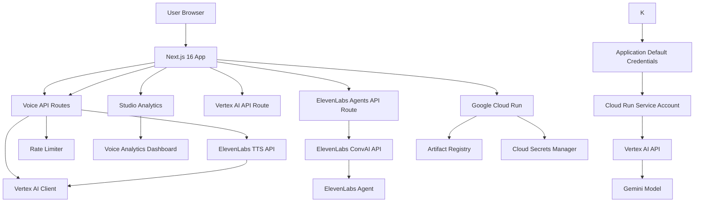

# LessonArcade

**AI-Powered Voice Lessons for Modern Education** — Transform traditional lessons into interactive, voice-enabled learning experiences with natural AI narration.

## What It Does

LessonArcade is a voice-first educational platform that delivers engaging, accessible lessons through AI-powered voice narration. Users can browse interactive lessons, listen to natural-sounding narration powered by ElevenLabs, and control playback with pause, resume, and stop functionality. The platform features bilingual support (English and Chinese), advanced guardrails to prevent abuse, and comprehensive analytics for tracking learner engagement.

### Key Features

- **Natural AI Voice Narration** — High-quality text-to-speech using ElevenLabs API with customizable voice presets
- **Interactive Controls** — Pause, resume, and stop narration at any point
- **Bilingual Support** — Full English and Chinese language support with automatic detection
- **Advanced Guardrails** — Acknowledgment system, cooldown periods, and multi-tier rate limiting
- **Voice Analytics** — Real-time telemetry tracking completion rates, replay patterns, and interruption points
- **Privacy-First Design** — All telemetry uses hashed IP addresses with no personal data collection
- **Conversational AI Agents** — Real-time voice conversations with ElevenLabs Agents for interactive learning

## Voice Demo

LessonArcade ships with a production-ready Voice Demo that turns any JSON lesson into a narrated, interactive experience. The demo showcases TTS-based narration, step-by-step checks for understanding, and telemetry capture for every playback and interaction. There are two primary flows you can try after deployment:

- `/demo/voice/effective-meetings` – linear, lesson-style voice walkthrough
- `/demo/voice-chat/effective-meetings` – chat-style, conversational flow built on the same lesson data

For deployment and health checks, see `docs/voice-demo-playbook.md`. Once you have a stable public URL, you can record it in `voice-demo-url.txt` (see `voice-demo-url.example`) and share it with reviewers, demo participants, or internal stakeholders.

For a short, copy-paste friendly overview of the Voice Demo suitable for proposals and slide decks, see `docs/voice-demo-overview.md`.

## Embeddable Player

LessonArcade lessons can be embedded directly into any website or Learning Management System (LMS) using a simple iframe. The embeddable player delivers the same interactive experience as the main demo, including gamification, completion tracking, and analytics. For Phase 3, only the "demo" workspace is supported, with public demo lessons available for embedding.

For complete documentation and examples, see [docs/embed-player.md](docs/embed-player.md).

### Example

```html
<iframe
  src="https://YOUR-DEPLOYED-URL/embed/demo/lesson/effective-meetings"
  width="100%"
  height="640"
  frameborder="0"
  allowfullscreen
></iframe>
```

## Demo Sign-in and Workspace Switching

LessonArcade includes a minimal, demo-friendly sign-in and workspace switching experience for Phase 3 SaaS development.

### How It Works

The demo sign-in uses a simple email-based authentication system:
- No password storage or external IdP integration
- Session stored in a signed cookie
- **NOT production-grade auth** - for demo/development only

### Seeded Users and Workspaces

Running `pnpm db:seed:demo` creates:

**Users:**
- Demo Owner: `demo-owner@example.com`

**Workspaces:**
- Demo Workspace (`demo`): Contains `effective-meetings` and `react-hooks-intro` lessons
- Sample Team (`sample-team`): Contains `design-feedback-basics` and `feedback-that-lands` lessons

### Sign In

1. Visit `/studio` → redirected to `/auth/demo-signin`
2. Click "Sign in as Demo Owner" or enter `demo-owner@example.com`
3. You'll be signed in and redirected to the Studio

### Switch Workspaces

1. In the Studio header, click the workspace switcher dropdown
2. Select a different workspace
3. The page will refresh showing data for the selected workspace

### Sign Out

Click "Sign Out" in the Studio header to return to the sign-in page.

## Technology Stack

### Core Framework
- **Next.js 16** — React framework with App Router for server-side rendering
- **TypeScript** — Type-safe development
- **Tailwind CSS** — Utility-first styling

### Google Cloud Hosting & Services
- **Google Cloud Run** — Serverless deployment with automatic scaling
- **Gemini AI** — Content generation and lesson enhancement
- **Vertex AI** — Production-grade Gemini integration with Application Default Credentials
- **Google Artifact Registry** — Container image storage
- **Google Cloud Secrets Manager** — Secure API key management

### Partner Technology
- **ElevenLabs** — Industry-leading AI voice synthesis for natural narration
- **ElevenLabs API** — Multi-language text-to-speech with customizable voice presets
- **ElevenLabs Agents** — Conversational AI for real-time voice interactions

### Testing & Quality
- **Vitest** — Fast unit testing framework
- **Playwright** — End-to-end testing across browsers
- **ESLint** — Code linting and style enforcement

## Local Development Setup

### Prerequisites
- Node.js 20+
- pnpm (recommended) or npm/yarn

### Installation

1. Clone the repository:
```bash
git clone <repository-url>
cd LessonArcade
```

2. Install dependencies:
```bash
pnpm install
```

3. Create a `.env.local` file based on `.env.example`:
```bash
cp .env.example .env.local
```

4. Configure environment variables in `.env.local`:

### AI Configuration

The application supports two modes for Gemini AI integration:

#### Option 1: Developer API Key (Local Development)

For local development and testing, use the Google AI Studio API key:

```bash
# Google AI Studio API Key for Gemini
# Get your key from: https://aistudio.google.com/app/apikey
GEMINI_API_KEY=your_gemini_api_key_here
```

#### Option 2: Vertex AI (Production)

For production deployments on Cloud Run, use Vertex AI with Application Default Credentials (ADC):

```bash
# Vertex AI Configuration (Production Mode)
# When set, uses Vertex AI instead of developer API key
GCP_PROJECT_ID=your-gcp-project-id
GCP_REGION=us-central1
GCP_VERTEX_MODEL=gemini-2.0-flash-exp
```

**Note**: Vertex AI mode is recommended for production deployments as it:
- Uses Google Cloud's Application Default Credentials (ADC) for authentication
- Eliminates the need to manage API keys
- Provides better security and scalability
- Integrates seamlessly with Cloud Run service accounts

### Additional Environment Variables

```bash
# Basic Authentication for Lesson Studio
STUDIO_BASIC_AUTH_USER=your_admin_username
STUDIO_BASIC_AUTH_PASS=your_admin_password

# Salt for IP hashing in structured logs
LOGGING_SALT=random_salt_string_here

# ElevenLabs API Configuration
ELEVENLABS_API_KEY=your_elevenlabs_api_key_here

# Default voice IDs for different languages
ELEVENLABS_VOICE_ID_EN=your_english_voice_id
ELEVENLABS_VOICE_ID_ZH=your_chinese_voice_id

# Voice Presets for AI Voice
VOICE_TTS_VOICE_ID_EN_INSTRUCTOR=your_voice_id
VOICE_TTS_VOICE_ID_EN_NARRATOR=your_voice_id
VOICE_TTS_VOICE_ID_ZH_INSTRUCTOR=your_voice_id
VOICE_TTS_VOICE_ID_ZH_NARRATOR=your_voice_id
```

### ElevenLabs Agents Configuration

For conversational AI features, configure the following:

```bash
# ElevenLabs Agent ID (public, safe to expose)
# Create an agent at: https://elevenlabs.io/app/convai/agents
NEXT_PUBLIC_AGENT_ID=your_agent_id_here
```

### E2E Testing Mock Mode (for CI only)

# Set to a mock signed URL for deterministic E2E tests
E2E_ELEVENLABS_SIGNED_URL=https://mock-signed-url.com
```

**Note**: `NEXT_PUBLIC_AGENT_ID` is safe to be public as it's only used to identify which agent to connect to. The actual authentication happens server-side using `ELEVENLABS_API_KEY`.

### Running the Development Server

```bash
pnpm dev
```

Open [http://localhost:3000](http://localhost:3000) in your browser.

## Running Tests

### Linting
```bash
pnpm lint
```

### Type Checking
```bash
pnpm typecheck
```

### Unit Tests
```bash
pnpm test
```

### End-to-End Tests

```bash
# Run all E2E tests
pnpm test:e2e

# Run E2E tests in CI mode
pnpm test:e2e:ci
```

## Deployment

### Cloud Run Deployment (Primary Contest Path)

The application is deployed on Google Cloud Run for automatic scaling and cost-effective hosting.

**IMPORTANT FOR CONTEST SUBMISSION:** The hosted URL for judging must come from Google Cloud Run. Do not use other cloud hosting providers (Vercel, Netlify, etc.) for this contest submission.

#### Quick Start (One-Command Deployment)

For the fastest path to deploy and get your hosted URL for Devpost, use the provided deployment scripts:

```bash
# 1. Set your project ID (required)
export GCP_PROJECT_ID="your-project-id"

# 2. Enable required APIs (one-time setup)
gcloud services enable run.googleapis.com cloudbuild.googleapis.com artifactregistry.googleapis.com secretmanager.googleapis.com aiplatform.googleapis.com

# 3. Grant Vertex AI permissions to Cloud Run service account (one-time setup)
PROJECT_NUMBER=$(gcloud projects describe $GCP_PROJECT_ID --format='value(projectNumber)')
SERVICE_ACCOUNT="${PROJECT_NUMBER}-compute@developer.gserviceaccount.com"
gcloud projects add-iam-policy-binding $GCP_PROJECT_ID \
   --member="serviceAccount:$SERVICE_ACCOUNT" \
   --role="roles/aiplatform.user"

# 4. Run the deployment script
./scripts/cloud-run/deploy.sh

# The script will output: HOSTED_URL=https://your-service-url.a.run.app
# Use this URL for your Devpost submission
```

**Optional: Run smoke tests after deployment:**
```bash
# Get the URL from the deploy script output or:
SERVICE_URL=$(gcloud run services describe lessonarcade --region=us-central1 --format="value(status.url)")

# Run smoke tests
./scripts/cloud-run/smoke-test.sh $SERVICE_URL
```

For complete deployment instructions, see [`docs/deploy-cloud-run.md`](docs/deploy-cloud-run.md).

#### Prerequisites

- Google Cloud project with Cloud Run API enabled
- `gcloud` CLI installed and authenticated
- Artifact Registry configured
- Docker installed and running

#### Required APIs

- `run.googleapis.com` — Cloud Run Admin API
- `cloudbuild.googleapis.com` — Cloud Build API
- `artifactregistry.googleapis.com` — Artifact Registry API
- `secretmanager.googleapis.com` — Secret Manager API
- `aiplatform.googleapis.com` — Vertex AI API (for production mode)

#### Environment Variables and Secrets

For production deployments, use Google Cloud Secret Manager for sensitive values (API keys, passwords):

```bash
# Create secrets
gcloud secrets create gemini-api-key --replication-policy="automatic"
gcloud secrets create elevenlabs-api-key --replication-policy="automatic"
gcloud secrets create studio-auth-user --replication-policy="automatic"
gcloud secrets create studio-auth-pass --replication-policy="automatic"

# Add secret values
echo -n "your-key" | gcloud secrets versions add gemini-api-key --data-file=-
```

**For Vertex AI mode**, set the following environment variables (non-sensitive, can be set directly):

```bash
--set-env-vars=GCP_PROJECT_ID=$PROJECT_ID,GCP_REGION=us-central1,GCP_VERTEX_MODEL=gemini-2.0-flash-exp
```

See [`docs/deploy-cloud-run.md`](docs/deploy-cloud-run.md) for complete secret management instructions.

#### Port Configuration

Cloud Run automatically injects a `PORT` environment variable. The application listens on this port (configured in [`Dockerfile`](Dockerfile)):

```dockerfile
ENV PORT=8080
ENV HOSTNAME=0.0.0.0
```

#### Health Checks

Cloud Run automatically configures a default TCP startup probe:
- `timeoutSeconds: 240`
- `periodSeconds: 240`
- `failureThreshold: 1`

For custom health check configuration, see [`docs/deploy-cloud-run.md`](docs/deploy-cloud-run.md).

#### Getting the Hosted URL

The deployment script automatically outputs the hosted URL at the end:

```bash
=== HOSTED URL FOR DEVPOST SUBMISSION ===
HOSTED_URL=https://lessonarcade-xxxxx.a.run.app
========================================
```

Alternatively, you can retrieve it manually:

```bash
SERVICE_URL=$(gcloud run services describe lessonarcade \
     --region=us-central1 \
     --format="value(status.url)")

echo "$SERVICE_URL"
```

#### Troubleshooting

For common failures (port issues, health check failures, missing environment variables), see the [Common Failures](docs/deploy-cloud-run.md#common-failures) section in [`docs/deploy-cloud-run.md`](docs/deploy-cloud-run.md).

## Privacy & Data Handling

LessonArcade is designed with privacy as a core principle:

- **No Personal Data Collection** — User IP addresses are hashed before storage
- **Aggregated Analytics** — Only aggregated metrics are collected (completion rates, replay counts)
- **No User Tracking** — No cookies, tracking pixels, or third-party analytics
- **Secure Secrets** — All API keys and sensitive configuration are managed via Google Cloud Secrets Manager
- **Data Minimization** — Only the minimum data required for voice analytics is collected

## Architecture



## SaaS Data Model (Phase 3)

LessonArcade Phase 3 introduces a multi-tenant SaaS data model designed for teams, agencies, and brands that want to run many interactive lessons under one roof.

At core of the design:

- **User & Workspace** – A user can belong to multiple workspaces, and each workspace represents an organization or brand with its own theme and settings.
- **Lesson & LessonVersion** – Each lesson belongs to exactly one workspace and can have multiple versions, so teams can iterate safely while keeping a stable published version in production.
- **LessonContent** – Stores the LessonArcade JSON "source of truth" for each version, with checksums to support future deduplication and content analysis.
- **LessonRun** – Records every learner run (score, mode, timestamps, metadata), forming the basis for analytics, progress tracking, and future billing.
- **WorkspaceSettings** – Captures workspace-level configuration such as brand/theme, voice presets, and feature flags.

The entire model is documented as a Prisma schema draft with a phased migration plan, so we can evolve from today's single-tenant demo into a full SaaS platform without a disruptive rewrite.

### Dev Database and Prisma

The project uses a local SQLite database at `prisma/dev.db` for development.

- The file is not tracked in Git and can be safely deleted; it will be recreated from the Prisma schema and seed scripts.
- To sync schema to the local dev DB, run:
  ```bash
  pnpm db:push:dev
  ```
- There is normally no need to call `npx prisma db push` interactively; for this repo, always prefer the `db:push:dev` script.

**Note:** This is dev-only. Production deployments should use a proper managed database with a separate `DATABASE_URL`.

## Pricing & Plans (Concept)

LessonArcade is moving toward a multi-workspace SaaS with plans based on workspaces, editor seats, and lesson-run usage. The pricing structure includes three tiers: **Free** (for individuals experimenting with the platform), **Pro** (for small teams with voice and embed support), and **Team** (for larger organizations with multiple workspaces and advanced analytics). Pricing is currently conceptual for prototypes and proposals. For full details on the plan structure, metrics, and billing model, see [`plans/la3-p1-02-pricing-and-plans.md`](plans/la3-p1-02-pricing-and-plans.md). The plan definitions are also mirrored in [`lib/saas/pricing.ts`](lib/saas/pricing.ts) for future UI integration.

## Demo

Try the live demo at [demo-url-placeholder] (replace with actual Cloud Run URL).

## Devpost Submission

For complete submission requirements and canonical Devpost write-up, see:

- **[`docs/devpost-draft.md`](docs/devpost-draft.md)** — Copy-paste ready Devpost submission content with all required sections (Problem, Solution, How We Built It, Architecture, Challenges, Accomplishments, What We Learned, What's Next)
- **[`docs/submission.md`](docs/submission.md)** — Complete checklist for contest compliance, pre-submit verification, and final steps

### Quick Links

- Hosted project URL (Cloud Run): [your-deployment-url]
- Demo video (<= 3 minutes): [your-video-url]
- Repository: [your-repo-url]

## Contributing

This project is open source under the Apache 2.0 license. Contributions are welcome!

## License

This project is licensed under the Apache License, Version 2.0. See the [LICENSE](LICENSE) file for details.

## Support

For questions or issues, please open an issue in repository.

---

**Built for AI Partner Catalyst Hackathon — ElevenLabs Challenge**
