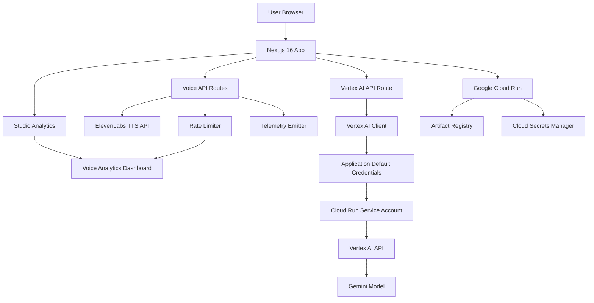

# LessonArcade

**AI-Powered Voice Lessons for Modern Education** — Transform traditional lessons into interactive, voice-enabled learning experiences with natural AI narration.

## What It Does

LessonArcade is a voice-first educational platform that delivers engaging, accessible lessons through AI-powered voice narration. Users can browse interactive lessons, listen to natural-sounding narration powered by ElevenLabs, and control playback with pause, resume, and stop functionality. The platform features bilingual support (English and Chinese), advanced guardrails to prevent abuse, and comprehensive analytics for tracking learner engagement.

### Key Features

- **Natural AI Voice Narration** — High-quality text-to-speech using ElevenLabs API with customizable voice presets
- **Interactive Controls** — Pause, resume, and stop narration at any point
- **Bilingual Support** — Full English and Chinese language support with automatic detection
- **Advanced Guardrails** — Acknowledgment system, cooldown periods, and multi-tier rate limiting
- **Voice Analytics** — Real-time telemetry tracking completion rates, replay patterns, and interruption points
- **Privacy-First Design** — All telemetry uses hashed IP addresses with no personal data collection

## Technology Stack

### Core Framework
- **Next.js 16** — React framework with App Router for server-side rendering
- **TypeScript** — Type-safe development
- **Tailwind CSS** — Utility-first styling

### Google Cloud Hosting & Services
- **Google Cloud Run** — Serverless deployment with automatic scaling
- **Gemini AI** — Content generation and lesson enhancement
- **Vertex AI** — Production-grade Gemini integration with Application Default Credentials
- **Google Artifact Registry** — Container image storage
- **Google Cloud Secrets Manager** — Secure API key management

### Partner Technology
- **ElevenLabs** — Industry-leading AI voice synthesis for natural narration
- **ElevenLabs API** — Multi-language text-to-speech with customizable voice presets

### Testing & Quality
- **Vitest** — Fast unit testing framework
- **Playwright** — End-to-end testing across browsers
- **ESLint** — Code linting and style enforcement

## Local Development Setup

### Prerequisites
- Node.js 20+
- pnpm (recommended) or npm/yarn

### Installation

1. Clone the repository:
```bash
git clone <repository-url>
cd LessonArcade
```

2. Install dependencies:
```bash
pnpm install
```

3. Create a `.env.local` file based on `.env.example`:
```bash
cp .env.example .env.local
```

4. Configure environment variables in `.env.local`:

### AI Configuration

The application supports two modes for Gemini AI integration:

#### Option 1: Developer API Key (Local Development)

For local development and testing, use the Google AI Studio API key:

```bash
# Google AI Studio API Key for Gemini
# Get your key from: https://aistudio.google.com/app/apikey
GEMINI_API_KEY=your_gemini_api_key_here
```

#### Option 2: Vertex AI (Production)

For production deployments on Cloud Run, use Vertex AI with Application Default Credentials (ADC):

```bash
# Vertex AI Configuration (Production Mode)
# When set, uses Vertex AI instead of developer API key
GCP_PROJECT_ID=your-gcp-project-id
GCP_REGION=us-central1
GCP_VERTEX_MODEL=gemini-2.0-flash-exp
```

**Note**: Vertex AI mode is recommended for production deployments as it:
- Uses Google Cloud's Application Default Credentials (ADC) for authentication
- Eliminates the need to manage API keys
- Provides better security and scalability
- Integrates seamlessly with Cloud Run service accounts

### Additional Environment Variables

```bash
# Basic Authentication for Lesson Studio
STUDIO_BASIC_AUTH_USER=your_admin_username
STUDIO_BASIC_AUTH_PASS=your_admin_password

# Salt for IP hashing in structured logs
LOGGING_SALT=random_salt_string_here

# ElevenLabs API Configuration
ELEVENLABS_API_KEY=your_elevenlabs_api_key_here

# Default voice IDs for different languages
ELEVENLABS_VOICE_ID_EN=your_english_voice_id
ELEVENLABS_VOICE_ID_ZH=your_chinese_voice_id

# Voice Presets for AI Voice
VOICE_TTS_VOICE_ID_EN_INSTRUCTOR=your_voice_id
VOICE_TTS_VOICE_ID_EN_NARRATOR=your_voice_id
VOICE_TTS_VOICE_ID_ZH_INSTRUCTOR=your_voice_id
VOICE_TTS_VOICE_ID_ZH_NARRATOR=your_voice_id
```

### Running the Development Server

```bash
pnpm dev
```

Open [http://localhost:3000](http://localhost:3000) in your browser.

## Running Tests

### Linting
```bash
pnpm lint
```

### Type Checking
```bash
pnpm typecheck
```

### Unit Tests
```bash
pnpm test
```

### End-to-End Tests
```bash
# Run all E2E tests
pnpm test:e2e

# Run E2E tests in CI mode
pnpm test:e2e:ci
```

## Deployment

### Cloud Run Deployment (Primary Contest Path)

The application is deployed on Google Cloud Run for automatic scaling and cost-effective hosting.

**IMPORTANT FOR CONTEST SUBMISSION:** The hosted URL for judging must come from Google Cloud Run. Do not use other cloud hosting providers (Vercel, Netlify, etc.) for this contest submission.

For complete, copy-paste runnable deployment instructions, see [`docs/deploy-cloud-run.md`](docs/deploy-cloud-run.md).

#### Quick Start

```bash
# 1. Set up your Google Cloud project
export PROJECT_ID="your-project-id"
gcloud config set project $PROJECT_ID

# 2. Enable required APIs
gcloud services enable run.googleapis.com cloudbuild.googleapis.com artifactregistry.googleapis.com secretmanager.googleapis.com aiplatform.googleapis.com

# 3. Grant Vertex AI permissions to Cloud Run service account
PROJECT_NUMBER=$(gcloud projects describe $PROJECT_ID --format='value(projectNumber)')
SERVICE_ACCOUNT="${PROJECT_NUMBER}-compute@developer.gserviceaccount.com"
gcloud projects add-iam-policy-binding $PROJECT_ID \
  --member="serviceAccount:$SERVICE_ACCOUNT" \
  --role="roles/aiplatform.user"

# 4. Use the provided deployment script
./scripts/cloud-run/deploy.sh
```

#### Prerequisites

- Google Cloud project with Cloud Run API enabled
- `gcloud` CLI installed and authenticated
- Artifact Registry configured
- Docker installed and running

#### Required APIs

- `run.googleapis.com` — Cloud Run Admin API
- `cloudbuild.googleapis.com` — Cloud Build API
- `artifactregistry.googleapis.com` — Artifact Registry API
- `secretmanager.googleapis.com` — Secret Manager API
- `aiplatform.googleapis.com` — Vertex AI API (for production mode)

#### Environment Variables and Secrets

For production deployments, use Google Cloud Secret Manager for sensitive values (API keys, passwords):

```bash
# Create secrets
gcloud secrets create gemini-api-key --replication-policy="automatic"
gcloud secrets create elevenlabs-api-key --replication-policy="automatic"
gcloud secrets create studio-auth-user --replication-policy="automatic"
gcloud secrets create studio-auth-pass --replication-policy="automatic"

# Add secret values
echo -n "your-key" | gcloud secrets versions add gemini-api-key --data-file=-
```

**For Vertex AI mode**, set the following environment variables (non-sensitive, can be set directly):

```bash
--set-env-vars=GCP_PROJECT_ID=$PROJECT_ID,GCP_REGION=us-central1,GCP_VERTEX_MODEL=gemini-2.0-flash-exp
```

See [`docs/deploy-cloud-run.md`](docs/deploy-cloud-run.md) for complete secret management instructions.

#### Port Configuration

Cloud Run automatically injects a `PORT` environment variable. The application listens on this port (configured in [`Dockerfile`](Dockerfile)):

```dockerfile
ENV PORT=8080
ENV HOSTNAME=0.0.0.0
```

#### Health Checks

Cloud Run automatically configures a default TCP startup probe:
- `timeoutSeconds: 240`
- `periodSeconds: 240`
- `failureThreshold: 1`

For custom health check configuration, see [`docs/deploy-cloud-run.md`](docs/deploy-cloud-run.md).

#### Getting the Hosted URL

After deployment, capture the service URL for Devpost submission:

```bash
SERVICE_URL=$(gcloud run services describe lessonarcade \
    --region=us-central1 \
    --format="value(status.url)")

echo "$SERVICE_URL"
```

#### Troubleshooting

For common failures (port issues, health check failures, missing environment variables), see the [Common Failures](docs/deploy-cloud-run.md#common-failures) section in [`docs/deploy-cloud-run.md`](docs/deploy-cloud-run.md).

## Privacy & Data Handling

LessonArcade is designed with privacy as a core principle:

- **No Personal Data Collection** — User IP addresses are hashed before storage
- **Aggregated Analytics** — Only aggregated metrics are collected (completion rates, replay counts)
- **No User Tracking** — No cookies, tracking pixels, or third-party analytics
- **Secure Secrets** — All API keys and sensitive configuration are managed via Google Cloud Secrets Manager
- **Data Minimization** — Only the minimum data required for voice analytics is collected

## Architecture



## Demo

Try the live demo at [demo-url-placeholder] (replace with actual Cloud Run URL)

## Devpost Submission Checklist

This checklist ensures the repository is strictly contest-compliant per Devpost rules.

### Hosted Project URL
- [ ] **Public URL to deployed application** for judging and testing
  - Must be accessible to judges without authentication barriers
  - **Required: Google Cloud Run deployment** — Do not use other cloud hosting providers for this contest
  - See [`docs/deploy-cloud-run.md`](docs/deploy-cloud-run.md) for deployment instructions

### Public Open Source Repository
- [ ] **Public GitHub repository** with visible license
  - Repository must be publicly accessible
  - LICENSE file included at repository root (Apache-2.0)
  - License must be visible on repository landing page
  - Repository contains all necessary source code, assets, and instructions
  - Repository is functional and can be successfully installed and run

### Demo Video Requirements
- [ ] **Public YouTube or Vimeo link** (<= 3 minutes)
  - Video uploaded to YouTube or Vimeo
  - Made publicly visible (no private/unlisted restrictions)
  - Duration: approximately 3 minutes or less
  - Content requirements:
    - [ ] Overview of what the project does
    - [ ] Explanation of how the project solves a problem
    - [ ] Footage showing the project functioning on the target platform
    - [ ] No third-party trademarks or copyrighted music (unless permission granted)

### English Requirement
- [ ] **All submission materials in English**
  - Text description in English
  - Demo video in English OR includes English subtitles
  - Testing instructions in English
  - If non-English content is present, provide English translations

### AI Usage Limitation
- [ ] **Only allowed Google Cloud AI tools at runtime**
  - Google Gemini API (via Google AI Studio or Vertex AI)
  - ElevenLabs API (partner integration for voice synthesis)
  - **No other AI APIs are used by the product at runtime**
  - Development tools (e.g., AI coding assistants) may be used during development but must not be part of the deployed application

*See [`docs/submission.md`](docs/submission.md) for complete submission requirements and pre-submit checklist.*

## Contributing

This project is open source under the Apache-2.0 license. Contributions are welcome!

## License

This project is licensed under the Apache License, Version 2.0. See the [LICENSE](LICENSE) file for details.

## Support

For questions or issues, please open an issue in the repository.

---

**Built for the AI Partner Catalyst Hackathon — ElevenLabs Challenge**
