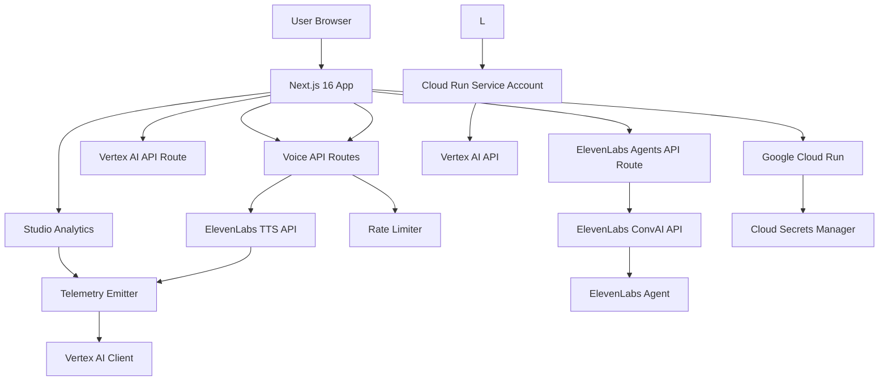

# LessonArcade

**AI-Powered Voice Lessons for Modern Education** — Transform traditional lessons into interactive, voice-enabled learning experiences with natural AI narration.

## What It Does

LessonArcade is a voice-first educational platform that delivers engaging, accessible lessons through AI-powered voice narration. Users can browse interactive lessons, listen to natural-sounding narration powered by ElevenLabs, and control playback with pause, resume, and stop functionality. The platform features bilingual support (English and Chinese), advanced guardrails to prevent abuse, and comprehensive analytics for tracking learner engagement.

### Key Features

- **Natural AI Voice Narration** — High-quality text-to-speech using ElevenLabs API with customizable voice presets
- **Interactive Controls** — Pause, resume, and stop narration at any point
- **Bilingual Support** — Full English and Chinese language support with automatic detection
- **Advanced Guardrails** — Acknowledgment system, cooldown periods, and multi-tier rate limiting
- **Voice Analytics** — Real-time telemetry tracking completion rates, replay patterns, and interruption points
- **Privacy-First Design** — All telemetry uses hashed IP addresses with no personal data collection
- **Conversational AI Agents** — Real-time voice conversations with ElevenLabs Agents for interactive learning

## Voice Demo

LessonArcade ships with a production-ready Voice Demo that turns any JSON lesson into a narrated, interactive experience. The demo showcases TTS-based narration, step-by-step checks for understanding, and telemetry capture for every playback and interaction. There are two primary flows you can try after deployment:

- `/demo/voice/effective-meetings` – linear, lesson-style voice walkthrough
- `/demo/voice-chat/effective-meetings` – chat-style, conversational flow built on the same lesson data

For deployment and health checks, see `docs/voice-demo-playbook.md`. Once you have a stable public URL, you can record it in `voice-demo-url.txt` (see `voice-demo-url.example`) and share it with reviewers, demo participants, or internal stakeholders.

For a short, copy-paste friendly overview of Voice Demo suitable for proposals and slide decks, see `docs/voice-demo-overview.md`.

## Embeddable Player

LessonArcade lessons can be embedded directly into any website or Learning Management System (LMS) using a simple iframe. The embeddable player delivers the same interactive experience as the main demo, including gamification, completion tracking, and analytics. For Phase 3, only the "demo" workspace is supported, with public demo lessons available for embedding.

For complete documentation and examples, see [docs/embed-player.md](docs/embed-player.md).

### Example

```html
<iframe
  src="https://YOUR-DEPLOYED-URL/embed/demo/lesson/effective-meetings"
  width="100%"
  height="640"
  frameborder="0"
  allowfullscreen
></iframe>
```

## Demo Sign-in and Workspace Switching

LessonArcade includes a minimal, demo-friendly sign-in and workspace switching experience for Phase 3 SaaS development.

### How It Works

The demo sign-in uses a simple email-based authentication system:
- No password storage or external IdP integration
- Session stored in a signed cookie
- **NOT production-grade auth** - for demo/development only

### Seeded Users and Workspaces

Running `pnpm db:seed:demo` creates:

**Users:**
- Demo Owner: `demo-owner@example.com`
- Demo Editor: `demo-editor@example.com`
- Demo Viewer: `demo-viewer@example.com`

**Workspaces:**
- Demo Workspace (`demo`): Contains `effective-meetings` and `react-hooks-intro` lessons
- Sample Team (`sample-team`): Contains `design-feedback-basics` and `feedback-that-lands` lessons

### Demo Identities and Roles

The demo sign-in page provides three pre-configured identities for testing collaboration features:

| Identity | Email | Role | Permissions |
|-----------|--------|------------|
| Demo Owner | demo-owner@example.com | OWNER | Full access to workspace, can manage lessons, members, and settings |
| Demo Editor | demo-editor@example.com | EDITOR | Can create and edit lessons, add comments |
| Demo Viewer | demo-viewer@example.com | VIEWER | Read-only access to lessons and comments |

**Collaboration Features:**
- **Lesson Comments**: All roles can view comments on lessons
- **Add Comments**: Only EDITOR, ADMIN, and OWNER roles can create new comments
- **Read-Only Mode**: VIEWER role sees comments but cannot post new ones

### Sign In

1. Visit `/studio` → redirected to `/auth/demo-signin`
2. Click "Sign in as Demo Owner/Editor/Viewer" or enter email
3. You'll be signed in and redirected to Studio

### Switch Workspaces

1. In the Studio header, click the workspace switcher dropdown
2. Select a different workspace
3. The page will refresh showing data for the selected workspace

### Sign Out

Click "Sign Out" in the Studio header to return to the sign-in page.

## Technology Stack

### Core Framework

- **Next.js 16** — React framework with App Router for server-side rendering
- **TypeScript** — Type-safe development
- **Tailwind CSS** — Utility-first styling

### Google Cloud Hosting & Services

- **Google Cloud Run** — Serverless deployment with automatic scaling
- **Gemini AI** — Content generation and lesson enhancement
- **Vertex AI** — Production-grade Gemini integration with Application Default Credentials
- **Google Artifact Registry** — Container image storage
- **Google Cloud Secrets Manager** — Secure API key management

### Partner Technology

- **ElevenLabs** — Industry-leading AI voice synthesis for natural narration
- **ElevenLabs API** — Multi-language text-to-speech with customizable voice presets
- **ElevenLabs Agents** — Conversational AI for real-time voice interactions

### Testing & Quality

- **Vitest** — Fast unit testing framework
- **Playwright** — End-to-end testing across browsers
- **ESLint** — Code linting and style enforcement

## Local Development Setup

### Prerequisites

- Node.js 20+
- pnpm (recommended) or npm/yarn

### Installation

1. Clone the repository:
```bash
git clone <repository-url>
cd LessonArcade
```

2. Install dependencies:
```bash
pnpm install
```

3. Create a `.env.local` file based on `.env.example`:
```bash
cp .env.example .env.local
```

4. Configure environment variables in `.env.local`:

### AI Configuration

The application supports two modes for Gemini AI integration:

#### Option 1: Developer API Key (Local Development)

For local development and testing, use the Google AI Studio API key:

```bash
# Google AI Studio API Key for Gemini
# Get your key from: https://aistudio.google.com/app/apikey
GEMINI_API_KEY=your_gemini_api_key_here
```

#### Option 2: Vertex AI (Production)

For production deployments on Cloud Run, use Vertex AI with Application Default Credentials (ADC):

```bash
# Vertex AI Configuration (Production Mode)
# When set, uses Vertex AI instead of developer API key
GCP_PROJECT_ID=your-gcp-project-id
GCP_REGION=us-central1
GCP_VERTEX_MODEL=gemini-2.0-flash-exp
```

**Note**: Vertex AI mode is recommended for production deployments as it:
- Uses Google Cloud's Application Default Credentials (ADC) for authentication
- Eliminates the need to manage API keys
- Provides better security and scalability
- Integrates seamlessly with Cloud Run service accounts

### Additional Environment Variables

```bash
# Basic Authentication for Lesson Studio
STUDIO_BASIC_AUTH_USER=your_admin_username
STUDIO_BASIC_AUTH_PASS=your_admin_password

# Salt for IP hashing in structured logs
LOGGING_SALT=random_salt_string_here

# ElevenLabs API Configuration
ELEVENLABS_API_KEY=your_elevenlabs_api_key_here

# Default voice IDs for different languages
ELEVENLABS_VOICE_ID_EN=your_english_voice_id
ELEVENLABS_VOICE_ID_ZH=your_chinese_voice_id

# Voice Presets for AI Voice
VOICE_TTS_VOICE_ID_EN_INSTRUCTOR=your_voice_id
VOICE_TTS_VOICE_ID_EN_NARRATOR=your_voice_id
VOICE_TTS_VOICE_ID_ZH_INSTRUCTOR=your_voice_id
VOICE_TTS_VOICE_ID_ZH_NARRATOR=your_voice_id
```

### ElevenLabs Agents Configuration

For conversational AI features, configure the following:

```bash
# ElevenLabs Agent ID (public, safe to expose)
# Create an agent at: https://elevenlabs.io/app/convai/agents
NEXT_PUBLIC_AGENT_ID=your_agent_id_here
```

### E2E Testing Mock Mode (for CI only)

```bash
# Set to a mock signed URL for deterministic E2E tests
E2E_ELEVENLABS_SIGNED_URL=https://mock-signed-url.com
```

**Note**: `NEXT_PUBLIC_AGENT_ID` is safe to be public as it's only used to identify which agent to connect to. The actual authentication happens server-side using `ELEVENLABS_API_KEY`.

### Running the Development Server

```bash
pnpm dev
```

Open [http://localhost:3000](http://localhost:3000) in your browser.

## Running Tests

### Linting

```bash
pnpm lint
```

### Type Checking

```bash
pnpm typecheck
```

### Unit Tests

```bash
pnpm test
```

### End-to-End Tests

```bash
# Run all E2E tests
pnpm test:e2e

# Run E2E tests in CI mode
pnpm test:e2e:ci
```

### Run CI Checks Locally

To run the same checks as CI locally, use:

```bash
pnpm ci:check
```

This command runs lint, typecheck, build, test, and smoke tests in the same order as CI.

## Deployment

### Cloud Run Deployment (Primary Contest Path)

The application is deployed on Google Cloud Run for automatic scaling and cost-effective hosting.

**IMPORTANT FOR CONTEST SUBMISSION:** The hosted URL for judging must come from Google Cloud Run. Do not use other cloud hosting providers (Vercel, Netlify, etc.) for this contest submission.

#### Quick Start (One-Command Deployment)

For the fastest path to deploy and get your hosted URL for Devpost, use the provided deployment scripts:

```bash
# 1. Set your project ID (required)
export GCP_PROJECT_ID="your-project-id"

# 2. Enable required APIs (one-time setup)
gcloud services enable run.googleapis.com cloudbuild.googleapis.com artifactregistry.googleapis.com secretmanager.googleapis.com aiplatform.googleapis.com

# 3. Grant Vertex AI permissions to Cloud Run service account (one-time setup)
PROJECT_NUMBER=$(gcloud projects describe $GCP_PROJECT_ID --format='value(projectNumber)')
SERVICE_ACCOUNT="${PROJECT_NUMBER}-compute@developer.gserviceaccount.com"
gcloud projects add-iam-policy-binding $GCP_PROJECT_ID \
    --member="serviceAccount:$SERVICE_ACCOUNT" \
    --role="roles/aiplatform.user"

# 4. Run deployment script
./scripts/cloud-run/deploy.sh

# The script will output: HOSTED_URL=https://your-service-url.a.run.app
# Use this URL for your Devpost submission
```

**Optional: Run smoke tests after deployment:**

```bash
# Get the URL from the deploy script output or:
SERVICE_URL=$(gcloud run services describe lessonarcade --region=us-central1 --format="value(status.url)")

# Run smoke tests
./scripts/cloud-run/smoke-test.sh $SERVICE_URL
```

#### Prerequisites

- Google Cloud project with Cloud Run API enabled
- `gcloud` CLI installed and authenticated
- Artifact Registry configured
- Docker installed and running

#### Required APIs

- `run.googleapis.com` — Cloud Run Admin API
- `cloudbuild.googleapis.com` — Cloud Build API
- `artifactregistry.googleapis.com` — Artifact Registry API
- `secretmanager.googleapis.com` — Secret Manager API
- `aiplatform.googleapis.com` — Vertex AI API (for production mode)

#### Environment Variables and Secrets

For production deployments, use Google Cloud Secret Manager for sensitive values (API keys, passwords):

```bash
# Create secrets
gcloud secrets create gemini-api-key --replication-policy="automatic"
gcloud secrets create elevenlabs-api-key --replication-policy="automatic"
gcloud secrets create studio-auth-user --replication-policy="automatic"
gcloud secrets create studio-auth-pass --replication-policy="automatic"

# Add secret values
echo -n "your-key" | gcloud secrets versions add gemini-api-key --data-file=-
echo -n "your-password" | gcloud secrets versions add studio-auth-user --data-file=-
echo -n "your-password" | gcloud secrets versions add studio-auth-pass --data-file=-
```

**For Vertex AI mode**, set the following environment variables (non-sensitive, can be set directly):

```bash
--set-env-vars=GCP_PROJECT_ID=$PROJECT_ID,GCP_REGION=us-central1,GCP_VERTEX_MODEL=gemini-2.0-flash-exp
```

See [`docs/deploy-cloud-run.md`](docs/deploy-cloud-run.md) for complete secret management instructions.

#### Port Configuration

Cloud Run automatically injects a `PORT` environment variable. The application listens on this port (configured in [`Dockerfile`](Dockerfile)):

```dockerfile
ENV PORT=8080
ENV HOSTNAME=0.0.0.0
```

#### Health Checks

Cloud Run automatically configures a default TCP startup probe:
- `timeoutSeconds: 240`
- `periodSeconds: 240`
- `failureThreshold: 1`

For custom health check configuration, see [`docs/deploy-cloud-run.md`](docs/deploy-cloud-run.md).

#### Getting Hosted URL

The deployment script automatically outputs the hosted URL at the end:

```bash
=== HOSTED URL FOR DEVPOST SUBMISSION ===
HOSTED_URL=https://lessonarcade-xxxxx.a.run.app
====================================
```

Alternatively, you can retrieve it manually:

```bash
SERVICE_URL=$(gcloud run services describe lessonarcade \
      --region=us-central1 \
      --format="value(status.url)")

echo "$SERVICE_URL"
```

#### Troubleshooting

For common failures (port issues, health check failures, missing environment variables), see [Common Failures](docs/deploy-cloud-run.md#common-failures) section in [`docs/deploy-cloud-run.md`](docs/deploy-cloud-run.md).

## Privacy & Data Handling

LessonArcade is designed with privacy as a core principle:

- **No Personal Data Collection** — User IP addresses are hashed before storage
- **Aggregated Analytics** — Only aggregated metrics are collected (completion rates, replay counts)
- **No User Tracking** — No cookies, tracking pixels, or third-party analytics
- **Secure Secrets** — All API keys and sensitive configuration are managed via Google Cloud Secrets Manager
- **Data Minimization** — Only the minimum data required for voice analytics is collected

## Architecture



## SaaS Data Model (Phase 3)

LessonArcade Phase 3 introduces a multi-tenant SaaS data model designed for teams, agencies, and brands that want to run many interactive lessons under one roof.

At the core of the design:

- **User & Workspace** – A user can belong to multiple workspaces, and each workspace represents an organization or brand with its own theme and settings.
- **Lesson & LessonVersion** – Each lesson belongs to exactly one workspace and can have multiple versions, so teams can iterate safely while keeping a stable published version in production.
- **LessonContent** – Stores the LessonArcade JSON "source of truth" for each version, with checksums to support future deduplication and content analysis.
- **LessonRun** – Records every learner run (score, mode, timestamps, metadata), forming the basis for analytics, progress tracking, and future billing.
- **WorkspaceSettings** – Captures workspace-level configuration such as brand/theme, voice presets, and feature flags.
- **LessonComment** – Allows team members to leave comments on lessons for collaboration and feedback.

The entire model is documented as a Prisma schema draft with a phased migration plan, so we can evolve from today's single-tenant demo into a full SaaS platform without a disruptive rewrite.

### Dev Database and Prisma

The project uses a local SQLite database at `prisma/dev.db` for development.

- The file is not tracked in Git and can be safely deleted; it will be recreated from the Prisma schema and seed scripts.
- To sync schema to the local dev DB, run:
```bash
     pnpm db:push:dev
```
- There is normally no need to call `npx prisma db push` interactively; for this repo, always prefer the `db:push:dev` script.

**Note:** This is dev-only. Production deployments should use a proper managed database with a separate `DATABASE_URL`.

## Integrations & Webhooks (PoC)

LessonArcade v0.3 includes a proof-of-concept webhook system for outbound notifications when collaboration events occur.

### Webhook Events

Currently supported events:
- `LESSON_COMMENT_CREATED` - Triggered when a new comment is created on a lesson

### Configuring Webhooks

1. Sign in to Studio as an Owner or Admin
2. Navigate to `/studio/settings/integrations`
3. Click "Add Webhook" and enter your webhook URL
4. Select event type (currently only "Lesson comment created")
5. Toggle the webhook active/inactive as needed
6. Delete webhooks as needed

### Webhook Payload Format

When a `LESSON_COMMENT_CREATED` event occurs, webhooks receive a POST request with the following JSON payload:

```json
{
  "type": "lesson.comment.created",
  "workspace": {
    "id": "workspace-id",
    "name": "Workspace Name",
    "slug": "workspace-slug"
  },
  "lesson": {
    "id": "lesson-id",
    "title": "Lesson Title",
    "slug": "lesson-slug"
  },
  "comment": {
    "id": "comment-id",
    "body": "Comment text",
    "createdAt": "2025-12-28T00:00:00.000Z",
    "levelIndex": 0,
    "itemKey": "question-1"
  },
  "author": {
    "id": "user-id",
    "name": "Author Name",
    "email": "author@example.com"
  },
  "timestamp": "2025-12-28T00:00:00.000Z"
}
```

### PoC Limitations

This is a preview/demo feature with the following limitations:
- No retry logic for failed webhook deliveries
- No signature verification (webhooks are not authenticated)
- No rate limiting on webhook delivery
- No batching of multiple events
- Only one event type is supported

For production use, this foundation would need to be extended with:
- Retry queue with exponential backoff
- HMAC signature verification for security
- Rate limiting and circuit breakers
- Event filtering and batching
- Support for more event types

### Future Integrations

This webhook system is designed as a foundation for future integrations:
- **Slack**: Post notifications to Slack channels when comments are created
- **Email**: Send email digests of new comments
- **LMS**: Push lesson activity to external learning management systems
- **Custom**: Build custom integrations using the webhook payload

## Workspace Insights (v0.3)

LessonArcade v0.3 includes a Workspace Insights dashboard that provides learning effectiveness metrics for each workspace. This dashboard helps teams quickly identify which lessons are healthy, which need work, and what recently happened.

### Accessing Insights

1. Sign in to Studio as any role (Owner, Editor, or Viewer)
2. Navigate to `/studio/insights` or click "Insights" in the Studio navigation
3. The dashboard shows metrics for the currently selected workspace

### CSV Export

The insights dashboard includes an "Export CSV" button that allows you to download all insights data as a CSV file for external reporting and analysis.

**Features:**
- One-click download of insights data
- Filename includes workspace slug and time window (e.g., `lessonarcade-insights-demo-30d.csv`)
- Includes all sections: Summary, Top Struggling Lessons, Top Engaged Lessons, Recent Activity
- Available to all roles (Owner, Editor, Viewer) since it's read-only

### Metrics Included

The insights dashboard displays the following time-windowed metrics (default: 30 days, with option to switch to 7 days):

| Metric | Description |
|--------|-------------|
| **Total Runs** | Count of lesson completions within the time window |
| **Average Score** | Average percentage score across all completed runs |
| **Unique Sessions** | Count of distinct learner sessions (via anonymous session IDs) |
| **Total Comments** | Count of lesson comments created within the time window |

### Lesson-Level Analytics

**Lessons that need attention** – Shows up to 3 lessons with the lowest average scores that have at least 3 runs. This helps identify lessons that may need content revision or clarification.

**Most engaged lessons** – Shows up to 3 lessons with the highest run counts. This helps identify the most popular lessons by engagement.

**Recent activity** – Shows the last 5 events from lesson completions and comments, merged and sorted by timestamp. This provides quick visibility into recent workspace activity.

### Data Sources

The insights dashboard uses the following data from the SaaS data model:
- **LessonRun** records for metrics on runs, scores, and session tracking
- **LessonComment** records for collaboration activity tracking
- **Lesson** metadata for lesson titles and slugs

### Limitations

This is a v0.3 reporting view intended for small teams and demos:
- No advanced date range picker (only 7/30 day presets)
- No cohort analysis or per-learner drilldown
- No comparison with previous periods

Future versions may include:
- Custom date range picker
- Cohort analysis and learner retention
- Per-learner performance drilldown
- Integration with personalization engine

## Read-Only Reporting APIs (v0.3)

LessonArcade v0.3 includes read-only API endpoints that return insights and lessons overview data for the active workspace. These endpoints enable future integrations to consume insights via stable endpoints.

**Important:** These are Studio-scoped endpoints that require demo authentication (v0.3). They are not public APIs.

### Available Endpoints

#### GET /api/studio/insights

Returns the same data as the `/studio/insights` page for the active workspace.

**Query Parameters:**
- `window` (optional): Time window in days (7 or 30, default: 30)

**Request:**
```http
GET /api/studio/insights?window=30
Authorization: [session cookie]
```

**Response:**
```json
{
  "ok": true,
  "insights": {
    "timeWindowStart": "2025-12-28T00:00:00.000Z",
    "timeWindowEnd": "2025-12-28T23:59:59.999Z",
    "totalRunsInWindow": 10,
    "avgScorePercentInWindow": 75.5,
    "totalUniqueLearnerSessions": 5,
    "totalCommentsInWindow": 3,
    "topStrugglingLessons": [...],
    "topEngagedLessons": [...],
    "recentActivity": [...]
  }
}
```

**Error Responses:**
- `401`: Unauthorized (no valid session)
- `400`: Bad request (invalid window parameter)
- `404`: Not found (workspace not found)
- `500`: Internal server error

#### GET /api/studio/insights.csv

Returns a CSV download of workspace insights for the active workspace.

**Query Parameters:**
- `window` (optional): Time window in days (7 or 30, default: 30)

**Request:**
```http
GET /api/studio/insights.csv?window=30
Authorization: [session cookie]
```

**Response:**
- Content-Type: `text/csv; charset=utf-8`
- Content-Disposition: `attachment; filename="lessonarcade-insights-{workspaceSlug}-{windowDays}d.csv"`

**CSV Format:**
The CSV includes the following sections:
- **Summary** – Time window start/end, total runs, average score, unique sessions, total comments
- **Top Struggling Lessons**: Table with lesson title, slug, runs, and average score
- **Top Engaged Lessons**: Table with lesson title, slug, runs, and average score
- **Recent Activity**: Table with type, timestamp, description

**Error Responses:**
- `401`: Unauthorized (no valid session)
- `400`: Bad request (invalid window parameter)
- `404`: Not found (workspace not found)
- `500`: Internal server error

#### GET /api/studio/lessons-overview

Returns the same data as the `/studio/lessons` page for the active workspace.

**Request:**
```http
GET /api/studio/lessons-overview
Authorization: [session cookie]
```

**Response:**
```json
{
  "ok": true,
  "lessons": {
    "workspace": {
      "id": "workspace-id",
      "slug": "demo",
      "name": "Demo Workspace"
    },
    "lessons": [
      {
        "id": "lesson-id",
        "slug": "lesson-slug",
        "title": "Lesson Title",
        "status": "PUBLISHED",
        "runCount": 10,
        "averageScorePercent": 75.5,
        "lastCompletedAt": "2025-12-28T00:00:00.000Z"
      }
    ],
    "totals": {
      "totalLessons": 5,
      "totalRuns": 25,
      "averageScorePercent": 72.3
    }
  }
}
```

**Error Responses:**
- `401`: Unauthorized (no valid session)
- `404`: Not found (workspace not found)
- `500`: Internal server error

### Authentication & Workspace Scoping

All read-only reporting APIs:
- Require a valid session (via demo auth cookie)
- Derive the active workspace from the session
- Return data scoped to that workspace only
- Do not allow cross-workspace data access

### Future Enhancements

Future versions may include:
- Public API endpoints with proper API key authentication
- More granular permissions (e.g., read-only for specific metrics)
- Pagination for large datasets
- Filtering and sorting options
- Real-time data via WebSockets
- Filtering and sorting options

## Lesson Drilldown Insights (v0.3)

LessonArcade v0.3 adds lesson-level insights that allow teams to drill down into specific lessons for deeper analysis. Click on any lesson title from Insights dashboard or Lessons Overview to see detailed metrics for that specific lesson.

### Accessing Lesson Insights

1. From **Workspace Insights** page (`/studio/insights`):
   - Click on any lesson title in the "Lessons that need attention" or "Most engaged lessons" tables
   - Navigate to the lesson drilldown page

2. From **Lessons Overview** page (`/studio/lessons`):
   - Click on the "Insights" button next to any lesson (only visible if the lesson has runs)
   - Navigate directly to `/studio/insights/lessons/{lessonSlug}`

### Lesson Insights Dashboard

The lesson insights page displays the following metrics for a specific lesson:

**Metric Cards:**
- **Total Runs** – Count of lesson completions within the time window
- **Average Score** – Average percentage score across all completed runs
- **Unique Sessions** – Count of distinct learner sessions (via anonymous session IDs)
- **Comments** – Count of open and resolved comments (displayed as "Open / Resolved")

**Mode Breakdown:**
- **Focus Mode** – Number of runs completed in focus mode
- **Arcade Mode** – Number of runs completed in arcade mode

**Daily Activity (UTC):**
- Table showing runs and average scores by day
- Days are grouped using UTC date boundaries for consistency

**Recent Activity:**
- Timeline showing the last 10 events from lesson completions and comments
- Events are merged and sorted by timestamp (most recent first)
- Activity types include:
  - **Run completion** – Shows "Completed with {score}%" or "Completed"
  - **Comment** – Shows "Comment added by {authorName}"

### Time Window Selection

The page supports switching between 7-day and 30-day time windows:
- Default: 30 days
- Option: 7 days
- Clicking a window selector updates the URL with `?window=7` or `?window=30`
- All metrics and data refresh to reflect the selected time window

### CSV Export

The lesson insights page includes an "Export CSV" button that downloads all lesson-level metrics:

**Features:**
- One-click download of lesson insights data
- Filename format: `lessonarcade-lesson-insights-{workspaceSlug}-{lessonSlug}-{windowDays}d.csv`
- Safe filename sanitization (only lowercase, numbers, dots, hyphens, and underscores allowed)
- Includes all sections: Summary, Mode Breakdown, Comments Summary, Daily Buckets (UTC), Recent Activity

### API Endpoints

#### GET /api/studio/lessons/[lessonSlug]/insights

Returns lesson-level insights data for a specific lesson in the active workspace.

**Query Parameters:**
- `window` (optional): Time window in days (7 or 30, default: 30)

**Response:**
```json
{
  "ok": true,
  "insights": {
    "timeWindowStart": "2025-12-28T00:00:00.000Z",
    "timeWindowEnd": "2025-12-28T23:59:59.999Z",
    "lesson": {
      "id": "lesson-id",
      "slug": "lesson-slug",
      "title": "Lesson Title"
    },
    "totalRuns": 10,
    "avgScorePercent": 75.5,
    "modeBreakdown": {
      "focusRuns": 7,
      "arcadeRuns": 3
    },
    "uniqueSessions": 5,
    "totalComments": 3,
    "openComments": 2,
    "resolvedComments": 1,
    "dailyBuckets": [
      {
        "date": "2025-12-27",
        "runs": 5,
        "avgScorePercent": 70.0
      }
    ],
    "recentActivity": [
      {
        "type": "run",
        "timestamp": "2025-12-28T10:00:00.000Z",
        "description": "Completed with 80% score"
      }
    ]
  }
}
```

**Error Responses:**
- `401`: Unauthorized (no valid session)
- `400`: Bad request (invalid window parameter)
- `404`: Not found (workspace or lesson not found)
- `500`: Internal server error

#### GET /api/studio/lessons/[lessonSlug]/insights.csv

Returns a CSV download of lesson insights for a specific lesson in the active workspace.

**Query Parameters:**
- `window` (optional): Time window in days (7 or 30, default: 30)

**Response:**
- Content-Type: `text/csv; charset=utf-8`
- Content-Disposition: `attachment; filename="lessonarcade-lesson-insights-{workspaceSlug}-{lessonSlug}-{windowDays}d.csv"`

**CSV Format:**
The CSV includes the following sections:
- **Summary** – Lesson title, slug, time window, total runs, average score, unique sessions, total comments
- **Mode Breakdown** – Focus mode runs, Arcade mode runs
- **Comments Summary** – Open comments, Resolved comments, Total comments
- **Daily Buckets (UTC)** – Date, runs, average score per day
- **Recent Activity** – Type, timestamp, description

**Error Responses:**
- `401`: Unauthorized (no valid session)
- `400`: Bad request (invalid window parameter)
- `404`: Not found (workspace or lesson not found)
- `500`: Internal server error

### Workspace Scoping

All lesson insights endpoints are workspace-scoped:
- Data is only returned for the lesson in the active workspace
- Users cannot access insights for lessons in other workspaces
- Attempting to access a lesson that doesn't exist in the active workspace returns 404

### Limitations

This is a v0.3 reporting view intended for small teams and demos:
- No advanced date range picker (only 7/30 day presets)
- No cohort analysis or per-learner drilldown
- No comparison with previous periods

Future versions may include:
- Custom date range picker
- Cohort analysis and learner retention
- Per-learner performance drilldown
- Integration with personalization engine

## Pricing & Plans (Concept)

LessonArcade is moving toward a multi-workspace SaaS with plans based on workspaces, editor seats, and lesson-run usage. The pricing structure includes three tiers: **Free** (for individuals experimenting with the platform), **Pro** (for small teams with voice and embed support), and **Team** (for larger organizations with multiple workspaces and advanced analytics). Pricing is currently conceptual for prototypes and proposals. For full details on plan structure, metrics, and billing model, see [`plans/la3-p1-02-pricing-and-plans.md`](plans/la3-p1-02-pricing-and-plans.md). The plan definitions are also mirrored in [`lib/saas/pricing.ts`](lib/saas/pricing.ts) for future UI integration.

## Demo

Try the live demo at [demo-url-placeholder] (replace with the actual Cloud Run URL).

## Devpost Submission

For complete submission requirements and canonical Devpost write-up, see:
- **[`docs/devpost-draft.md`](docs/devpost-draft.md)** — Copy-paste ready Devpost submission content with all required sections (Problem, Solution, How We Built It, Architecture, Challenges, Accomplishments, What We Learned, What's Next)
- **[`docs/submission.md`](docs/submission.md)** — Complete checklist for contest compliance, pre-submit verification, and final steps

### Quick Links

- Hosted project URL (Cloud Run): [your-deployment-url]
- Demo video (<= 3 minutes): [your-video-url]
- Repository: [your-repo-url]

## Contributing

This project is open source under the Apache 2.0 license. Contributions are welcome!

## License

This project is licensed under the Apache License, Version 2.0. See the [LICENSE](LICENSE) file for details.

## Support

For questions or issues, please open an issue in the repository.

---

**Built for AI Partner Catalyst Hackathon — ElevenLabs Challenge**
