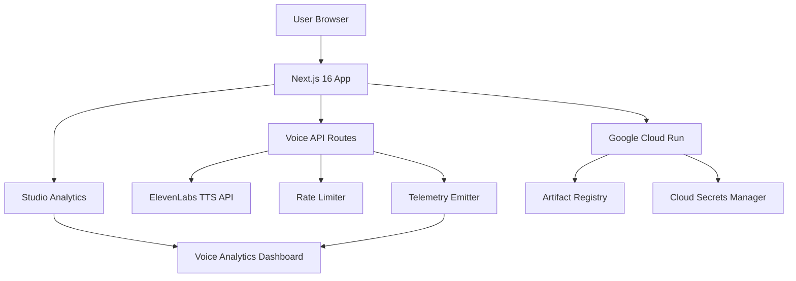

# AI Partner Catalyst Hackathon - Submission Requirements

## Devpost Submission Checklist

This checklist ensures the repository is strictly contest-compliant per Devpost rules.

### Hosted Project URL
- [ ] **Public URL to deployed application** for judging and testing
  - Must be accessible to judges without authentication barriers
  - Recommended: Google Cloud Run deployment
  - URL format: `https://[project-name]-[hash].a.run.app`

### Public Open Source Repository
- [ ] **Public GitHub repository** with visible license
  - Repository must be publicly accessible
  - LICENSE file included at repository root (Apache-2.0)
  - License must be visible on repository landing page
  - Repository contains all necessary source code, assets, and instructions
  - Repository is functional and can be successfully installed and run

### Demo Video Requirements
- [ ] **Public YouTube or Vimeo link** (<= 3 minutes)
  - Video uploaded to YouTube or Vimeo
  - Made publicly visible (no private/unlisted restrictions)
  - Duration: approximately 3 minutes or less
  - Content requirements:
    - [ ] Overview of what the project does
    - [ ] Explanation of how the project solves a problem
    - [ ] Footage showing the project functioning on the target platform
    - [ ] No third-party trademarks or copyrighted music (unless permission granted)

### English Requirement
- [ ] **All submission materials in English**
  - Text description in English
  - Demo video in English OR includes English subtitles
  - Testing instructions in English
  - If non-English content is present, provide English translations

### AI Usage Limitation
- [ ] **Only allowed Google Cloud AI tools at runtime**
  - Google Gemini API (via Google AI Studio or Vertex AI)
  - ElevenLabs API (partner integration for voice synthesis)
  - **No other AI APIs are used by the product at runtime**
  - Development tools (e.g., AI coding assistants) may be used during development but must not be part of the deployed application

---

## Challenge-Specific Requirements

### Challenge Selection
- [ ] **ElevenLabs Challenge** selected (LessonArcade uses ElevenLabs + Google Cloud AI)

### Project Requirements
- [ ] Project addresses the ElevenLabs Challenge: "Use ElevenLabs and Google Cloud AI to make your app conversational, intelligent, and voice-driven"
- [ ] Solution integrates both Google Cloud products (Gemini) AND ElevenLabs products
- [ ] Project is newly created during contest period (Nov 17 - Dec 31, 2025)
- [ ] Project runs on web platform (Next.js web application)

### Technology Constraints
- [ ] Uses Google Cloud AI tools (Gemini models via Vertex AI or API)
- [ ] Uses ElevenLabs products (API for voice synthesis)
- [ ] No other AI tools permitted (only Google Cloud + Partner's built-in AI features)
- [ ] No use of services that directly compete with Google Cloud for cloud platform capabilities

### Content Restrictions
- [ ] No derogatory, offensive, threatening, defamatory, or discriminatory content
- [ ] No unlawful content or content violating applicable laws
- [ ] No third-party advertising, slogans, logos indicating sponsorship
- [ ] Original work - no third-party intellectual property violations
- [ ] No content violating third-party publicity, privacy, or IP rights

### Eligibility
- [ ] Team members are above age of majority in their jurisdiction
- [ ] Not a resident of ineligible countries (Italy, Brazil, Quebec, Crimea, Cuba, Iran, Syria, North Korea, Sudan, Belarus, Russia, Ukraine regions, Afghanistan, Antarctica, China, Djibouti, Iraq, Kazakhstan, Somalia, Venezuela, Vietnam, Western Sahara)
- [ ] Not on OFAC's SDN list or Department of Commerce denied lists
- [ ] Not an employee/contractor of Google, Partners, Devpost, or their affiliates

---

## Devpost Write-Up Draft

### Problem

Traditional e-learning platforms face significant challenges in delivering engaging, accessible educational content:

1. **Static Content**: Text-heavy lessons lack engagement and fail to capture learner attention
2. **Language Barriers**: Limited multilingual support excludes non-English speakers
3. **Accessibility Gaps**: Visual-only content is inaccessible to visually impaired learners
4. **No Analytics**: Educators lack insights into learner engagement and completion rates
5. **Complex Infrastructure**: Deploying and scaling voice-enabled applications requires significant technical expertise and resources

These barriers prevent educators from creating truly inclusive and engaging learning experiences that reach diverse global audiences.

### Solution

**LessonArcade** is a voice-first educational platform that transforms traditional lessons into interactive, AI-powered learning experiences. Built with Next.js 16 and deployed on Google Cloud Run, LessonArcade enables:

- **Natural AI Voice Narration**: Using ElevenLabs' advanced text-to-speech API, lessons are delivered with human-like voices in multiple languages
- **Interactive Controls**: Learners can pause, resume, and stop narration at any point
- **Bilingual Support**: Full English and Chinese language support with automatic language detection
- **Advanced Guardrails**: Acknowledgment system, cooldown periods, and multi-tier rate limiting to prevent abuse
- **Comprehensive Analytics**: Real-time voice usage telemetry tracking completion rates, replay patterns, and interruption points
- **Privacy-First Design**: All telemetry uses hashed IP addresses with no personal data collection

### How It Uses Google Cloud + Partner Technology

#### Google Cloud Technologies
- **Google Cloud Run**: Serverless deployment with automatic scaling, ensuring the application handles traffic spikes efficiently while maintaining cost-effectiveness
- **Gemini AI**: Content generation and lesson enhancement through Google's advanced AI models
- **Google Artifact Registry**: Container image storage for Docker deployments
- **Google Cloud Secrets Manager**: Secure management of API keys and sensitive configuration

#### ElevenLabs Technology
- **ElevenLabs Text-to-Speech API**: High-quality, natural-sounding voice synthesis in multiple languages
- **Customizable Voice Presets**: Different voices for instructors, narrators, and content types
- **Multilingual Support**: English and Chinese voice synthesis with consistent quality across languages

The integration combines Google Cloud's scalable infrastructure with ElevenLabs' industry-leading voice technology to deliver a seamless, accessible learning experience.

### Architecture

**Key Components:**

1. **Frontend**: Next.js 16 with App Router, React 19, TypeScript, Tailwind CSS
2. **Voice System**: 
   - Script building and chunking queue for optimal performance
   - Request deduplication and caching
   - Multi-tier rate limiting (minute/hour/day windows)
3. **Analytics**: 
   - Real-time voice usage tracking
   - Completion and replay rate metrics
   - Interruption point analysis
4. **Deployment**: 
   - Docker containerization with multi-stage builds
   - Google Cloud Run with automatic scaling
   - Basic Auth protection for admin routes

### What's Next

**Short-term Enhancements:**
- Additional language support (Spanish, French, Japanese)
- Mobile-responsive optimizations for tablet devices
- Voice chat mode for interactive Q&A sessions
- Lesson studio with visual content editor

**Long-term Vision:**
- Custom voice cloning for personalized learning
- Real-time collaboration features for group lessons
- AI-powered content generation from source materials
- Integration with learning management systems (LMS)

---

## Pre-Submit Checklist

### Code & Repository
- [ ] LICENSE file added (Apache-2.0)
- [ ] README.md updated with judge-friendly content
- [ ] All source code committed to repository
- [ ] Repository is public and accessible
- [ ] No sensitive data (API keys, secrets) in repository
- [ ] Playwright artifacts (.gitignore updated) not committed

### Testing
- [ ] `pnpm lint` passes with no errors
- [ ] `pnpm typecheck` passes with no errors
- [ ] `CI=1 pnpm test` passes all unit tests
- [ ] `pnpm test:e2e` passes all Playwright tests
- [ ] Playwright webServer starts reliably on port 3100

### CI/CD
- [ ] `.github/workflows/ci.yml` fixed with correct PLAYWRIGHT_WEB_SERVER_CMD
- [ ] Playwright browser caching added to CI workflow
- [ ] `.github/workflows/deploy.yml` changed to workflow_dispatch only
- [ ] CI pipeline runs successfully on push to main

### Documentation
- [ ] docs/submission.md created with all sections
- [ ] Progress tracking HTML file added for work items
- [ ] Local dev setup instructions complete
- [ ] Deployment instructions for Cloud Run included
- [ ] Privacy/data handling note included

### Devpost Submission
- [ ] Hosted project URL (Cloud Run) tested and accessible
- [ ] Demo video uploaded to YouTube/Vimeo and made public
- [ ] Video is 3 minutes or less
- [ ] Video shows project functioning
- [ ] Video is in English or has English subtitles
- [ ] Text description completed with all required sections
- [ ] Challenge selected: ElevenLabs Challenge

---

*Last updated: December 2025*
