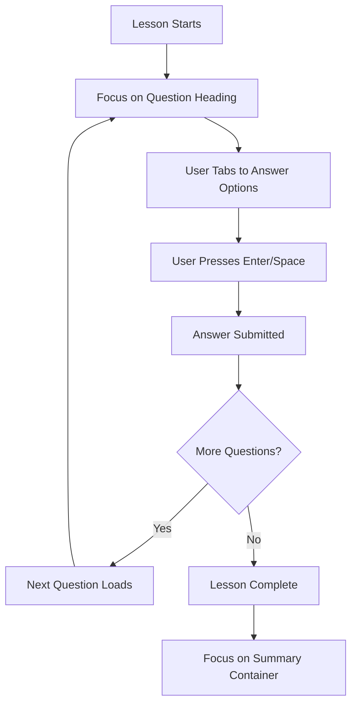
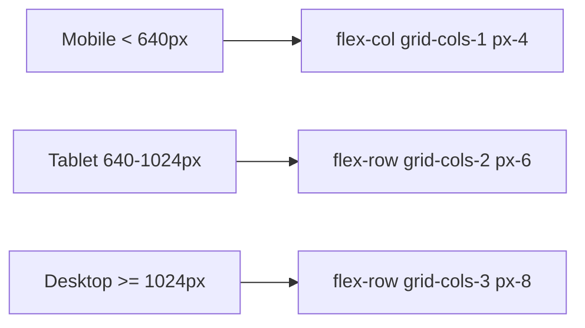

# Accessibility and Responsive Layout Implementation Plan

## Overview

This plan outlines the implementation of accessibility (a11y) improvements, responsive layout adjustments, and automated tests for key LessonArcade pages and components, along with a Voice Demo overview document.

## Scope

### Key Pages and Components

| Route | Page | Main Components |
|--------|-------|-----------------|
| `/` | Home | Navigation, HeroSection, PillarsSection |
| `/demo` | Demo Lessons | DemoLessonGrid, BrandSwitcher |
| `/demo/lesson/[slug]` | Lesson Player | LessonPlayer, LessonSummary, LevelHeader, LevelSidebar, MultipleChoiceItem, OpenEndedItem, CheckpointItem |
| `/demo/voice/[slug]` | Voice Lesson | VoiceLessonPlayer, VoiceControlsMin |
| `/demo/voice-chat/[slug]` | Voice Chat | VoiceChatFlow, VoiceControlsMin |
| `/studio` | Lesson Studio | LessonStudioForm |

---

## Part 1: Semantic Structure and Landmarks

### 1.1 Ensure Single `<main>` Element Per Page

**Issue**: Some pages may have missing or multiple `<main>` elements.

**Files to Update**:

1. **[`app/page.tsx`](app/page.tsx:9)** - Already has `<main>`, verify structure
2. **[`app/demo/page.tsx`](app/demo/page.tsx)** - Add `<main>` wrapper
3. **[`app/studio/page.tsx`](app/studio/page.tsx)** - Add `<main>` wrapper
4. **[`app/demo/lesson/[slug]/page.tsx`](app/demo/lesson/[slug]/page.tsx)** - Add `<main>` wrapper
5. **[`app/demo/voice/[slug]/page.tsx`](app/demo/voice/[slug]/page.tsx)** - Add `<main>` wrapper
6. **[`app/demo/voice-chat/[slug]/page.tsx`](app/demo/voice-chat/[slug]/page.tsx)** - Add `<main>` wrapper

**Implementation Pattern**:
```tsx
// Wrap main content in <main> with appropriate aria-label if needed
<main aria-label={ariaLabel || undefined}>
  {/* Main content */}
</main>
```

### 1.2 Ensure Proper Heading Hierarchy

**Requirements**:
- Single `<h1>` per page describing the page
- Use `<h2>` for major sections
- Use `<h3>` for subsections

**Files to Update**:

| File | Current Heading Structure | Changes Needed |
|-------|------------------------|----------------|
| [`app/demo/page.tsx`](app/demo/page.tsx:31) | Has `<h1>` at line 31, `<h2>` at line 70 | Verify hierarchy is correct |
| [`app/studio/page.tsx`](app/studio/page.tsx:17) | Has `<h1>` at line 17 | Verify hierarchy is correct |
| [`components/lesson/level-header.tsx`](components/lesson/level-header.tsx:49) | Has `<h1>` at line 49 | Change to `<h2>` (level title is not page title) |
| [`components/lesson/level-sidebar.tsx`](components/lesson/level-sidebar.tsx:41) | Has `<h2>` at line 41 | Verify hierarchy is correct |
| [`components/lesson/lesson-summary.tsx`](components/lesson/lesson-summary.tsx:85) | Has `<h3>` at line 85 | Verify hierarchy is correct |
| [`components/lesson/voice-lesson-player.tsx`](components/lesson/voice-lesson-player.tsx:1087) | Has `<h2>` at line 1087 | Verify hierarchy is correct |
| [`components/lesson/voice-chat-flow.tsx`](components/lesson/voice-chat-flow.tsx:85) | Has `<h2>` at line 85 | Verify hierarchy is correct |

### 1.3 Use Semantic Elements for Interactive Controls

**Files to Update**:

1. **[`components/lesson/level-sidebar.tsx`](components/lesson/level-sidebar.tsx:48)** - Already uses `<button>` ✅
2. **[`components/lesson/voice-lesson-player.tsx`](components/lesson/voice-lesson-player.tsx:1097)** - Uses `<div>` with onClick, change to `<button>`
3. **[`components/lesson/voice-lesson-player.tsx`](components/lesson/voice-lesson-player.tsx:1116)** - Uses `<div>` with onClick, change to `<button>`

**Implementation Pattern**:
```tsx
// Change from:
<div onClick={() => {...}} className="...">

// To:
<button onClick={() => {...}} className="..." type="button">
```

### 1.4 Add ARIA Attributes for Repeated Components

**Score Updates and Feedback**:

Add `role="status"` and `aria-live="polite"` to:

1. **[`components/lesson/lesson-summary.tsx`](components/lesson/lesson-summary.tsx)** - Score cards and progress indicators
2. **[`components/lesson/level-header.tsx`](components/lesson/level-header.tsx:127)** - LevelStats component

**Question-Answer Connection**:

Add `aria-describedby` to connect question text with answer options:

1. **[`components/lesson/items/multiple-choice-item.tsx`](components/lesson/items/multiple-choice-item.tsx:113)** - Add id to question `<h3>`, add `aria-describedby` to options container
2. **[`components/lesson/items/open-ended-item.tsx`](components/lesson/items/open-ended-item.tsx:61)** - Add id to question `<h3>`, add `aria-describedby` to textarea

**Implementation Pattern**:
```tsx
<h3 id="question-{item.id}">{prompt}</h3>
<div aria-describedby="question-{item.id}">
  {/* Answer options */}
</div>
```

### 1.5 Add Accessible Labels for Form Fields and Toggles

**Files to Update**:

1. **[`components/ui/language-toggle.tsx`](components/ui/language-toggle.tsx)** - Verify has `aria-label`
2. **[`components/studio/lesson-studio-form.tsx`](components/studio/lesson-studio-form.tsx)** - Verify all inputs have labels
3. **[`components/lesson/voice-lesson-player.tsx`](components/lesson/voice-lesson-player.tsx:1065)** - Speed slider needs `aria-label`
4. **[`components/lesson/voice-lesson-player.tsx`](components/lesson/voice-lesson-player.tsx:910)** - Voice preset select needs `aria-label`
5. **[`components/lesson/voice-controls-min.tsx`](components/lesson/voice-controls-min.tsx)** - Verify all controls have labels

**Implementation Pattern**:
```tsx
<input
  type="range"
  aria-label="Speech rate"
  aria-valuemin="0.8"
  aria-valuemax="1.2"
  aria-valuenow={speechRate}
  value={speechRate}
  onChange={(e) => setSpeechRate(parseFloat(e.target.value))}
/>
```

### 1.6 Announce State Changes (aria-pressed, aria-checked, aria-disabled)

**Files to Update**:

1. **[`components/lesson/lesson-summary.tsx`](components/lesson/lesson-summary.tsx:452)** - Mode toggle buttons need `aria-pressed`
2. **[`components/lesson/level-sidebar.tsx`](components/lesson/level-sidebar.tsx:48)** - Level buttons need `aria-pressed` or `aria-current`
3. **[`components/lesson/voice-lesson-player.tsx`](components/lesson/voice-lesson-player.tsx:892)** - Voice preset buttons need `aria-pressed`
4. **[`components/lesson/voice-lesson-player.tsx`](components/lesson/voice-lesson-player.tsx:951)** - Engine toggle buttons need `aria-pressed`

**Implementation Pattern**:
```tsx
<button
  aria-pressed={isActive}
  aria-disabled={isDisabled}
  onClick={...}
>
```

---

## Part 2: Keyboard Navigation and Focus Management

### 2.1 Ensure Proper Tab Order

**Tab Order Requirements**:
- Question heading → answer options → primary action buttons
- Visual reading order should match tab order

**Files to Update**:

1. **[`components/lesson/lesson-player.tsx`](components/lesson/lesson-player.tsx)** - Verify tab order in main content area
2. **[`components/lesson/items/multiple-choice-item.tsx`](components/lesson/items/multiple-choice-item.tsx:184)** - Option buttons should be focusable ✅ (already `<button>`)
3. **[`components/lesson/voice-chat-flow.tsx`](components/lesson/voice-chat-flow.tsx:309)** - Option buttons ✅ (already `<button>`)

### 2.2 Enable Enter and Space for Primary Actions

**Files to Update**:

1. **[`components/lesson/level-sidebar.tsx`](components/lesson/level-sidebar.tsx:48)** - Button element handles Enter/Space automatically ✅
2. **[`components/lesson/voice-lesson-player.tsx`](components/lesson/voice-lesson-player.tsx:1097)** - After converting to `<button>`, will handle Enter/Space
3. **[`components/lesson/voice-lesson-player.tsx`](components/lesson/voice-lesson-player.tsx:1116)** - After converting to `<button>`, will handle Enter/Space

### 2.3 Focus Management on Question Load

**Requirements**:
- When a new question/level is loaded, move focus to the question heading or container
- When a lesson is completed, move focus to the summary heading or container

**Files to Update**:

1. **[`components/lesson/lesson-player.tsx`](components/lesson/lesson-player.tsx)** - Add focus management on level change
2. **[`components/lesson/voice-lesson-player.tsx`](components/lesson/voice-lesson-player.tsx)** - Add focus management on item change
3. **[`components/lesson/voice-chat-flow.tsx`](components/lesson/voice-chat-flow.tsx)** - Add focus management on step change

**Implementation Pattern**:
```tsx
import { useRef, useEffect } from 'react'

// Add ref to question container
const questionRef = useRef<HTMLDivElement>(null)

// Focus on level/item change
useEffect(() => {
  if (questionRef.current) {
    questionRef.current.focus()
  }
}, [currentLevelIndex, currentItemIndex])

// In JSX:
<div ref={questionRef} tabIndex={-1} aria-label={ariaLabel}>
```

### 2.4 Visible Focus Styles

**Requirements**:
- All interactive elements should show clear focus outline
- Use Tailwind classes (ring, outline) that respect design tokens

**Files to Update**:

1. **[`components/ui/button.tsx`](components/ui/button.tsx)** - Verify focus-visible styles
2. **[`components/lesson/level-sidebar.tsx`](components/lesson/level-sidebar.tsx:54)** - Already has `focus-visible:outline-none focus-visible:ring-2` ✅
3. **[`components/lesson/items/multiple-choice-item.tsx`](components/lesson/items/multiple-choice-item.tsx:190)** - Already has `focus-visible:outline-none focus-visible:ring-2` ✅
4. **[`components/lesson/voice-chat-flow.tsx`](components/lesson/voice-chat-flow.tsx:312)** - Add focus-visible styles to option buttons
5. **[`components/lesson/voice-lesson-player.tsx`](components/lesson/voice-lesson-player.tsx:1097)** - Add focus-visible styles after converting to `<button>`
6. **[`components/lesson/voice-lesson-player.tsx`](components/lesson/voice-lesson-player.tsx:1116)** - Add focus-visible styles after converting to `<button>`

**Implementation Pattern**:
```tsx
className="... focus-visible:outline-none focus-visible:ring-2 focus-visible:ring-la-accent/50 focus-visible:ring-offset-2 focus-visible:ring-offset-la-surface"
```

---

## Part 3: Responsive Layout Improvements

### 3.1 Small Screen (360x640) Layout Fixes

**Files to Update**:

1. **[`app/demo/page.tsx`](app/demo/page.tsx:28)** - Header section
2. **[`components/lesson/lesson-player.tsx`](components/lesson/lesson-player.tsx:322)** - Main layout (sidebar + content)
3. **[`components/lesson/level-header.tsx`](components/lesson/level-header.tsx:43)** - Level header card
4. **[`components/lesson/lesson-summary.tsx`](components/lesson/lesson-summary.tsx:152)** - Score cards grid
5. **[`components/lesson/voice-lesson-player.tsx`](components/lesson/voice-lesson-player.tsx:1083)** - Voice lesson layout
6. **[`components/lesson/voice-chat-flow.tsx`](components/lesson/voice-chat-flow.tsx:232)** - Voice chat layout
7. **[`components/lesson/voice-controls-min.tsx`](components/lesson/voice-controls-min.tsx:587)** - Voice controls toolbar

**Specific Fixes**:

#### Lesson Header (Title, Score, Mode)
**File**: [`components/lesson/lesson-player.tsx`](components/lesson/lesson-player.tsx:345)

Current:
```tsx
<div className="flex flex-col sm:flex-row justify-between items-start sm:items-center gap-4">
```

Ensure:
- Text doesn't overflow on 360px width
- Score summary is readable
- Mode toggle is accessible

#### Question and Answers
**File**: [`components/lesson/items/multiple-choice-item.tsx`](components/lesson/items/multiple-choice-item.tsx:106)

Ensure:
- Question text doesn't overflow or require horizontal scroll
- Answer options are stacked vertically on small screens
- Buttons have minimum 44px touch targets

#### Voice Controls Toolbar
**File**: [`components/lesson/voice-controls-min.tsx`](components/lesson/voice-controls-min.tsx:589)

Current:
```tsx
<div className="flex flex-wrap items-center gap-3">
```

Ensure:
- Controls stay within viewport width
- Touch targets are large enough (minimum 44x44px)
- Status text is readable

### 3.2 Responsive Class Patterns

**Use Tailwind Responsive Classes**:

| Pattern | Mobile (<640px) | Tablet (640px+) | Desktop (1024px+) |
|---------|-------------------|-------------------|---------------------|
| Layout | `flex-col` | `flex-row` | `flex-row` |
| Grid | `grid-cols-1` | `grid-cols-2` | `grid-cols-3` |
| Padding | `px-4` | `px-6` | `px-8` |
| Text | `text-sm` | `text-base` | `text-lg` |
| Gap | `gap-2` | `gap-4` | `gap-6` |

### 3.3 Specific Responsive Updates

**Lesson Summary Score Cards** - [`components/lesson/lesson-summary.tsx`](components/lesson/lesson-summary.tsx:152)

Current:
```tsx
<div className="grid grid-cols-1 md:grid-cols-3 gap-4">
```

Verify this works correctly on small screens. Consider:
- Using `grid-cols-1 sm:grid-cols-2 lg:grid-cols-3` for better tablet support

**Voice Lesson Sidebar** - [`components/lesson/voice-lesson-player.tsx`](components/lesson/voice-lesson-player.tsx:1084)

Current:
```tsx
<div className="w-full lg:w-80 lg:min-h-screen lg:sticky lg:top-0 border-r border-la-border/20 bg-la-bg/50 p-4">
```

This is already responsive ✅

**Voice Chat Layout** - [`components/lesson/voice-chat-flow.tsx`](components/lesson/voice-chat-flow.tsx:232)

Current:
```tsx
<div className="max-w-4xl mx-auto px-4 py-6 space-y-6">
```

Verify chat messages and controls are usable on 360px width.

---

## Part 4: Automated Tests

### 4.1 React Testing Library Unit Tests

**New Test File**: `test/a11y/accessibility-attributes.test.tsx`

**Tests to Add**:

```tsx
describe('Accessibility Attributes', () => {
  describe('MultipleChoiceItem', () => {
    it('has proper heading hierarchy with question id', async () => {
      // Test that h3 has id and aria-describedby connects to options
    })

    it('announces score updates with aria-live', async () => {
      // Test that feedback regions have aria-live="polite"
    })

    it('has accessible labels on interactive elements', async () => {
      // Test buttons have aria-label or visible text
    })
  })

  describe('LessonSummary', () => {
    it('has role="status" on score updates', async () => {
      // Test score cards announce changes
    })

    it('has aria-pressed on mode toggle buttons', async () => {
      // Test mode buttons announce pressed state
    })
  })

  describe('VoiceControlsMin', () => {
    it('has aria-label on slider controls', async () => {
      // Test speed slider has proper label
    })

    it('has aria-pressed on preset buttons', async () => {
      // Test preset buttons announce pressed state
    })
  })
})
```

### 4.2 Playwright E2E Tests

**New Test File**: `e2e/accessibility-and-layout.spec.ts`

#### Test 1: Keyboard-Only Lesson Flow

```typescript
test('keyboard-only navigation through lesson', async ({ page }) => {
  // Visit lesson page
  await page.goto('/demo/lesson/react-hooks-intro')

  // Focus should be on the first question
  await expect(page.locator('h1, h2').first()).toBeFocused()

  // Tab to first answer option
  await page.keyboard.press('Tab')
  const firstOption = page.locator('button').filter({ hasText: /^[A-D]/ }).first()
  await expect(firstOption).toBeFocused()

  // Select answer with Enter
  await page.keyboard.press('Enter')

  // Wait for feedback
  await expect(page.locator('text=/Correct|Incorrect/')).toBeVisible()

  // Tab to next button or navigate
  await page.keyboard.press('Tab')

  // Navigate through lesson...
  // When lesson completes, focus should be on summary
  await expect(page.locator('text=/Lesson Complete|Summary/').toBeFocused()
})
```

#### Test 2: Mobile Viewport Layout Checks

```typescript
test('lesson layout on mobile viewport', async ({ page }) => {
  // Set mobile viewport
  await page.setViewportSize({ width: 360, height: 640 })

  // Visit lesson page
  await page.goto('/demo/lesson/react-hooks-intro')

  // Question text should be visible
  const questionText = page.locator('h3').first()
  await expect(questionText).toBeVisible()
  await expect(questionText).not.toHaveCSS('overflow', 'hidden')

  // Primary buttons should be visible and not clipped
  const primaryButton = page.locator('button').filter({ hasText: /Submit|Check|Next/ }).first()
  await expect(primaryButton).toBeVisible()

  // Verify button is not off-screen
  const buttonBox = await primaryButton.boundingBox()
  expect(buttonBox?.y).toBeLessThan(640) // Not below viewport
  expect(buttonBox?.x).toBeGreaterThanOrEqual(0) // Not off left edge
  expect(buttonBox?.x).toBeLessThan(360) // Not off right edge
})

test('voice lesson layout on mobile viewport', async ({ page }) => {
  // Set mobile viewport
  await page.setViewportSize({ width: 360, height: 640 })

  // Visit voice lesson page
  await page.goto('/demo/voice/effective-meetings')

  // Voice controls should be visible
  const voiceControls = page.locator('text=/Play|Pause|Stop/')
  await expect(voiceControls).toBeVisible()

  // Controls should stay within viewport
  const controlsBox = await voiceControls.boundingBox()
  expect(controlsBox?.y).toBeLessThan(640)
  expect(controlsBox?.x).toBeGreaterThanOrEqual(0)
  expect(controlsBox?.x).toBeLessThan(360)
})
```

#### Test 3: Focus Management Assertions

```typescript
test('focus moves to question on level change', async ({ page }) => {
  await page.goto('/demo/lesson/react-hooks-intro')

  // Get initial focus
  let focusedElement = await page.evaluate(() => document.activeElement?.tagName)
  expect(focusedElement).toMatch(/H[1-6]|DIV|BUTTON/)

  // Navigate to next level (click level in sidebar)
  await page.locator('text=/Level 2/').click()

  // Focus should have moved
  focusedElement = await page.evaluate(() => document.activeElement?.tagName)
  expect(focusedElement).toBeTruthy()
})
```

### 4.3 Update Playwright Config

**File**: [`playwright.config.ts`](playwright.config.ts)

Add mobile viewport project for testing:

```typescript
{
  name: 'Mobile Chrome',
  use: { ...devices['Pixel 5'], viewport: { width: 360, height: 640 } },
},
```

---

## Part 5: Voice Demo Overview Document

### 5.1 Create New Document

**New File**: `docs/voice-demo-overview.md`

**Content** (as specified in requirements):

```markdown
## Voice Demo Overview

LessonArcade includes a production-ready Voice Demo that turns any JSON lesson into a narrated, interactive experience. The system streams TTS narration, inserts checks for understanding after each key concept, and records telemetry for every playback and interaction.

There are two primary flows:

- `/demo/voice/effective-meetings` – a linear, lesson-style walkthrough where the voice coach guides the learner step by step.
- `/demo/voice-chat/effective-meetings` – a chat-style conversational flow that uses the same lesson data but feels more like talking to a tutor.

The demo can be deployed as a standalone Cloud Run service following `docs/voice-demo-playbook.md`. Once deployed, teams can record the stable public URL in `voice-demo-url.txt` (see `voice-demo-url.example`) and share it with reviewers, demo participants, or internal stakeholders.
```

### 5.2 Update README

**File**: [`README.md`](README.md:19)

Add reference to new overview document in Voice Demo section:

```markdown
## Voice Demo

LessonArcade ships with a production-ready Voice Demo that turns any JSON lesson into a narrated, interactive experience. The demo showcases TTS-based narration, step-by-step checks for understanding, and telemetry capture for every playback and interaction. There are two primary flows you can try after deployment:

- `/demo/voice/effective-meetings` – linear, lesson-style voice walkthrough
- `/demo/voice-chat/effective-meetings` – chat-style, conversational flow built on the same lesson data

For deployment and health checks, see `docs/voice-demo-playbook.md`. Once you have a stable public URL, you can record it in `voice-demo-url.txt` (see `voice-demo-url.example`) and share it with reviewers, demo participants, or internal stakeholders.

For a short, copy-paste friendly overview of the Voice Demo suitable for proposals and slide decks, see `docs/voice-demo-overview.md`.
```

---

## Implementation Order

### Phase 1: Semantic Structure (Priority 1)
1. Add `<main>` elements to all pages
2. Fix heading hierarchy (h1 → h2 → h3)
3. Convert `<div>` with onClick to `<button>` elements
4. Add ARIA attributes for repeated components

### Phase 2: Focus Management (Priority 1)
1. Add focus management on level/item change
2. Ensure proper tab order
3. Add visible focus styles

### Phase 3: Responsive Layout (Priority 2)
1. Fix small screen layouts (360x640)
2. Ensure touch targets are 44x44px minimum
3. Add responsive classes where needed

### Phase 4: Tests (Priority 2)
1. Create unit tests for accessibility attributes
2. Create E2E tests for keyboard navigation
3. Create E2E tests for mobile viewport

### Phase 5: Documentation (Priority 3)
1. Create `docs/voice-demo-overview.md`
2. Update README with reference

---

## Quality Gate

After implementation, run:

```bash
pnpm lint
pnpm test
pnpm test:e2e:ci
pnpm test:smoke
```

All commands must succeed before considering the task complete.

---

## Summary of Changes

### Files to Modify

| Category | Files |
|-----------|--------|
| **Pages** | `app/page.tsx`, `app/demo/page.tsx`, `app/studio/page.tsx`, `app/demo/lesson/[slug]/page.tsx`, `app/demo/voice/[slug]/page.tsx`, `app/demo/voice-chat/[slug]/page.tsx` |
| **Components** | `components/lesson/lesson-player.tsx`, `components/lesson/lesson-summary.tsx`, `components/lesson/level-header.tsx`, `components/lesson/level-sidebar.tsx`, `components/lesson/voice-lesson-player.tsx`, `components/lesson/voice-chat-flow.tsx`, `components/lesson/voice-controls-min.tsx`, `components/lesson/items/multiple-choice-item.tsx`, `components/lesson/items/open-ended-item.tsx`, `components/lesson/items/checkpoint-item.tsx` |
| **UI Components** | `components/ui/button.tsx`, `components/ui/language-toggle.tsx` |
| **Tests** | `test/a11y/accessibility-attributes.test.tsx` (new), `e2e/accessibility-and-layout.spec.ts` (new) |
| **Config** | `playwright.config.ts` |
| **Documentation** | `README.md`, `docs/voice-demo-overview.md` (new) |

### Non-Goals (Explicitly Out of Scope)

- No new heavy a11y library dependencies
- No full UI redesign
- No changes to core lesson, voice, or studio business logic

---

## Notes for Implementation

1. **Focus Management**: Use `useRef` and `useEffect` with `tabIndex={-1}` on container divs to manage focus programmatically
2. **ARIA Live Regions**: Use `aria-live="polite"` for score updates and `aria-live="assertive"` for critical errors
3. **Touch Targets**: Ensure minimum 44x44px for all interactive elements on mobile
4. **Color Contrast**: Verify all text meets WCAG AA contrast ratios (4.5:1 for normal text, 3:1 for large text)
5. **Screen Reader Testing**: After implementation, test with NVDA (Windows) or VoiceOver (macOS) to verify announcements

---

## Mermaid Diagram: Focus Management Flow



---

## Mermaid Diagram: Responsive Layout Breakpoints


