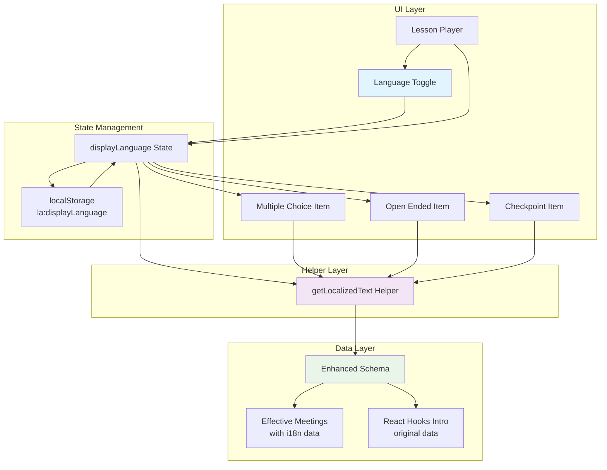
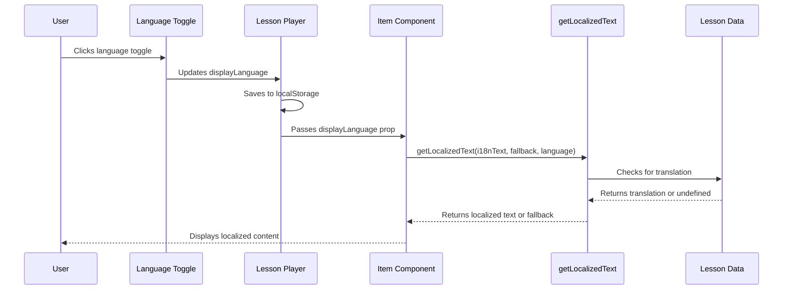
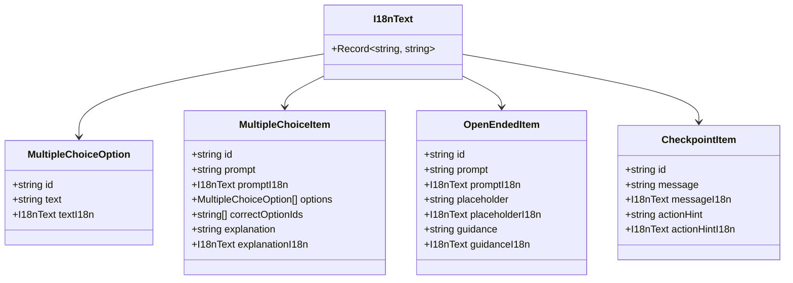

# Bilingual Feature Architecture Diagram

## System Architecture



## Data Flow for Text Localization



## Schema Extension Structure



## Component Hierarchy with Language Support

```mermaid
graph TD
    LP[Lesson Player] --> LT[Language Toggle]
    LP --> LS[Lesson Summary]
    LP --> LH[Level Header]
    LP --> IC[Item Container]
    
    IC --> MCI[Multiple Choice Item]
    IC --> OEI[Open Ended Item]
    IC --> CPI[Checkpoint Item]
    
    LP -.->|displayLanguage| MCI
    LP -.->|displayLanguage| OEI
    LP -.->|displayLanguage| CPI
    
    MCI --> GT[getLocalizedText]
    OEI --> GT
    CPI --> GT
    
    style LP fill:#e3f2fd
    style LT fill:#fff3e0
    style GT fill:#f1f8e9