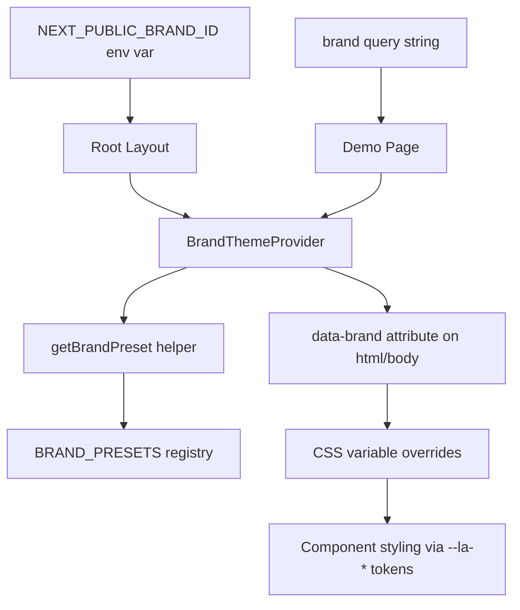

# Brand & Theme System Implementation Plan

## Overview

This plan outlines the implementation of a simple, robust brand/theme system for LessonArcade that allows different deployments to have their own logo/title and color palette.

## Architecture



## Design Tokens (Current Default)

The current design tokens in [`app/globals.css`](../app/globals.css) define the default brand:

| Token | Value | Description |
|-------|-------|-------------|
| `--la-bg` | `#1e293b` | Deep blue-slate background |
| `--la-surface` | `#f8fafc` | Soft neutral surface |
| `--la-primary` | `#6366f1` | Violet/indigo primary |
| `--la-accent` | `#14b8a6` | Teal/aqua accent |
| `--la-muted` | `#64748b` | Muted gray |
| `--la-border` | `#e2e8f0` | Light border |

## Implementation Steps

### 1. Brand Preset Model

**File:** [`lib/branding/brandPresets.ts`](../lib/branding/brandPresets.ts)

Define the brand preset types and registry:

```typescript
export type BrandId = "lessonarcade-default" | "warm-paper" | "night-classroom";

export interface BrandPreset {
  id: BrandId;
  label: string;
  description: string;
  logoText: string;
  primaryColor: string;
  accentColor: string;
  surfaceColor: string;
  backgroundColor: string;
}

export const BRAND_PRESETS: Record<BrandId, BrandPreset> = {
  "lessonarcade-default": {
    id: "lessonarcade-default",
    label: "LessonArcade Default",
    description: "The original LessonArcade design with deep blue-slate background",
    logoText: "LessonArcade",
    primaryColor: "#6366f1",
    accentColor: "#14b8a6",
    surfaceColor: "#f8fafc",
    backgroundColor: "#1e293b",
  },
  "warm-paper": {
    id: "warm-paper",
    label: "Warm Paper",
    description: "A lighter, paper-like warm palette",
    logoText: "LessonArcade",
    primaryColor: "#d97706", // Amber
    accentColor: "#059669", // Emerald
    surfaceColor: "#fef3c7", // Warm amber-100
    backgroundColor: "#fffbeb", // Amber-50
  },
  "night-classroom": {
    id: "night-classroom",
    label: "Night Classroom",
    description: "A darker, more cinematic palette",
    logoText: "LessonArcade",
    primaryColor: "#8b5cf6", // Violet
    accentColor: "#f43f5e", // Rose
    surfaceColor: "#1e1b4b", // Indigo-950
    backgroundColor: "#0f172a", // Slate-900
  },
};

export function getBrandPreset(id?: string | null): BrandPreset {
  if (id && id in BRAND_PRESETS) {
    return BRAND_PRESETS[id as BrandId];
  }
  return BRAND_PRESETS["lessonarcade-default"];
}
```

### 2. CSS Variable Overrides

**File:** [`app/globals.css`](../app/globals.css)

Add brand-specific overrides using `[data-brand="..."]` selectors:

```css
/* Warm Paper Theme */
[data-brand="warm-paper"] {
  --la-bg: #fffbeb;
  --la-surface: #fef3c7;
  --la-primary: #d97706;
  --la-accent: #059669;
  --la-muted: #a16207;
  --la-border: #fde68a;
}

/* Night Classroom Theme */
[data-brand="night-classroom"] {
  --la-bg: #0f172a;
  --la-surface: #1e1b4b;
  --la-primary: #8b5cf6;
  --la-accent: #f43f5e;
  --la-muted: #64748b;
  --la-border: #334155;
}
```

### 3. Brand Theme Provider

**File:** [`components/layout/BrandThemeProvider.tsx`](../components/layout/BrandThemeProvider.tsx)

A client component that sets the `data-brand` attribute:

```typescript
"use client";

import { useEffect } from "react";

interface BrandThemeProviderProps {
  brandId: string;
  children: React.ReactNode;
}

export function BrandThemeProvider({ brandId, children }: BrandThemeProviderProps) {
  useEffect(() => {
    document.documentElement.dataset.brand = brandId;
  }, [brandId]);

  return <>{children}</>;
}
```

### 4. Root Layout Integration

**File:** [`app/layout.tsx`](../app/layout.tsx)

Read brand from env var and use the provider:

```typescript
import { BrandThemeProvider } from "@/components/layout/BrandThemeProvider";
import { getBrandPreset } from "@/lib/branding/brandPresets";

// Get brand from env, default to lessonarcade-default
const brandId = process.env.NEXT_PUBLIC_BRAND_ID || "lessonarcade-default";
const brandPreset = getBrandPreset(brandId);

export default function RootLayout({ children }: { children: React.ReactNode }) {
  return (
    <html lang="en">
      <BrandThemeProvider brandId={brandPreset.id}>
        <body className={`${geistSans.variable} ${geistMono.variable} antialiased`}>
          {children}
        </body>
      </BrandThemeProvider>
    </html>
  );
}
```

### 5. Demo Page Brand Switcher

**File:** [`app/demo/page.tsx`](../app/demo/page.tsx)

Add a non-intrusive brand switcher (dev only):

```typescript
"use client";

import { useState, useEffect } from "react";
import { BRAND_PRESETS, getBrandPreset, type BrandId } from "@/lib/branding/brandPresets";

function BrandSwitcher() {
  const [brandId, setBrandId] = useState<BrandId>("lessonarcade-default");

  useEffect(() => {
    // Read from query param on mount
    const params = new URLSearchParams(window.location.search);
    const brand = params.get("brand");
    if (brand) {
      setBrandId(getBrandPreset(brand).id);
    }
  }, []);

  const handleChange = (e: React.ChangeEvent<HTMLSelectElement>) => {
    const newBrand = e.target.value as BrandId;
    setBrandId(newBrand);
    document.documentElement.dataset.brand = newBrand;

    // Update URL query param
    const url = new URL(window.location.href);
    url.searchParams.set("brand", newBrand);
    window.history.replaceState({}, "", url.toString());
  };

  if (process.env.NODE_ENV === "production") {
    return null;
  }

  return (
    <div className="fixed bottom-4 right-4 z-50 bg-la-surface border border-la-border rounded-lg p-3 shadow-lg">
      <label htmlFor="brand-select" className="block text-sm font-medium text-la-muted mb-1">
        Theme Preview
      </label>
      <select
        id="brand-select"
        value={brandId}
        onChange={handleChange}
        className="bg-la-bg text-la-surface text-sm rounded px-2 py-1 border border-la-border"
      >
        {Object.values(BRAND_PRESETS).map((preset) => (
          <option key={preset.id} value={preset.id}>
            {preset.label}
          </option>
        ))}
      </select>
    </div>
  );
}
```

### 6. Unit Tests

**File:** [`test/branding/brandPresets.test.ts`](../test/branding/brandPresets.test.ts)

```typescript
import { describe, it, expect } from 'vitest'
import { getBrandPreset, BRAND_PRESETS, type BrandId } from '@/lib/branding/brandPresets'

describe('getBrandPreset', () => {
  it('resolves known brand ids', () => {
    const defaultPreset = getBrandPreset('lessonarcade-default')
    expect(defaultPreset.id).toBe('lessonarcade-default')
    expect(defaultPreset.primaryColor).toBe('#6366f1')

    const warmPaper = getBrandPreset('warm-paper')
    expect(warmPaper.id).toBe('warm-paper')
    expect(warmPaper.primaryColor).toBe('#d97706')

    const nightClassroom = getBrandPreset('night-classroom')
    expect(nightClassroom.id).toBe('night-classroom')
    expect(nightClassroom.primaryColor).toBe('#8b5cf6')
  })

  it('falls back to lessonarcade-default for unknown strings', () => {
    const unknown = getBrandPreset('unknown-brand')
    expect(unknown.id).toBe('lessonarcade-default')
  })

  it('falls back to lessonarcade-default for undefined', () => {
    const undefinedPreset = getBrandPreset(undefined)
    expect(undefinedPreset.id).toBe('lessonarcade-default')
  })

  it('falls back to lessonarcade-default for null', () => {
    const nullPreset = getBrandPreset(null)
    expect(nullPreset.id).toBe('lessonarcade-default')
  })
})
```

### 7. E2E Tests

**File:** [`e2e/branding.spec.ts`](../e2e/branding.spec.ts)

```typescript
import { test, expect } from '@playwright/test';

test.describe('Branding System', () => {
  test('demo page loads with default brand', async ({ page }) => {
    await page.goto('/demo');

    const brandAttr = await page.locator('html').getAttribute('data-brand');
    expect(brandAttr).toBe('lessonarcade-default');
  });

  test('demo page loads with warm-paper brand from query', async ({ page }) => {
    await page.goto('/demo?brand=warm-paper');

    const brandAttr = await page.locator('html').getAttribute('data-brand');
    expect(brandAttr).toBe('warm-paper');
  });

  test('demo page loads with night-classroom brand from query', async ({ page }) => {
    await page.goto('/demo?brand=night-classroom');

    const brandAttr = await page.locator('html').getAttribute('data-brand');
    expect(brandAttr).toBe('night-classroom');
  });

  test('demo page falls back to default for unknown brand', async ({ page }) => {
    await page.goto('/demo?brand=unknown-brand');

    const brandAttr = await page.locator('html').getAttribute('data-brand');
    expect(brandAttr).toBe('lessonarcade-default');
  });

  test('brand switcher updates data-brand attribute', async ({ page }) => {
    await page.goto('/demo');

    // Find and interact with brand switcher
    const brandSelect = page.locator('#brand-select');
    await expect(brandSelect).toBeVisible();

    // Select warm-paper
    await brandSelect.selectOption('warm-paper');
    let brandAttr = await page.locator('html').getAttribute('data-brand');
    expect(brandAttr).toBe('warm-paper');

    // Select night-classroom
    await brandSelect.selectOption('night-classroom');
    brandAttr = await page.locator('html').getAttribute('data-brand');
    expect(brandAttr).toBe('night-classroom');
  });
});
```

## Environment Variable

Add to [`.env.example`](../.env.example):

```bash
# ============================================
# Branding Configuration
# ============================================

# Brand ID for this deployment
# Options: lessonarcade-default, warm-paper, night-classroom
NEXT_PUBLIC_BRAND_ID=
```

## Quality Gate

Run the following commands to ensure everything works:

1. `pnpm lint` - ESLint checks
2. `pnpm test` - Unit tests
3. `pnpm test:e2e:ci` - E2E tests (Chromium only)
4. `pnpm test:smoke` - Smoke tests

All must pass before committing.

## Summary

- **Brand presets** live in [`lib/branding/brandPresets.ts`](../lib/branding/brandPresets.ts) with three predefined themes
- **Root layout** reads `NEXT_PUBLIC_BRAND_ID` env var and uses `BrandThemeProvider` to set `data-brand`
- **CSS overrides** in [`app/globals.css`](../app/globals.css) use `[data-brand="..."]` selectors to override design tokens
- **E2E tests** verify the `data-brand` attribute is correctly set on the `<html>` element
- **Demo page** includes a dev-only brand switcher for easy preview
