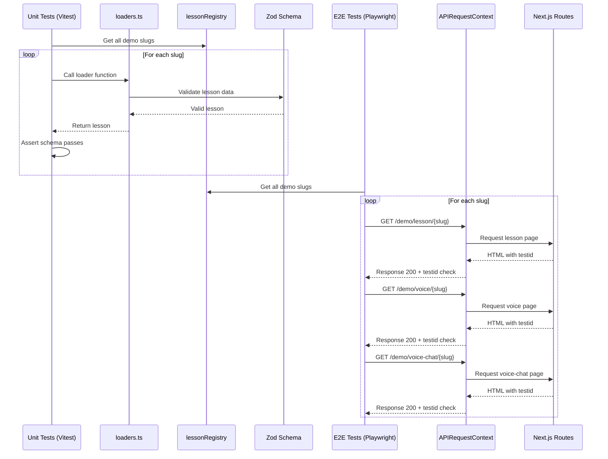

# Demo Lessons Expansion Plan

## Overview
Add 3 new high-quality demo lessons with bilingual I18nText support (EN + Traditional Chinese) and ensure they work across all three public routes (`/demo/lesson`, `/demo/voice`, `/demo/voice-chat`) with automated tests.

## New Demo Lessons

### 1. Decision-Making Under Uncertainty
- **Slug**: `decision-making-uncertainty`
- **File**: `data/demo-lessons/decision-making-uncertainty.json`
- **Learning Outcome**: Learn frameworks and techniques for making confident decisions when information is incomplete.
- **Tags**: decision-making, leadership, strategy, problem-solving, management
- **Estimated Duration**: 40 minutes
- **Levels** (3):
  - Level 1: Understanding Uncertainty Types
  - Level 2: Decision Frameworks
  - Level 3: Risk Assessment & Action

### 2. Giving Feedback That Lands
- **Slug**: `feedback-that-lands`
- **File**: `data/demo-lessons/feedback-that-lands.json`
- **Learning Outcome**: Master techniques for delivering feedback that is heard, understood, and acted upon.
- **Tags**: feedback, communication, leadership, management, soft-skills
- **Estimated Duration**: 35 minutes
- **Levels** (3):
  - Level 1: Preparing for Feedback Conversations
  - Level 2: Delivering Feedback Effectively
  - Level 3: Following Up and Ensuring Impact

### 3. Running Effective 1:1s
- **Slug**: `effective-one-on-ones`
- **File**: `data/demo-lessons/effective-one-on-ones.json`
- **Learning Outcome**: Transform one-on-one meetings into valuable touchpoints that build trust and drive growth.
- **Tags**: management, one-on-ones, leadership, coaching, team-management
- **Estimated Duration**: 30 minutes
- **Levels** (3):
  - Level 1: Purpose and Preparation
  - Level 2: Running the Conversation
  - Level 3: Follow-up and Growth Planning

## Lesson Structure Requirements

Each lesson must include:
- **Bilingual I18nText**: All text fields should have `textI18n` with `{"zh": "Traditional Chinese"}` translations
- **Multiple Levels**: 3 levels with clear progression
- **Mixed Item Types**:
  - `multiple_choice`: At least 3 per lesson
  - `open_ended`: At least 2 per lesson
  - `checkpoint`: At least 1 per level
- **Key Points**: 4-5 bullet points per level
- **Video**: YouTube video with appropriate time ranges

## Implementation Steps

### Step 1: Create Demo Lesson JSON Files
Create 3 new JSON files in `data/demo-lessons/`:
- `decision-making-uncertainty.json`
- `feedback-that-lands.json`
- `effective-one-on-ones.json`

Each file must pass the Zod schema validation in [`lib/lessonarcade/schema.ts`](lib/lessonarcade/schema.ts).

### Step 2: Update Loaders Registry
Modify [`lib/lessonarcade/loaders.ts`](lib/lessonarcade/loaders.ts):
1. Import the 3 new lesson JSON files
2. Create loader functions for each (following pattern of existing loaders)
3. Add to `lessonRegistry` object
4. Add to `getDemoLessonSummaries()` function

### Step 3: Add Unit Tests
Create `test/demo/demo-lessons-validation.test.ts`:
- Iterate through all demo slugs in `lessonRegistry`
- Call each loader function
- Assert the result passes Zod schema validation
- This prevents broken demo content from shipping

### Step 4: Add E2E Tests
Create `e2e/demo-lessons-coverage.spec.ts`:
- Use Playwright's `APIRequestContext` for fast, deterministic testing
- For each slug in `lessonRegistry`:
  1. GET `/demo/lesson/{slug}` → expect 200 + `data-testid="la-lesson-page"`
  2. GET `/demo/voice/{slug}` → expect 200 + `data-testid="la-voice-page"`
  3. GET `/demo/voice-chat/{slug}` → expect 200 + `data-testid="la-voice-chat-page"`
- Do NOT trigger audio
- Do NOT rely on visible text assertions

### Step 5: Quality Gates
Run and verify all quality checks pass:
```bash
pnpm lint
pnpm test
pnpm build
pnpm presskit:check
pnpm test:e2e:ci
```

### Step 6: Commit and Push
Commit directly to main (no PR/MR required).

## Reserved Slugs (to avoid collision)
Existing demo slugs:
- `react-hooks-intro`
- `effective-meetings`
- `design-feedback-basics`

New slugs must be unique and SEO-friendly:
- `decision-making-uncertainty`
- `feedback-that-lands`
- `effective-one-on-ones`

## Data Test IDs (for E2E tests)
- `/demo/lesson/{slug}` → `data-testid="la-lesson-page"`
- `/demo/voice/{slug}` → `data-testid="la-voice-page"`
- `/demo/voice-chat/{slug}` → `data-testid="la-voice-chat-page"`

## Architecture Diagram

```mermaid
graph TB
    subgraph Demo Lessons Data
        A1[decision-making-uncertainty.json]
        A2[feedback-that-lands.json]
        A3[effective-one-on-ones.json]
        B1[react-hooks-intro.json]
        B2[effective-meetings.json]
        B3[design-feedback-basics.json]
    end

    subgraph Loaders Module
        C[lib/lessonarcade/loaders.ts]
        C1[loadDecisionMakingLesson]
        C2[loadFeedbackThatLandsLesson]
        C3[loadEffectiveOneOnOnesLesson]
        C4[lessonRegistry]
        C5[getDemoLessonSummaries]
    end

    subgraph API Routes
        D1[/demo/lesson/{slug}/]
        D2[/demo/voice/{slug}/]
        D3[/demo/voice-chat/{slug}/]
        D4[/demo/]
    end

    subgraph Tests
        E1[Unit Tests - Schema Validation]
        E2[E2E Tests - Route Coverage]
    end

    A1 --> C1
    A2 --> C2
    A3 --> C3
    B1 --> C
    B2 --> C
    B3 --> C

    C1 --> C4
    C2 --> C4
    C3 --> C4

    C4 --> C5
    C5 --> D4

    C4 --> D1
    C4 --> D2
    C4 --> D3

    C4 --> E1
    D1 --> E2
    D2 --> E2
    D3 --> E2
```

## Test Flow Diagram


