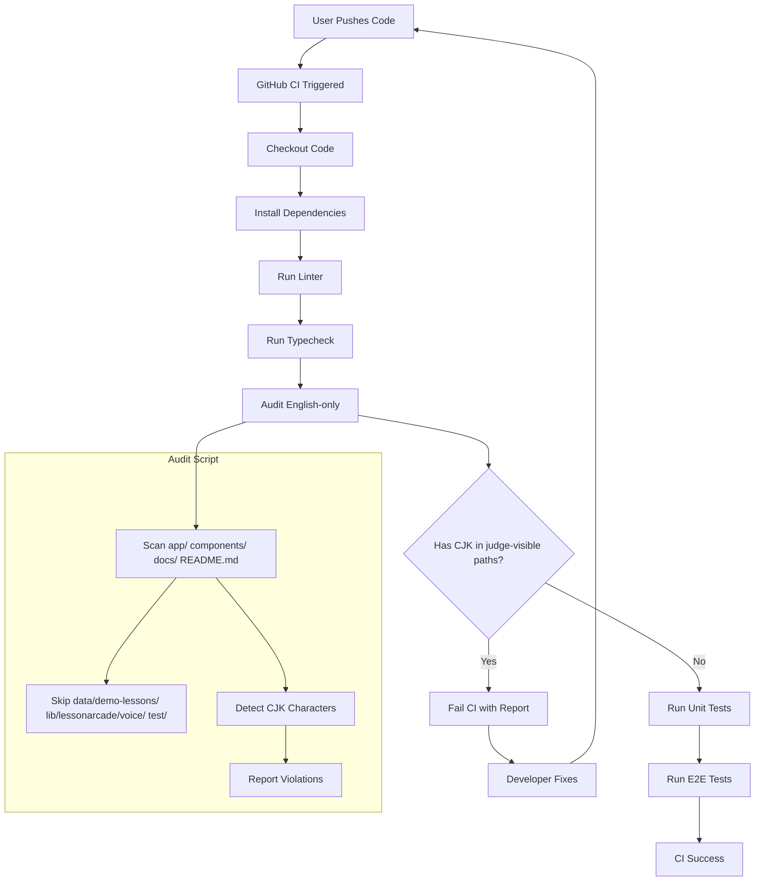

# English Audit and Guardrails Implementation Plan

## Overview
This plan implements a 3-step process to audit non-English text, create an automated guard to prevent regression, and wire it into CI.

## Step 1: Audit and Replace Non-English User-Facing Text

### 1.1 Files Requiring Changes

#### 1.1.1 `components/ui/language-toggle.tsx` (Line 21)
**Current:** `{ code: 'zh' as LanguageCode, label: '中文', flag: '🇨🇳' }`
**Change:** Replace `label: '中文'` with `label: 'ZH'`
**Reason:** This is user-facing UI text in the language toggle component that judges will see.

#### 1.1.2 `lib/lessonarcade/voice/preset-registry.ts` (Lines 54-60)
**Current:**
```typescript
const roleLabels: Record<string, string> = {
  'INSTRUCTOR': '講師',
  'NARRATOR': '旁白',
  'TEACHER': '教師',
  'STORYTELLER': '故事講述者'
}
label = `中文${roleLabels[role.toUpperCase()] || role}`
```
**Change:** Replace Chinese role labels with English:
```typescript
const roleLabels: Record<string, string> = {
  'INSTRUCTOR': 'Instructor',
  'NARRATOR': 'Narrator',
  'TEACHER': 'Teacher',
  'STORYTELLER': 'Storyteller'
}
label = `${languageCode === 'en' ? 'English' : 'Chinese'} ${roleLabels[role.toUpperCase()] || role}`
```
**Reason:** These labels are returned by `getAvailablePresets()` which is used for client UI.

### 1.2 Files NOT Requiring Changes (Allowed Bilingual Content)

#### 1.2.1 `lib/lessonarcade/voice/build-script.ts` (Lines 50, 68, 92)
**Status:** Keep as-is
**Reason:** These are conditional strings for voice narration used only when `displayLanguage === 'zh'`. They have English defaults via ternary operators and are not shown in the default/judge UI path.

#### 1.2.2 `data/demo-lessons/` (All lesson JSON files)
**Status:** Keep as-is
**Reason:** Bilingual lesson content with i18n fields and English defaults. Explicitly allowed by task requirements.

#### 1.2.3 `test/` (All test files)
**Status:** Keep as-is
**Reason:** Test data for bilingual functionality. Not user-facing.

## Step 2: Create Automated Guard Script

### 2.1 Create `scripts/audit-english.ts`

**Purpose:** Scan relevant text files for CJK characters and fail with a concise report.

**Key Features:**
- CJK character detection using Unicode ranges
- Allowlist for directories with expected bilingual content
- Scan directories: `app/`, `components/`, `docs/`, `README.md`
- Allowlist directories: `data/demo-lessons/`, `lib/lessonarcade/voice/`, `test/`
- Output format: File path + line number + matched snippet
- Exit code 1 on failure, 0 on success

**CJK Unicode Ranges:**
- CJK Unified Ideographs: `[\u4e00-\u9fff]`
- CJK Extension A: `[\u3400-\u4dbf]`
- CJK Extension B: `[\u20000-\u2a6df]`
- Hangul: `[\uac00-\ud7af]`
- Hiragana: `[\u3040-\u309f]`
- Katakana: `[\u30a0-\u30ff]`

**Implementation Approach:**
```typescript
// Scan files recursively in target directories
// For each file, read line by line
// Check each line for CJK characters using regex
// Skip files in allowlist directories
// Report violations with file:line:snippet format
```

### 2.2 Update `package.json`

**Add script:**
```json
"audit:english": "tsx scripts/audit-english.ts"
```

**Note:** Using `tsx` as the TypeScript runner (faster than ts-node, no additional dependency needed if already available).

### 2.3 Create Unit Tests

**File:** `test/scripts/audit-english.test.ts`

**Test Cases:**
1. **Pass on allowed paths** - Verify script passes when CJK is found in `data/demo-lessons/`
2. **Fail on disallowed path with CJK** - Verify script fails when CJK is found in `app/` or `components/`
3. **Pass on English-only content** - Verify script passes when no CJK is found in scanned directories
4. **Report format** - Verify output includes file path, line number, and snippet

**Test Pattern:** Follow existing test pattern from `test/presskit/presskit.test.ts`

## Step 3: Wire into CI and Update Progress

### 3.1 Update `.github/workflows/ci.yml`

**Add step after typecheck:**
```yaml
- name: Audit English-only content
  run: pnpm audit:english
```

**Placement:** After "Run typecheck" step, before "Run unit tests" step.

### 3.2 Update `artifacts/progress.html`

**Mark as Done:**
- `la1-p0-04` (LA3-P0-04: Submission Documentation)
- `la1-p0-06` (assuming this exists in the file)
- `la1-p0-08` (this task)

**Note:** Need to verify the exact IDs in the progress.html file.

### 3.3 Run All Checks

**Commands:**
```bash
pnpm lint
pnpm typecheck
CI=1 pnpm test
pnpm test:e2e
```

**Success Criteria:** All checks pass with no errors.

### 3.4 Commit and Push

**If all green:**
```bash
git add .
git commit -m "feat: add English audit guardrails and replace non-English UI text"
git push origin main
```

## Architecture Diagram



## Success Criteria

1. All CJK text in judge-visible UI (`app/`, `components/`, `docs/`, `README.md`) is replaced with English
2. `scripts/audit-english.ts` successfully detects CJK characters and reports violations
3. Allowlist correctly excludes expected bilingual content directories
4. Unit tests pass for the audit script
5. CI workflow runs the audit and fails on violations
6. Progress tracking is updated
7. All existing tests (lint, typecheck, test, test:e2e) pass
8. Changes are committed and pushed to main

## Risk Mitigation

1. **Breaking existing functionality:** The audit script has an allowlist to avoid flagging expected bilingual content.
2. **False positives:** The CJK regex is comprehensive and will only match actual CJK characters.
3. **CI performance:** The audit script is lightweight and runs quickly.
4. **Test coverage:** Unit tests ensure the audit script works correctly for both pass and fail scenarios.
