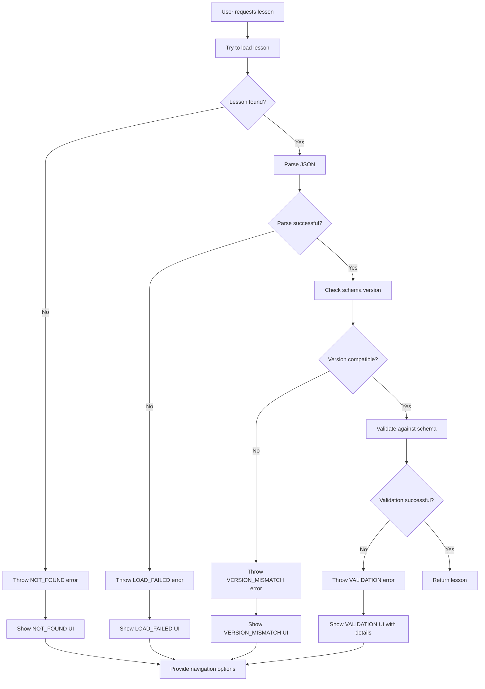

# Error Handling Implementation Plan

## Overview
This plan outlines the implementation of improved error handling and UX for lesson JSON loading issues in the LessonArcade application. The goal is to provide friendly error messages to users while maintaining useful debug information for developers.

## Current Issues
1. Generic error messages that don't distinguish between different types of failures
2. No version mismatch detection
3. Validation errors are not user-friendly
4. Debug information is not properly sanitized
5. No structured error handling across the application

## Implementation Steps

### 1. Create Typed Error Class
Create a `LessonLoadError` class with specific error codes:
- `NOT_FOUND`: Lesson doesn't exist in demo or user storage
- `VALIDATION`: Lesson JSON fails schema validation
- `VERSION_MISMATCH`: Lesson has incompatible schema version
- `LOAD_FAILED`: General loading failure (file system, parsing, etc.)

### 2. Update Validation Logic
Enhance the validation flow in `lib/lessonarcade/loaders.ts`:
- Throw `LessonLoadError` instead of generic `Error`
- Format validation issues in a user-friendly way
- Add optional version detection without breaking existing lessons
- Include safe debug information

### 3. Update Loading Functions
Modify both demo and user lesson loading functions:
- `loadLessonBySlug` in loaders.ts
- `loadUserLessonBySlug` in storage.ts
- Ensure proper error codes are thrown for each scenario

### 4. Create Error UI Component
Build a reusable error component that:
- Uses existing design tokens and shadcn/ui components
- Shows appropriate messages based on error code
- Provides clear navigation options
- Includes collapsible debug information

### 5. Update Lesson Page
Enhance `app/demo/lesson/[slug]/page.tsx`:
- Catch and handle `LessonLoadError` specifically
- Render friendly error UI based on error type
- Ensure metadata generation is resilient
- Add debug information in a safe, collapsed section

### 6. Verify Debug Page
Ensure `app/demo/lesson/debug/page.tsx` doesn't leak sensitive information.

## Error Handling Flow



## Error Message Strategy

### NOT_FOUND
- **Headline**: "Lesson Not Found"
- **Message**: "The lesson you're looking for doesn't exist or may have been removed."
- **Actions**: Browse demo lessons, Create own lesson

### VALIDATION
- **Headline**: "Lesson Unavailable"
- **Message**: "There's an issue with the lesson data that prevents it from loading properly."
- **Actions**: Browse demo lessons, Report issue
- **Debug**: Show validation errors in collapsed section

### VERSION_MISMATCH
- **Headline**: "Lesson Incompatible"
- **Message**: "This lesson was created with a newer version of LessonArcade and cannot be loaded."
- **Actions**: Browse demo lessons, Check for updates

### LOAD_FAILED
- **Headline**: "Loading Failed"
- **Message**: "We couldn't load this lesson due to a technical issue. Please try again later."
- **Actions**: Browse demo lessons, Try again

## Technical Implementation Details

### LessonLoadError Class
```typescript
export class LessonLoadError extends Error {
  constructor(
    public code: 'NOT_FOUND' | 'VALIDATION' | 'VERSION_MISMATCH' | 'LOAD_FAILED',
    message: string,
    public debug: {
      slug: string;
      source: 'demo' | 'user';
      issues?: string[];
    }
  ) {
    super(message);
    this.name = 'LessonLoadError';
  }
}
```

### Version Detection
- Check if raw input has `schemaVersion` property
- If present and not equal to 1, throw VERSION_MISMATCH
- If not present, assume version 1 for backward compatibility

### Debug Information
- Include only safe, relevant information
- No file system paths or stack traces
- Sanitized validation issues
- Source identification (demo vs user)

## Quality Assurance

1. **Linting**: Ensure all code passes pnpm lint
2. **Build**: Verify pnpm build completes successfully
3. **Manual Testing**:
   - Test non-existent lesson → NOT_FOUND UI
   - Break demo JSON locally → VALIDATION UI
   - Add schemaVersion: 2 → VERSION_MISMATCH UI
4. **Security**: Verify no sensitive information is exposed

## Files to Modify

1. `lib/lessonarcade/loaders.ts` - Add error class and update validation
2. `lib/lessonarcade/storage.ts` - Update user lesson loading
3. `app/demo/lesson/[slug]/page.tsx` - Handle errors with friendly UI
4. `app/demo/lesson/debug/page.tsx` - Verify no sensitive info leaks
5. New component: `components/lesson/lesson-error.tsx` - Error UI component

## Success Criteria

1. All lesson loading errors are properly categorized
2. Users see friendly, actionable error messages
3. Debug information is available but not exposed by default
4. No sensitive information is leaked
5. Existing functionality remains intact
6. All lint and build checks pass