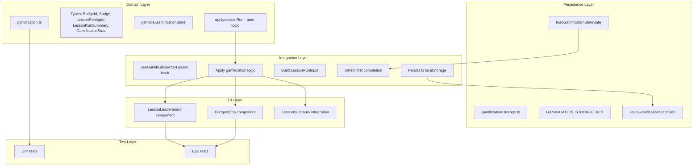

# Gamification Implementation Plan

## Overview

This plan implements advanced gamification elements for the LessonArcade project, including badges, learning streaks, per-lesson achievements, and a local leaderboard for a single user.

## Architecture Diagram



## Data Model

### Types (lib/lessonarcade/gamification.ts)

```typescript
export type BadgeId = "first-lesson" | "five-lessons" | "perfect-score" | "three-day-streak";

export interface Badge {
  id: BadgeId;
  label: string;
  description: string;
}

export interface LessonRunInput {
  lessonId: string;
  score: number;
  maxScore: number;
  correctCount: number;
  completedAt: Date;
  mode: "focus" | "arcade";
}

export interface LessonRunSummary {
  lessonId: string;
  score: number;
  maxScore: number;
  completedAt: string; // ISO date string
  mode: "focus" | "arcade";
}

export interface GamificationState {
  totalLessonsCompleted: number;
  totalRuns: number;
  currentStreakDays: number;
  longestStreakDays: number;
  badgesUnlocked: BadgeId[];
  history: LessonRunSummary[];
  bestScoresByLesson: Record<string, LessonRunSummary>;
}
```

## Badge Definitions

| BadgeId | Label | Description | Unlock Condition |
|---------|-------|-------------|------------------|
| first-lesson | First Lesson | Complete your first lesson | totalLessonsCompleted === 1 |
| five-lessons | Five Lessons | Complete 5 lessons | totalLessonsCompleted >= 5 |
| perfect-score | Perfect Score | Achieve maximum points on a lesson | score === maxScore in a run |
| three-day-streak | 3-Day Streak | Complete lessons on 3 consecutive days | currentStreakDays >= 3 |

## Streak Logic

Streaks are calculated based on consecutive local calendar days with at least one completed lesson:

1. Extract YYYY-MM-DD from completedAt in user's local timezone
2. If new run is on same day as existing run → no streak change
3. If new run is exactly 1 day after most recent activity → increment streak
4. If new run is more than 1 day after most recent activity → reset streak to 1
5. Update longestStreakDays when currentStreakDays exceeds previous maximum

## Implementation Components

### 1. Domain Model (lib/lessonarcade/gamification.ts)

**Pure functions with no side effects:**

- `getInitialGamificationState()` - Returns initial empty state
- `applyLessonRun(state, run)` - Core gamification logic
  - Updates totalLessonsCompleted and totalRuns
  - Calculates and updates streak
  - Evaluates badge unlock conditions
  - Updates bestScoresByLesson (highest score, latest on tie)
  - Appends to history array
  - Returns `{ state, newlyUnlockedBadges }`

### 2. Persistence Layer (lib/lessonarcade/gamification-storage.ts)

**Browser-safe localStorage wrapper:**

- `GAMIFICATION_STORAGE_KEY = "lessonarcade_progress_v1"`
- `loadGamificationStateSafe()` - Returns initial state if window unavailable or parse fails
- `saveGamificationStateSafe(state)` - No-op if window unavailable

### 3. Integration Hook (hooks/use-gamification-after-lesson.ts)

**Client-side hook for lesson completion:**

```typescript
function useGamificationAfterLesson(
  lessonId: string,
  isCompleted: boolean,
  score: number,
  maxScore: number,
  correctCount: number,
  mode: "focus" | "arcade"
) {
  // Track if already processed this completion
  // On first completion:
  //   1. Load current state
  //   2. Build LessonRunInput
  //   3. Call applyLessonRun
  //   4. Save updated state
  // Return { gamificationState, newlyUnlockedBadges }
}
```

### 4. UI Components

#### BadgesStrip (components/lesson/BadgesStrip.tsx)

- Props: `allBadges`, `unlockedBadgeIds`, `newlyUnlockedBadgeIds?`
- Renders horizontal list of unlocked badges
- Highlights newly unlocked badges with animation/glow
- `data-testid="la-badges-strip"`

#### LessonLeaderboard (components/lesson/LessonLeaderboard.tsx)

- Props: `lessonId`, `history`
- Filters history by lessonId
- Sorts by score desc, then completedAt desc
- Renders top 5 runs in table (rank, score, completed date)
- `data-testid="la-leaderboard"`

### 5. Integration into LessonSummary

Modify `components/lesson/lesson-summary.tsx`:

1. Add `useGamificationAfterLesson` hook
2. When lesson is complete, display:
   - BadgesStrip (if badgesUnlocked.length > 0)
   - LessonLeaderboard (if history has runs for this lesson)

## Test Strategy

### Unit Tests (test/lessonarcade/gamification.test.ts)

1. **Badge unlock tests:**
   - First completed lesson unlocks "first-lesson" badge
   - After 5 completed lessons, "five-lessons" badge unlocks
   - Perfect score run unlocks "perfect-score" badge

2. **Streak tests:**
   - Three consecutive days unlock "three-day-streak" badge
   - Correctly update currentStreakDays and longestStreakDays
   - Same-day completions don't break streak
   - Gap of more than 1 day resets streak

3. **Leaderboard tests:**
   - bestScoresByLesson keeps best run by score
   - When scores tie, latest completedAt wins

### Storage Tests (test/lessonarcade/gamification-storage.test.ts)

1. `loadGamificationStateSafe` returns initial state when window unavailable
2. Invalid JSON in localStorage returns initial state gracefully

### E2E Tests (e2e/gamification.spec.ts)

1. Navigate to demo lesson (e.g., react-hooks-intro)
2. Complete all questions in the lesson
3. Assert badges strip appears with "first-lesson" badge label
4. Reload page
5. Navigate to same lesson
6. Verify badges strip still shows unlocked badge (persistence)

## Quality Gates

Before committing, ensure all commands pass:

```bash
pnpm lint          # ESLint checks
pnpm test          # Vitest unit tests
pnpm test:e2e:ci   # Playwright E2E tests (Chromium)
pnpm test:smoke    # Smoke tests
```

## File Structure

```
lib/lessonarcade/
  gamification.ts           # Pure domain model
  gamification-storage.ts   # localStorage wrapper

hooks/
  use-gamification-after-lesson.ts  # Completion hook

components/lesson/
  BadgesStrip.tsx          # Badge display component
  LessonLeaderboard.tsx     # Leaderboard component
  lesson-summary.tsx       # Modified to integrate gamification

test/lessonarcade/
  gamification.test.ts      # Unit tests
  gamification-storage.test.ts  # Storage tests

e2e/
  gamification.spec.ts      # E2E tests
```

## Notes

- All gamification logic is pure and testable
- localStorage access is isolated in a small module
- Hook ensures gamification updates only run once on first completion
- Components use data-testid attributes for E2E testing
- Streak uses local timezone YYYY-MM-DD for day calculation
