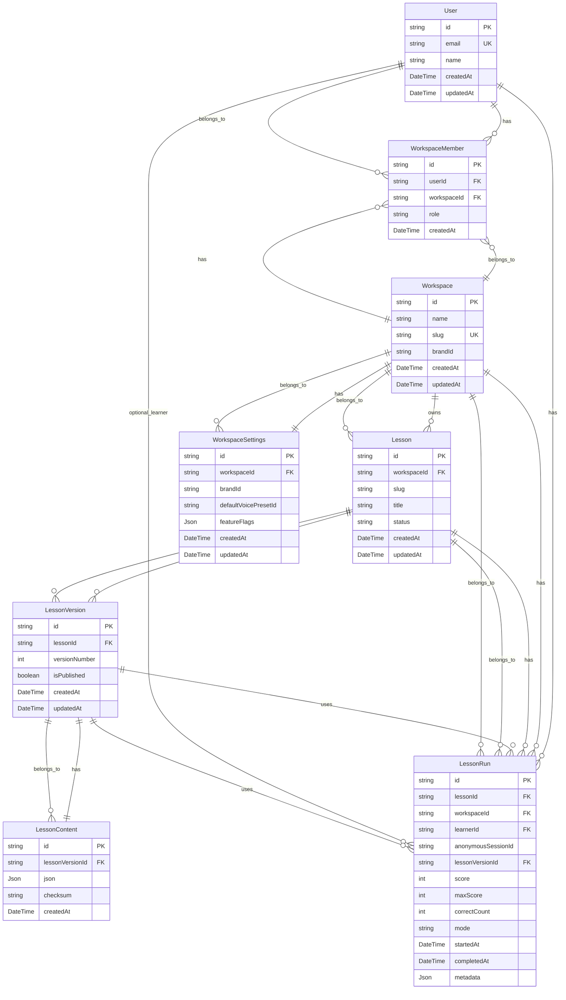

# LA3-P0-01: SaaS Data Model Design

## Problem Statement and Goals

LessonArcade currently operates as a single-tenant demo platform with a small number of JSON-based lessons stored in the `data/demo-lessons/` directory. The current architecture treats all lessons as belonging to a single deployment, with gamification state stored locally in the browser via localStorage.

Phase 3 requires transitioning to a multi-workspace SaaS structure that supports:

- **Multi-tenant architecture**: One user account can belong to multiple workspaces (organizations/brands).
- **Workspace isolation**: Each workspace can host multiple lessons, each with multiple versions over time, while maintaining data separation.
- **Lesson run tracking**: A place to store lesson runs and progress that can support future billing and analytics.
- **Brand/theme per workspace**: Each workspace can have its own brand configuration linked to the existing brand/theme system.

The data model must satisfy these design goals:

1. **Keep LessonArcade JSON as source of truth**: The core lesson content structure (defined in `lib/lessonarcade/schema.ts`) should remain the canonical format. The database stores and versions this JSON, not replaces it.
2. **Safe multi-workspace coexistence**: Multiple workspaces can exist in the same database without data leakage or conflicts.
3. **Evolution path to auth and billing**: The model should be extensible to support real authentication, billing plans, and analytics without requiring a full rewrite.
4. **Backward compatibility**: Existing demo data should be preserved and migratable to the new structure without breaking the current demo experience.

## Core Entities and Relationships

### User

Represents an end user or administrator of LessonArcade.

**Fields:**
- `id`: Unique identifier (string, likely UUID)
- `email`: User's email address (unique)
- `name`: Display name
- `createdAt`: Timestamp of account creation
- `updatedAt`: Timestamp of last modification

**Relationships:**
- A User can belong to multiple Workspaces through WorkspaceMember (N:M)
- A User can have many LessonRuns (1:N)

**Cardinality:** User ↔ WorkspaceMember (1:N), User ↔ LessonRun (1:N)

---

### Workspace

Represents an organization, team, or brand. Workspaces provide isolation and customization boundaries for LessonArcade content.

**Fields:**
- `id`: Unique identifier (string, likely UUID)
- `name`: Human-readable workspace name
- `slug`: URL-friendly identifier (unique across all workspaces)
- `brandId`: Reference to the brand/theme system (links to existing `BrandId` type)
- `createdAt`: Timestamp of workspace creation
- `updatedAt`: Timestamp of last modification

**Relationships:**
- A Workspace can have many WorkspaceMembers (1:N)
- A Workspace can have many Lessons (1:N)
- A Workspace can have many LessonRuns (1:N)
- A Workspace has one WorkspaceSettings (1:1)

**Cardinality:** Workspace ↔ WorkspaceMember (1:N), Workspace ↔ Lesson (1:N), Workspace ↔ LessonRun (1:N), Workspace ↔ WorkspaceSettings (1:1)

---

### WorkspaceMember

Join table between User and Workspace that defines membership and permissions.

**Fields:**
- `id`: Unique identifier (string, likely UUID)
- `userId`: Foreign key to User
- `workspaceId`: Foreign key to Workspace
- `role`: Enum of allowed roles (OWNER, ADMIN, EDITOR, VIEWER)
- `createdAt`: Timestamp of membership creation

**Constraints:**
- Unique constraint on `(userId, workspaceId)` to prevent duplicate memberships

**Relationships:**
- Belongs to one User (N:1)
- Belongs to one Workspace (N:1)

**Cardinality:** WorkspaceMember ↔ User (N:1), WorkspaceMember ↔ Workspace (N:1)

**Role Definitions:**
- `OWNER`: Full control, can delete workspace, manage billing
- `ADMIN`: Can manage lessons, members, and settings
- `EDITOR`: Can create and edit lessons
- `VIEWER`: Read-only access to lessons and analytics

---

### Lesson

Represents a logical lesson owned by a workspace. A Lesson is a container for multiple versions of lesson content.

**Fields:**
- `id`: Unique identifier (string, likely UUID)
- `workspaceId`: Foreign key to Workspace
- `slug`: URL-friendly identifier (unique within workspace)
- `title`: Display title
- `status`: Enum of lesson states (DRAFT, ACTIVE, ARCHIVED)
- `createdAt`: Timestamp of lesson creation
- `updatedAt`: Timestamp of last modification

**Relationships:**
- Belongs to one Workspace (N:1)
- Has many LessonVersions (1:N)
- Has many LessonRuns (1:N)

**Cardinality:** Lesson ↔ Workspace (N:1), Lesson ↔ LessonVersion (1:N), Lesson ↔ LessonRun (1:N)

**Status Definitions:**
- `DRAFT`: Lesson is being edited, not visible to learners
- `ACTIVE`: Lesson is published and available to learners
- `ARCHIVED`: Lesson is no longer active but preserved for historical records

---

### LessonVersion

Represents a specific version of a Lesson's content. This allows safe editing of upcoming versions while keeping a stable published version.

**Fields:**
- `id`: Unique identifier (string, likely UUID)
- `lessonId`: Foreign key to Lesson
- `versionNumber`: Integer version number (1, 2, 3, ...)
- `isPublished`: Boolean flag indicating if this version is the currently published one
- `createdAt`: Timestamp of version creation
- `updatedAt`: Timestamp of last modification

**Relationships:**
- Belongs to one Lesson (N:1)
- Has one LessonContent (1:1)

**Cardinality:** LessonVersion ↔ Lesson (N:1), LessonVersion ↔ LessonContent (1:1)

**Design Notes:**
- Only one version per lesson should have `isPublished = true` at any given time
- Version numbers are monotonically increasing within a lesson
- This enables A/B testing and rollback capabilities in the future

---

### LessonContent

Stores the actual LessonArcade JSON blob for a specific lesson version.

**Fields:**
- `id`: Unique identifier (string, likely UUID)
- `lessonVersionId`: Foreign key to LessonVersion
- `json`: JSON field containing the full LessonArcade lesson structure (matches `LessonArcadeLesson` schema)
- `checksum`: Hash of the JSON content for integrity verification and deduplication
- `createdAt`: Timestamp of content creation

**Relationships:**
- Belongs to one LessonVersion (N:1)

**Cardinality:** LessonContent ↔ LessonVersion (N:1)

**Design Notes:**
- The `json` field contains the complete lesson structure as defined in `lib/lessonarcade/schema.ts`
- The `checksum` field (e.g., SHA-256) enables content deduplication and integrity checks
- This separation allows efficient querying of lesson metadata without loading full JSON payloads

---

### LessonRun

Represents one completed (or in-progress) run of a lesson by a learner. This is the basis for analytics and future billing.

**Fields:**
- `id`: Unique identifier (string, likely UUID)
- `lessonId`: Foreign key to Lesson (not LessonVersion - tracks runs against the logical lesson)
- `workspaceId`: Foreign key to Workspace (denormalized for efficient querying)
- `learnerId`: Optional foreign key to User (null for anonymous learners)
- `anonymousSessionId`: Optional session identifier for anonymous learners
- `lessonVersionId`: Foreign key to LessonVersion (tracks which version was used)
- `score`: Points earned in this run
- `maxScore`: Maximum possible points
- `correctCount`: Number of correct answers
- `mode`: Enum of play modes ("focus" or "arcade")
- `startedAt`: Timestamp when the run began
- `completedAt`: Timestamp when the run completed (null for in-progress runs)
- `metadata`: JSON field for additional data (e.g., browser info, device type, time spent per level)

**Relationships:**
- Belongs to one Lesson (N:1)
- Belongs to one Workspace (N:1)
- Optionally belongs to one User (N:1)
- Belongs to one LessonVersion (N:1)

**Cardinality:** LessonRun ↔ Lesson (N:1), LessonRun ↔ Workspace (N:1), LessonRun ↔ User (N:1, optional), LessonRun ↔ LessonVersion (N:1)

**Design Notes:**
- Either `learnerId` or `anonymousSessionId` should be populated, never both
- The `metadata` field allows flexible tracking without schema changes
- Storing `workspaceId` as denormalized data enables efficient analytics queries

---

### WorkspaceSettings

Stores workspace-level configuration and preferences.

**Fields:**
- `id`: Unique identifier (string, likely UUID)
- `workspaceId`: Foreign key to Workspace (unique)
- `brandId`: Preferred brand/theme (links to existing `BrandId` type)
- `defaultVoicePresetId`: Default voice preset for the workspace
- `featureFlags`: JSON field for beta features and toggles
- `createdAt`: Timestamp of settings creation
- `updatedAt`: Timestamp of last modification

**Relationships:**
- Belongs to one Workspace (N:1)

**Cardinality:** WorkspaceSettings ↔ Workspace (N:1)

**Design Notes:**
- The `featureFlags` JSON field allows flexible feature toggling without schema changes
- This model can be extended with additional settings as needed

---

### Future Extensions (Not in MVP)

The following entities are planned for future phases but are not part of the initial SaaS MVP:

#### BillingPlan
- Links workspaces to subscription tiers
- Defines quotas (monthly active learners, seats, etc.)

#### WorkspaceSubscription
- Tracks billing state for a workspace
- Links to BillingPlan and payment provider

#### APIKey
- Enables embedding LessonArcade player in external sites
- Scoped to a workspace with rate limits

#### Webhook
- Allows external systems to receive lesson completion events
- Configured per workspace

#### LMSIntegration
- Stores configuration for external Learning Management System integrations
- Supports SCORM, xAPI, and custom integrations

## Entity Relationship Diagram



## Proposed Prisma Schema Draft

The following is a draft Prisma schema that implements the entities described above. This is **not** to be applied to the actual `schema.prisma` file in this step—it is design documentation only.

```prisma
// LA3-P0-01: SaaS Data Model Design - Draft Schema
// This is a design document. Do not apply to schema.prisma yet.

generator client {
  provider = "prisma-client-js"
}

datasource db {
  provider = "postgresql" // PostgreSQL recommended for production
  url      = env("DATABASE_URL")
}

// ============================================================================
// ENUMS
// ============================================================================

enum WorkspaceMemberRole {
  OWNER   // Full control, can delete workspace, manage billing
  ADMIN   // Can manage lessons, members, and settings
  EDITOR  // Can create and edit lessons
  VIEWER  // Read-only access to lessons and analytics
}

enum LessonStatus {
  DRAFT     // Lesson is being edited, not visible to learners
  ACTIVE    // Lesson is published and available to learners
  ARCHIVED  // Lesson is no longer active but preserved
}

enum LessonRunMode {
  focus   // Focused learning mode
  arcade  // Gamified arcade mode
}

// ============================================================================
// USER AND WORKSPACE
// ============================================================================

model User {
  id        String   @id @default(uuid())
  email     String   @unique
  name      String
  createdAt DateTime @default(now())
  updatedAt DateTime @updatedAt

  // Relationships
  workspaceMembers WorkspaceMember[]
  lessonRuns      LessonRun[]

  @@map("users")
}

model Workspace {
  id        String   @id @default(uuid())
  name      String
  slug      String   @unique // URL-friendly identifier
  brandId   String   @default("lessonarcade-default") // Links to existing BrandId type
  createdAt DateTime @default(now())
  updatedAt DateTime @updatedAt

  // Relationships
  members          WorkspaceMember[]
  lessons          Lesson[]
  lessonRuns       LessonRun[]
  settings         WorkspaceSettings?

  @@map("workspaces")
}

model WorkspaceMember {
  id         String              @id @default(uuid())
  userId     String
  workspaceId String
  role       WorkspaceMemberRole @default(VIEWER)
  createdAt  DateTime            @default(now())

  // Relationships
  user     User     @relation(fields: [userId], references: [id], onDelete: Cascade)
  workspace Workspace @relation(fields: [workspaceId], references: [id], onDelete: Cascade)

  @@unique([userId, workspaceId]) // Prevent duplicate memberships
  @@index([userId])
  @@index([workspaceId])
  @@map("workspace_members")
}

// ============================================================================
// LESSON CONTENT MANAGEMENT
// ============================================================================

model Lesson {
  id        String       @id @default(uuid())
  workspaceId String
  slug      String       // Unique within workspace
  title     String
  status    LessonStatus @default(DRAFT)
  createdAt DateTime     @default(now())
  updatedAt DateTime     @updatedAt

  // Relationships
  workspace      Workspace        @relation(fields: [workspaceId], references: [id], onDelete: Cascade)
  versions       LessonVersion[]
  runs           LessonRun[]

  @@unique([workspaceId, slug]) // Slug must be unique within workspace
  @@index([workspaceId])
  @@index([status])
  @@map("lessons")
}

model LessonVersion {
  id            String   @id @default(uuid())
  lessonId      String
  versionNumber Int      // Monotonically increasing within a lesson
  isPublished   Boolean  @default(false) // Only one per lesson should be true
  createdAt     DateTime @default(now())
  updatedAt     DateTime @updatedAt

  // Relationships
  lesson   Lesson        @relation(fields: [lessonId], references: [id], onDelete: Cascade)
  content  LessonContent?
  runs     LessonRun[]

  @@unique([lessonId, versionNumber]) // Version numbers must be unique within a lesson
  @@index([lessonId])
  @@index([isPublished])
  @@map("lesson_versions")
}

model LessonContent {
  id              String   @id @default(uuid())
  lessonVersionId String   @unique // One-to-one with LessonVersion
  json            Json     // Full LessonArcade lesson structure (matches lib/lessonarcade/schema.ts)
  checksum        String   // Hash of JSON for integrity and deduplication
  createdAt       DateTime @default(now())

  // Relationships
  lessonVersion LessonVersion @relation(fields: [lessonVersionId], references: [id], onDelete: Cascade)

  @@index([checksum]) // For deduplication queries
  @@map("lesson_contents")
}

// ============================================================================
// LESSON RUNS AND ANALYTICS
// ============================================================================

model LessonRun {
  id                 String        @id @default(uuid())
  lessonId           String
  workspaceId        String        // Denormalized for efficient analytics queries
  learnerId          String?       // Optional: authenticated user
  anonymousSessionId String?       // Optional: anonymous learner session
  lessonVersionId    String
  score              Int
  maxScore           Int
  correctCount       Int
  mode               LessonRunMode
  startedAt          DateTime      @default(now())
  completedAt        DateTime?
  metadata           Json?         // Additional data: browser info, device type, time per level, etc.

  // Relationships
  lesson        Lesson        @relation(fields: [lessonId], references: [id], onDelete: Cascade)
  workspace     Workspace     @relation(fields: [workspaceId], references: [id], onDelete: Cascade)
  learner       User?         @relation(fields: [learnerId], references: [id], onDelete: SetNull)
  lessonVersion LessonVersion @relation(fields: [lessonVersionId], references: [id])

  // Either learnerId or anonymousSessionId should be set, not both
  @@index([lessonId])
  @@index([workspaceId])
  @@index([learnerId])
  @@index([anonymousSessionId])
  @@index([completedAt])
  @@map("lesson_runs")
}

// ============================================================================
// WORKSPACE CONFIGURATION
// ============================================================================

model WorkspaceSettings {
  id                    String   @id @default(uuid())
  workspaceId           String   @unique // One-to-one with Workspace
  brandId               String   @default("lessonarcade-default")
  defaultVoicePresetId  String?
  featureFlags          Json?    // Beta features and toggles
  createdAt             DateTime @default(now())
  updatedAt             DateTime @updatedAt

  // Relationships
  workspace Workspace @relation(fields: [workspaceId], references: [id], onDelete: Cascade)

  @@map("workspace_settings")
}
```

### Key Design Decisions in the Schema

1. **UUID Primary Keys**: Using `@default(uuid())` for all primary keys provides better security (non-guessable IDs) and easier distributed system support compared to auto-increment integers.

2. **String IDs vs UUIDs**: The schema uses UUIDs as strings, which is consistent with the existing project's string-based IDs in lesson JSON files.

3. **LessonVersion for Versioning**: The separate `LessonVersion` model enables safe editing workflows where editors can work on draft versions while a published version remains stable for learners.

4. **LessonContent Separation**: Storing JSON content in a separate table allows querying lesson metadata without loading large JSON payloads, and the checksum field enables content deduplication.

5. **Denormalized workspaceId in LessonRun**: Storing `workspaceId` in `LessonRun` enables efficient analytics queries without joins, which is important for billing and usage metrics.

6. **Anonymous vs Authenticated Learners**: The `LessonRun` model supports both via optional `learnerId` and `anonymousSessionId` fields. Exactly one should be populated.

7. **Cascade Deletes**: Using `onDelete: Cascade` on relationships ensures data consistency when parent entities are deleted.

8. **JSON Fields**: Using Prisma's `Json` type for flexible data storage (`metadata`, `featureFlags`, `json` content) allows schema evolution without migrations.

9. **BrandId Integration**: The `brandId` field references the existing `BrandId` type from `lib/branding/brandPresets.ts`, maintaining compatibility with the current theme system.

## Migration Strategy and Backward Compatibility

### Phase A: Add New Tables (No Data Migration)

In this phase, we add the new Prisma schema tables while leaving the existing demo setup untouched:

1. **Add Prisma to the project**: Install Prisma and set up the database connection.
2. **Create new tables**: Run `prisma migrate dev` to create the new tables (`users`, `workspaces`, `workspace_members`, `lessons`, `lesson_versions`, `lesson_contents`, `lesson_runs`, `workspace_settings`).
3. **Existing demo data remains**: JSON files in `data/demo-lessons/` continue to work as before.
4. **Frontend unchanged**: The existing lesson loader (`lib/lessonarcade/loaders.ts`) continues to read from JSON files.

**Outcome**: Database tables exist but are empty. Demo functionality continues to work via JSON files.

### Phase B: Migrate Demo Lessons

In this phase, we incrementally move existing demo lessons into the new structure:

1. **Create a default workspace**: Add a "Demo Workspace" with `brandId = "lessonarcade-default"`.
2. **Create a demo user**: Add a user account for demo purposes.
3. **Import lesson JSON**: Write a migration script that:
   - Reads each JSON file from `data/demo-lessons/`
   - Creates a `Lesson` record with `status = ACTIVE`
   - Creates a `LessonVersion` with `versionNumber = 1` and `isPublished = true`
   - Creates a `LessonContent` record with the full JSON payload
4. **Preserve existing URLs**: Ensure the lesson slugs match the existing JSON file slugs so URLs don't break.

**Outcome**: Demo lessons exist in both JSON files (for backward compatibility) and database tables (for SaaS features).

### Phase C: Switch Frontend Loaders

In this phase, we update the frontend to use the database:

1. **Update lesson loader**: Modify `lib/lessonarcade/loaders.ts` to check the database first, falling back to JSON files if not found.
2. **Add lesson run tracking**: Implement API endpoints to record `LessonRun` data to the database.
3. **Update gamification**: Modify `lib/lessonarcade/gamification.ts` to optionally sync with the database (localStorage remains as fallback).
4. **Add workspace context**: Update the lesson player to include workspace context in API calls.

**Outcome**: The application primarily uses the database for lesson content and run tracking, with JSON files as a fallback for development.

### Phase D: Remove JSON Files (Optional)

Once confident in the database approach:

1. **Archive JSON files**: Move `data/demo-lessons/` to `data/demo-lessons-archive/` for reference.
2. **Remove JSON loader**: Clean up the fallback logic in `lib/lessonarcade/loaders.ts`.
3. **Update documentation**: Reflect the database-first architecture in docs.

**Outcome**: Complete transition to database-driven lesson management.

### Backward Compatibility Notes

- **Existing URLs preserved**: Lesson slugs in the database match JSON file slugs, so existing URLs continue to work.
- **Brand system unchanged**: The `BrandId` type from `lib/branding/brandPresets.ts` is used directly, so existing theme functionality works.
- **Gamification preserved**: LocalStorage gamification continues to work during the transition.
- **Demo mode available**: A demo workspace can be maintained for users who want to try the platform without signing up.

### Important Note

This step (LA3-P0-01) **does not** implement any of the above phases. It only captures the design. The actual schema changes and migrations will be implemented in future steps.

## Open Questions and Future Extensions

### Anonymous vs Authenticated Learners

**Question**: How should we model anonymous learners and their progression to authenticated users?

**Options**:
1. **Session-based**: Anonymous users are tracked via `anonymousSessionId` (UUID stored in localStorage). When they sign up, we migrate their runs to a `learnerId`.
2. **Email-based**: Anonymous users provide an email before starting, and we create a pending user account.
3. **Device-based**: Use device fingerprinting for anonymous tracking (privacy concerns).

**Recommendation**: Start with session-based tracking (option 1) as it's simplest and privacy-friendly. Implement migration logic when a user signs up.

### Billing Plans and Quotas

**Question**: How should billing plans and quotas be modeled?

**Considerations**:
- Monthly Active Learners (MAL): Count unique learners who complete a lesson in a billing period.
- Seats: Fixed number of named users who can access lessons.
- Lesson runs: Per-run pricing model.

**Proposed Extension**:
```prisma
model BillingPlan {
  id                    String   @id @default(uuid())
  name                  String
  description           String?
  monthlyActiveLearners Int?     // MAL quota
  seats                 Int?     // Named user quota
  pricePerMonth         Int      // In cents
  createdAt             DateTime @default(now())

  subscriptions WorkspaceSubscription[]
}

model WorkspaceSubscription {
  id             String      @id @default(uuid())
  workspaceId    String      @unique
  planId         String
  status         String      // ACTIVE, PAST_DUE, CANCELED
  currentPeriodStart DateTime
  currentPeriodEnd   DateTime
  stripeSubscriptionId String? // Payment provider reference
  createdAt      DateTime    @default(now())
  updatedAt      DateTime    @updatedAt

  workspace Workspace @relation(fields: [workspaceId], references: [id])
  plan      BillingPlan @relation(fields: [planId], references: [id])
}
```

### External LMS Integrations

**Question**: How should we model integrations with external Learning Management Systems (LMS)?

**Considerations**:
- SCORM 1.2/2004 packages export
- xAPI (Tin Can) statements
- Custom webhooks for completion events
- SSO integration (SAML, OAuth)

**Proposed Extension**:
```prisma
model LMSIntegration {
  id         String   @id @default(uuid())
  workspaceId String
  type       String   // SCORM, XAPI, WEBHOOK, SSO
  config     Json     // Provider-specific configuration
  enabled    Boolean  @default(true)
  createdAt  DateTime @default(now())
  updatedAt  DateTime @updatedAt

  workspace Workspace @relation(fields: [workspaceId], references: [id], onDelete: Cascade)
}

model LMSExport {
  id              String   @id @default(uuid())
  workspaceId     String
  lessonId        String
  integrationId   String
  exportUrl       String?  // URL to download SCORM package
  exportedAt      DateTime @default(now())

  workspace   Workspace @relation(fields: [workspaceId], references: [id])
  lesson      Lesson    @relation(fields: [lessonId], references: [id])
  integration LMSIntegration @relation(fields: [integrationId], references: [id])
}
```

### Lesson Collaboration and Review

**Question**: How should we model collaborative lesson editing and review workflows?

**Considerations**:
- Draft versions may need review before publishing
- Comments and feedback on lesson versions
- Approval workflows for enterprise customers

**Proposed Extension**:
```prisma
model LessonReview {
  id             String   @id @default(uuid())
  lessonVersionId String
  reviewerId     String
  status         String   // PENDING, APPROVED, REJECTED
  comments       String?
  reviewedAt     DateTime @default(now())

  lessonVersion LessonVersion @relation(fields: [lessonVersionId], references: [id])
  reviewer      User          @relation(fields: [reviewerId], references: [id])
}
```

### Analytics and Reporting

**Question**: How should we aggregate lesson run data for analytics and reporting?

**Considerations**:
- Daily/monthly aggregation tables for performance
- Pre-computed metrics (completion rates, average scores)
- Time-series data for trends

**Proposed Extension**:
```prisma
model DailyLessonStats {
  id             String   @id @default(uuid())
  workspaceId    String
  lessonId       String
  date           DateTime @db.Date
  totalRuns      Int
  completedRuns  Int
  avgScore       Float
  avgDurationSec Int

  workspace Workspace @relation(fields: [workspaceId], references: [id])
  lesson    Lesson    @relation(fields: [lessonId], references: [id])

  @@unique([workspaceId, lessonId, date])
}
```

### Content Localization

**Question**: How should we model multi-language lesson content?

**Current State**: The existing lesson schema supports `textI18n` fields for internationalization within a single JSON blob.

**Options**:
1. **Single JSON with i18n**: Keep the current approach where each lesson JSON contains all translations.
2. **Separate content per locale**: Create separate `LessonContent` records per locale.
3. **Shared base, localized overrides**: Store base content in one record with locale-specific overrides.

**Recommendation**: Start with option 1 (single JSON with i18n) as it matches the existing schema. Consider option 2 if content becomes large enough to warrant separation.

## Summary

This data model design provides a foundation for LessonArcade's transition to a multi-workspace SaaS platform. Key features include:

- **Multi-tenant architecture**: Users can belong to multiple workspaces with role-based access control.
- **Lesson versioning**: Safe editing workflows with published and draft versions.
- **Run tracking**: Comprehensive lesson run data for analytics and billing.
- **Brand integration**: Seamless integration with the existing brand/theme system.
- **Extensibility**: Clear paths for billing, LMS integration, and advanced analytics.

The design maintains backward compatibility with the current JSON-based demo setup while providing a clear migration path to a database-driven architecture.
