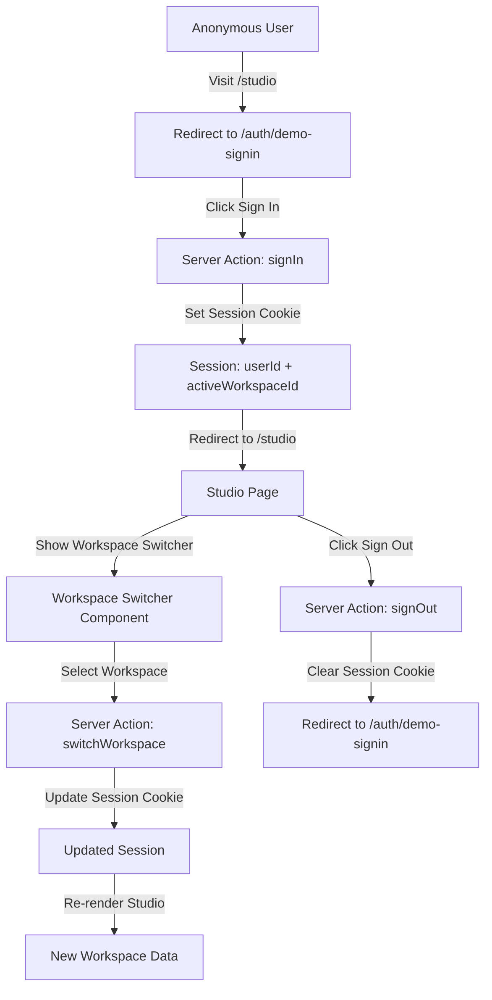

# Step 16: la3-p0-02 – Minimal Sign-in and Workspace Switching

## Overview

This plan implements a minimal, demo-friendly sign-in and workspace switching experience on top of the existing Phase 3 SaaS data model.

## Current State

- Prisma schema defines: `User`, `Workspace`, `WorkspaceMember`, `WorkspaceSettings`, `Lesson`, `LessonVersion`, `LessonContent`, `LessonRun`
- Demo seeding exists:
  - Demo workspace (slug: "demo")
  - Demo owner user (`demo-owner@example.com`)
  - Two demo lessons (`effective-meetings`, `react-hooks-intro`)
- Studio area under `/studio` with home and lessons overview
- Only Basic Auth for Studio routes (via `proxy.ts`), not per-user login
- No workspace switcher UI; everything assumes "demo" workspace

## Architecture Overview



## Implementation Steps

### 1. Extend Prisma Schema

Add a `loginToken` field to the `User` model for demo sign-in:

```prisma
model User {
  id         String   @id @default(uuid())
  email      String   @unique
  name       String
  loginToken String?  @unique // For demo sign-in (NOT production auth)
  createdAt  DateTime @default(now())
  updatedAt  DateTime @updatedAt

  workspaceMembers WorkspaceMember[]
  lessonRuns      LessonRun[]
}
```

### 2. Session Helper Module

Create `lib/saas/session.ts` with:

- `getCurrentSession()` - Read session from cookie
- `setSession(userId, workspaceId)` - Set session cookie
- `clearSession()` - Clear session cookie
- `getSessionData()` - Parse and validate session data

Implementation notes:
- Use `cookies()` from `next/headers`
- Use a simple signed token (base64 + HMAC) for demo purposes
- Store `userId` and `activeWorkspaceId` in session

### 3. Demo Sign-in Page

Create `app/auth/demo-signin/page.tsx`:

- Minimal, clean sign-in screen
- "Sign in as Demo Owner" button (for local/demo usage)
- Email input + "Sign In" button (simulates magic link)
- Clear disclaimer: "Demo-only sign-in, NOT production auth"

### 4. Server Actions

Create server actions for:

**`app/auth/signin/action.ts`:**
- Validate email (check against seeded users)
- Generate/set session cookie
- Redirect to `/studio`

**`app/studio/switch-workspace/action.ts`:**
- Validate user has access to target workspace
- Update session's `activeWorkspaceId`
- Redirect back to current Studio page

**`app/auth/signout/action.ts`:**
- Clear session cookie
- Redirect to `/auth/demo-signin`

### 5. Workspace Switcher Component

Create `components/studio/workspace-switcher.tsx`:

- Dropdown/pill selector showing current workspace
- List of available workspaces for current user
- Uses the existing `Select` component from `@radix-ui/react-select`
- Calls `switchWorkspace` server action on selection

### 6. Studio Page Updates

Update Studio pages to:

**`app/studio/page.tsx`:**
- Check for active session
- Redirect to `/auth/demo-signin` if not signed in
- Show workspace switcher in header

**`app/studio/lessons/page.tsx`:**
- Check for active session
- Redirect to `/auth/demo-signin` if not signed in
- Use active workspace from session instead of hardcoded "demo"
- Show workspace switcher in header

### 7. Extend Demo Seeding

Update `lib/test/demo-seed.ts` to create:

- Demo Owner user with login token
- Demo workspace (existing)
- Sample Team workspace (new)
- Appropriate WorkspaceMember records
- Lessons for each workspace:
  - Demo: `effective-meetings`, `react-hooks-intro`
  - Sample Team: `design-feedback-basics`, `feedback-that-lands`

### 8. Update Lesson Dashboard Service

Modify `lib/lessonarcade/lesson-dashboard-service.ts`:

- Rename `getDemoWorkspaceLessonsOverview` to `getWorkspaceLessonsOverview`
- Accept `workspaceId` parameter instead of using hardcoded slug
- Keep backward compatibility with optional `workspaceSlug` parameter

### 9. Testing

**Unit Tests (`test/saas/`):**

- `session.test.ts`:
  - Test session creation and validation
  - Test session data parsing
  - Test session clearing

- `workspace-lookup.test.ts`:
  - Test fetching user's workspaces
  - Test workspace access validation

**E2E Tests (`e2e/auth-and-workspaces.spec.ts`):**

1. Anonymous visit to `/studio` → redirected to sign-in page
2. Demo sign-in flow → lands on `/studio` with demo workspace
3. Workspace switcher shows current workspace name
4. Switch workspace → sees workspace name and lesson list change
5. Sign out → redirected to sign-in page

### 10. Documentation

Update `README.md` with new section:

```markdown
## Demo Sign-in and Workspace Switching

LessonArcade includes a minimal, demo-friendly sign-in and workspace switching experience for Phase 3 SaaS development.

### How It Works

The demo sign-in uses a simple email-based authentication system:
- No password storage or external IdP integration
- Session stored in a signed cookie
- **NOT production-grade auth** - for demo/development only

### Seeded Users and Workspaces

Running `pnpm db:seed:demo` creates:

**Users:**
- Demo Owner: `demo-owner@example.com` (login token: `demo-token`)

**Workspaces:**
- Demo Workspace (`demo`): Contains `effective-meetings` and `react-hooks-intro` lessons
- Sample Team (`sample-team`): Contains `design-feedback-basics` and `feedback-that-lands` lessons

### Sign In

1. Visit `/studio` → redirected to `/auth/demo-signin`
2. Click "Sign in as Demo Owner" or enter `demo-owner@example.com`
3. You'll be signed in and redirected to the Studio

### Switch Workspaces

1. In the Studio header, click the workspace switcher dropdown
2. Select a different workspace
3. The page will refresh showing data for the selected workspace

### Sign Out

Click "Sign Out" in the Studio header to return to the sign-in page.
```

## File Structure

```
lib/saas/
  session.ts                    # Session helper module

app/auth/
  demo-signin/
    page.tsx                    # Demo sign-in page
  signin/
    action.ts                   # Sign-in server action
  signout/
    action.ts                   # Sign-out server action

app/studio/
  switch-workspace/
    action.ts                   # Workspace switch server action
  page.tsx                      # Updated with auth check
  lessons/
    page.tsx                    # Updated with auth check

components/studio/
  workspace-switcher.tsx        # Workspace switcher component

test/saas/
  session.test.ts               # Session helper tests
  workspace-lookup.test.ts      # Workspace lookup tests

e2e/
  auth-and-workspaces.spec.ts   # E2E tests for auth and workspaces

lib/test/
  demo-seed.ts                  # Extended for multiple workspaces

lib/lessonarcade/
  lesson-dashboard-service.ts   # Updated for workspace parameter

README.md                       # Updated with demo sign-in docs
```

## Quality Gates

All tests must pass:
- `pnpm lint` - ESLint
- `pnpm test` - Vitest unit tests
- `pnpm test:e2e:ci` - Playwright E2E tests (chromium only)
- `pnpm test:smoke` - Smoke tests

## Security Notes

This implementation is **NOT production-grade authentication**:
- No password hashing or verification
- No real email sending (simulates magic link)
- Simple signed cookie (not JWT)
- No rate limiting on sign-in attempts
- No CSRF protection

For production, replace with:
- NextAuth.js or similar auth library
- OAuth providers (Google, GitHub, etc.)
- Proper session management with JWT
- CSRF protection
- Rate limiting
- Email verification

## Backward Compatibility

- Basic Auth (via `proxy.ts`) remains as outer guard
- Existing E2E tests for Basic Auth should still pass
- Demo workspace and lessons remain accessible
- No breaking changes to existing APIs
