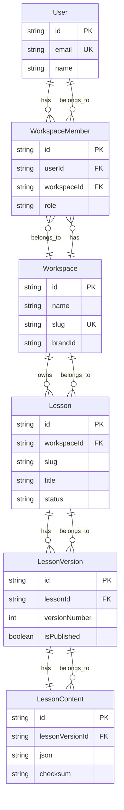
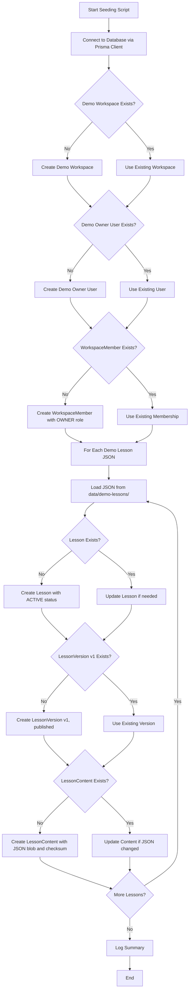

# LA3-P0-03: Demo Seeding Implementation Plan

## Overview

This plan implements the seeding of the Phase 3 SaaS data model with demo data. The goal is to populate the database with a "Demo Workspace" and a set of demo lessons based on existing JSON content, without changing frontend behavior.

## Context

- **Previous Step (LA3-P0-02)**: Added Prisma models and created dev database schema
- **Current State**: Frontend still uses JSON demo lessons, does not touch the database
- **This Step**: Introduce Prisma client helper, demo seeding script, and tests

## Architecture

### Database Schema Overview



### Seeding Workflow



## Implementation Details

### 1. Prisma Client Helper (`lib/db/prisma.ts`)

**Purpose**: Singleton PrismaClient instance for Next.js app

**Pattern**: Use globalThis pattern to avoid multiple instances in development

```typescript
// lib/db/prisma.ts
import { PrismaClient } from '@prisma/client'

const globalForPrisma = globalThis as unknown as {
  prisma: PrismaClient | undefined
}

export const prisma =
  globalForPrisma.prisma ??
  new PrismaClient()

if (process.env.NODE_ENV !== 'production') {
  globalForPrisma.prisma = prisma
}
```

**Key Points**:
- No connection pooling logic in this step (keep it simple)
- Uses existing DATABASE_URL env var
- Reuses existing Prisma schema

### 2. Demo Seeding Script (`scripts/db/seed-demo-lessons.ts`)

**Purpose**: Idempotently seed demo workspace, user, and lessons

**Structure**:

```typescript
#!/usr/bin/env tsx

import { readFileSync } from 'fs'
import { join } from 'path'
import { createHash } from 'crypto'
import { prisma } from '@/lib/db/prisma'

// Demo lesson slugs to seed
const DEMO_LESSON_SLUGS = [
  'effective-meetings',
  'react-hooks-intro',
]

// Demo workspace configuration
const DEMO_WORKSPACE = {
  name: 'LessonArcade Demo Workspace',
  slug: 'demo',
  brandId: 'lessonarcade-default',
}

// Demo owner user configuration
const DEMO_OWNER = {
  email: 'demo-owner@example.com',
  name: 'Demo Owner',
}

// Helper function to compute checksum
function computeChecksum(json: string): string {
  return createHash('sha256').update(json).digest('hex')
}

// Helper function to load lesson JSON
function loadLessonJson(slug: string): any {
  const path = join(process.cwd(), 'data', 'demo-lessons', `${slug}.json`)
  return JSON.parse(readFileSync(path, 'utf-8'))
}

// Main seeding function
export async function seedDemoData() {
  // 1. Ensure demo workspace
  const workspace = await prisma.workspace.upsert({
    where: { slug: DEMO_WORKSPACE.slug },
    update: {},
    create: DEMO_WORKSPACE,
  })

  // 2. Ensure demo owner user
  const user = await prisma.user.upsert({
    where: { email: DEMO_OWNER.email },
    update: {},
    create: DEMO_OWNER,
  })

  // 3. Ensure workspace member
  await prisma.workspaceMember.upsert({
    where: {
      userId_workspaceId: {
        userId: user.id,
        workspaceId: workspace.id,
      },
    },
    update: {},
    create: {
      userId: user.id,
      workspaceId: workspace.id,
      role: 'OWNER',
    },
  })

  // 4. Seed each demo lesson
  for (const slug of DEMO_LESSON_SLUGS) {
    const lessonJson = loadLessonJson(slug)
    const jsonStr = JSON.stringify(lessonJson)
    const checksum = computeChecksum(jsonStr)

    // Create or update lesson
    const lesson = await prisma.lesson.upsert({
      where: {
        workspaceId_slug: {
          workspaceId: workspace.id,
          slug: slug,
        },
      },
      update: {
        title: lessonJson.title || slug,
        status: 'ACTIVE',
      },
      create: {
        workspaceId: workspace.id,
        slug: slug,
        title: lessonJson.title || slug,
        status: 'ACTIVE',
      },
    })

    // Create or update lesson version
    const version = await prisma.lessonVersion.upsert({
      where: {
        lessonId_versionNumber: {
          lessonId: lesson.id,
          versionNumber: 1,
        },
      },
      update: {
        isPublished: true,
      },
      create: {
        lessonId: lesson.id,
        versionNumber: 1,
        isPublished: true,
      },
    })

    // Create or update lesson content
    await prisma.lessonContent.upsert({
      where: { lessonVersionId: version.id },
      update: {
        json: jsonStr,
        checksum: checksum,
      },
      create: {
        lessonVersionId: version.id,
        json: jsonStr,
        checksum: checksum,
      },
    })
  }

  // 5. Log summary
  const lessonCount = await prisma.lesson.count({
    where: { workspaceId: workspace.id },
  })

  console.log('✓ Demo data seeded successfully')
  console.log(`  Workspace: ${workspace.slug} (${workspace.id})`)
  console.log(`  Lessons seeded: ${lessonCount}`)
}

// Run if executed directly
if (import.meta.url === `file://${process.argv[1]}`) {
  seedDemoData()
    .catch(console.error)
    .finally(() => prisma.$disconnect())
}
```

**Key Points**:
- Idempotent: Uses upsert patterns throughout
- Uses `workspaceId_slug` and `lessonId_versionNumber` unique constraints
- Computes SHA-256 checksum for content integrity
- Logs summary of seeded data
- Can be run multiple times without creating duplicates

### 3. Package.json Script

**Add to package.json**:

```json
"db:seed:demo": "tsx scripts/db/seed-demo-lessons.ts"
```

**Pattern**: Matches existing `audit:english` script which uses tsx

### 4. Test (`test/db/demo-seed.test.ts`)

**Purpose**: Validate seeding logic works correctly

```typescript
import { describe, it, expect, beforeEach, afterEach } from 'vitest'
import { prisma } from '@/lib/db/prisma'
import { seedDemoData } from '@/scripts/db/seed-demo-lessons'

describe('Demo Seeding', () => {
  beforeEach(async () => {
    // Clean up before each test
    await prisma.lessonContent.deleteMany()
    await prisma.lessonVersion.deleteMany()
    await prisma.lesson.deleteMany()
    await prisma.workspaceMember.deleteMany()
    await prisma.user.deleteMany()
    await prisma.workspace.deleteMany()
  })

  afterEach(async () => {
    await prisma.$disconnect()
  })

  it('should create exactly one demo workspace', async () => {
    await seedDemoData()

    const workspaces = await prisma.workspace.findMany({
      where: { slug: 'demo' },
    })

    expect(workspaces).toHaveLength(1)
    expect(workspaces[0].name).toBe('LessonArcade Demo Workspace')
    expect(workspaces[0].brandId).toBe('lessonarcade-default')
  })

  it('should create demo owner user', async () => {
    await seedDemoData()

    const user = await prisma.user.findUnique({
      where: { email: 'demo-owner@example.com' },
    })

    expect(user).toBeDefined()
    expect(user?.name).toBe('Demo Owner')
  })

  it('should create workspace member with OWNER role', async () => {
    await seedDemoData()

    const workspace = await prisma.workspace.findUnique({
      where: { slug: 'demo' },
    })

    const user = await prisma.user.findUnique({
      where: { email: 'demo-owner@example.com' },
    })

    const member = await prisma.workspaceMember.findUnique({
      where: {
        userId_workspaceId: {
          userId: user!.id,
          workspaceId: workspace!.id,
        },
      },
    })

    expect(member).toBeDefined()
    expect(member?.role).toBe('OWNER')
  })

  it('should seed demo lessons', async () => {
    await seedDemoData()

    const workspace = await prisma.workspace.findUnique({
      where: { slug: 'demo' },
    })

    const lessons = await prisma.lesson.findMany({
      where: { workspaceId: workspace!.id },
    })

    expect(lessons.length).toBeGreaterThanOrEqual(1)

    // Check effective-meetings lesson
    const effectiveMeetings = lessons.find(l => l.slug === 'effective-meetings')
    expect(effectiveMeetings).toBeDefined()
    expect(effectiveMeetings?.status).toBe('ACTIVE')
  })

  it('should create lesson version and content for each lesson', async () => {
    await seedDemoData()

    const workspace = await prisma.workspace.findUnique({
      where: { slug: 'demo' },
    })

    const lesson = await prisma.lesson.findFirst({
      where: { workspaceId: workspace!.id },
    })

    const versions = await prisma.lessonVersion.findMany({
      where: { lessonId: lesson!.id },
    })

    expect(versions).toHaveLength(1)
    expect(versions[0].versionNumber).toBe(1)
    expect(versions[0].isPublished).toBe(true)

    const content = await prisma.lessonContent.findUnique({
      where: { lessonVersionId: versions[0].id },
    })

    expect(content).toBeDefined()
    expect(content?.checksum).toBeDefined()
    expect(content?.json).toBeDefined()
  })

  it('should be idempotent - running twice should not create duplicates', async () => {
    await seedDemoData()
    await seedDemoData()

    const workspaces = await prisma.workspace.findMany({
      where: { slug: 'demo' },
    })

    const users = await prisma.user.findMany({
      where: { email: 'demo-owner@example.com' },
    })

    const workspace = await prisma.workspace.findUnique({
      where: { slug: 'demo' },
    })

    const lessons = await prisma.lesson.findMany({
      where: { workspaceId: workspace!.id },
    })

    expect(workspaces).toHaveLength(1)
    expect(users).toHaveLength(1)
    expect(lessons.length).toBeGreaterThanOrEqual(1)
  })
})
```

**Key Points**:
- Uses same internal logic as seed script (imports seedDemoData)
- Cleans up before each test
- Tests idempotency
- Validates all entities are created correctly
- Fast and deterministic

## Files to Create

1. `lib/db/prisma.ts` - Prisma client helper
2. `scripts/db/seed-demo-lessons.ts` - Seeding script
3. `test/db/demo-seed.test.ts` - Test file

## Files to Modify

1. `package.json` - Add `db:seed:demo` script

## Demo Lessons to Seed

Based on existing JSON files in `data/demo-lessons/`:

1. **effective-meetings.json**
   - Slug: `effective-meetings`
   - Title: "How to Run Effective Meetings"
   - 3 levels with multiple choice, open-ended, and checkpoint items

2. **react-hooks-intro.json**
   - Slug: `react-hooks-intro`
   - Title: "Introduction to React Hooks"
   - 3 levels with multiple choice, open-ended, and checkpoint items

## Quality Gates

After implementation, run the following:

```bash
pnpm lint          # Lint check
pnpm test          # Unit tests
pnpm test:e2e:ci   # E2E tests
pnpm test:smoke    # Smoke tests
```

**Note**: If E2E tests fail for reasons unrelated to this work (e.g., pre-existing accessibility/layout failures), do not modify those tests in this step. Mention them explicitly in completion summary.

## Constraints

- **DO NOT** change frontend behavior
- **DO NOT** modify lesson player, Voice demos, or Studio to read from database
- **DO NOT** remove or change existing JSON lesson loading behavior
- Scope is strictly: Prisma client helper, demo seeding script, tests, and package.json wiring

## Success Criteria

1. ✓ Prisma client helper created at `lib/db/prisma.ts`
2. ✓ Demo seeding script created at `scripts/db/seed-demo-lessons.ts`
3. ✓ Script is idempotent (can be run multiple times)
4. ✓ Package.json has `db:seed:demo` script
5. ✓ Test file created at `test/db/demo-seed.test.ts`
6. ✓ All tests pass (lint, unit, e2e, smoke)
7. ✓ Changes committed and pushed to main branch
