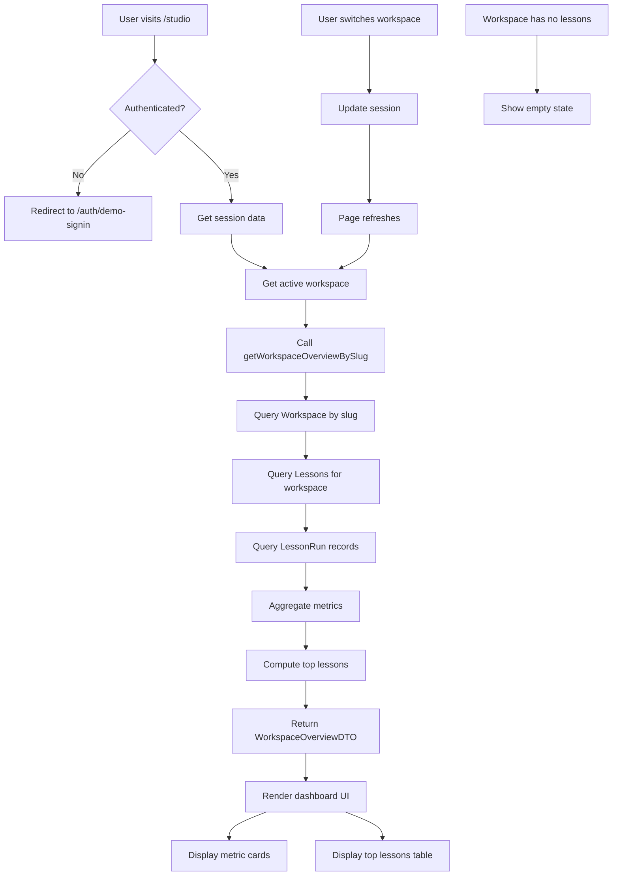

# LA3-P0-03: Studio Workspace Dashboard Implementation Plan

## Overview

This plan outlines the implementation of a workspace dashboard at `/studio` that aggregates key metrics per workspace, along with a DevOps improvement to add a non-interactive Prisma db push script.

## Purpose

The Studio dashboard provides teams with a single view of how their workspace is performing, including:
- Total lessons in the workspace
- Total lesson runs across all lessons
- Average score percentage
- Last completion timestamp
- Top lessons by run count

## Current State

- Project uses Phase 3 SaaS data model with User, Workspace, WorkspaceMember, Lesson, LessonVersion, LessonContent, LessonRun
- Demo seeding creates at least two workspaces ("Demo" and "Sample Team") with lessons
- Minimal demo sign-in and session system implemented
- `/studio/lessons` page shows per-lesson stats for the current workspace
- Prisma is used with SQLite dev DB at `file:./dev.db`
- Running `npx prisma db push` blocks on interactive prompts

## Implementation Tasks

### Task 1: Add Prisma Dev Script and Documentation

**File: `package.json`**

Add a new script for local dev SQLite DB:
```json
"db:push:dev": "DATABASE_URL=\"file:./dev.db\" prisma db push --accept-data-loss"
```

**File: `README.md`**

Add a new subsection under "SaaS Data Model" or "Local Development Setup":

```markdown
### Dev Database and Prisma

The project uses a local SQLite database at `prisma/dev.db` for development.

- The file is not tracked in Git and can be safely deleted
- It will be recreated from the Prisma schema and seed scripts
- To sync schema to the local dev DB, run:
  ```bash
  pnpm db:push:dev
  ```
- There is normally no need to call `npx prisma db push` interactively
- For this repo, always prefer the `db:push:dev` script

**Note:** This is dev-only. Production deployments should use a proper managed database with a separate `DATABASE_URL`.
```

### Task 2: Workspace Dashboard Service

**File: `lib/lessonarcade/workspace-dashboard-service.ts`**

Create a new service module with:

**DTO Types:**
```typescript
export interface TopLesson {
  id: string
  slug: string
  title: string
  totalRuns: number
  averageScorePercent: number | null
}

export interface WorkspaceOverviewDTO {
  workspaceName: string
  workspaceSlug: string
  totalLessons: number
  totalLessonRuns: number
  avgScorePercent: number | null
  lastCompletedAt: Date | null
  topLessons: TopLesson[]
}
```

**Service Function:**
```typescript
export async function getWorkspaceOverviewBySlug(
  prisma: PrismaClient,
  workspaceSlug: string
): Promise<WorkspaceOverviewDTO>
```

**Function Requirements:**
1. Resolve the Workspace row by slug
2. Aggregate:
   - `totalLessons`: number of lessons in that workspace
   - `totalLessonRuns`: count of LessonRun rows linked to lessons in that workspace
   - `avgScorePercent`: average score/maxScore across LessonRuns with valid values (handle division by zero safely)
   - `lastCompletedAt`: latest LessonRun completion timestamp for that workspace
   - `topLessons`: top 3 lessons by run count, including title, slug, totalRuns, and average score
3. Return structured DTO
4. Safe when there are zero lessons or zero runs (return zeros and nulls instead of throwing)

### Task 3: Studio Home Workspace Dashboard UI

**File: `app/studio/page.tsx`**

Refactor the Studio home route into a proper workspace dashboard page.

**Requirements:**
1. Call `requireAuth` to ensure user is signed in and active workspace is in session
2. Read current session and active workspace slug/id
3. Call workspace dashboard service to compute overview for that workspace
4. Render:
   - Header area showing current workspace name and basic stats
   - "Workspace cards" section with 3-4 metric cards:
     - "Lessons" (totalLessons)
     - "Lesson runs" (totalLessonRuns)
     - "Average score" (avgScorePercent)
     - "Last completion" (lastCompletedAt)
   - "Top lessons" table/list based on topLessons array
5. Responsive design:
   - Mobile: cards stack vertically, lesson list uses full width
   - Larger screens: grid layout consistent with rest of app
6. Add `data-testid="la-studio-dashboard-page"` on main container

**Integration:**
- Use existing `StudioHeader` and `WorkspaceSwitcher` components
- When user switches workspaces, `/studio` page reflects new workspace's stats

**Edge Cases:**
- If active workspace has zero lessons: show friendly empty state
  - "No lessons yet in this workspace. Start by creating your first interactive lesson."
- If workspace slug in session doesn't resolve: redirect to sign-in page

### Task 4: E2E Coverage for Dashboard

**File: `e2e/studio-dashboard.spec.ts`**

Add new Playwright spec for Studio dashboard.

**Test Cases:**
1. Visit `/studio` as anonymous user:
   - Expect redirect to demo sign-in flow
   - Complete sign-in and land on `/studio`

2. Once signed in:
   - Assert `data-testid="la-studio-dashboard-page"` is visible
   - Assert at least one metric card is visible with current workspace name

3. Use workspace switcher to change from demo to sample team:
   - Assert workspace name in dashboard header updates
   - Assert at least one metric (totalLessons or totalLessonRuns) changes value

**Test Helpers:**
- Use existing global demo seed and auth helpers
- Keep assertions robust (prefer relative checks or known deterministic values)

### Task 5: Planning Note

**File: `plans/la3-p0-03-studio-dashboard.md`**

This document serves as the planning note. It summarizes:
- Purpose of Studio dashboard
- Metrics shown in v0.3
- Ideas for future iterations (Phase 3+):
  - Filtering by date range
  - Per-lesson performance drilldown
  - Integrating AI personalization insights (e.g., "which lessons need attention" based on low scores or high retry rates)

## Quality Gates

After implementation, run:
```bash
pnpm lint
pnpm test
pnpm test:e2e:ci
pnpm test:smoke
```

**Note:** Known pre-existing E2E failures (branding and accessibility layout specs) should remain unchanged. All new tests must pass.

## Git Commit

Commit directly to main with message:
```
feat(la3-p0-03): add studio workspace dashboard and Prisma dev script
```

## Architecture Diagram



## File Structure

```
plans/
  la3-p0-03-studio-dashboard.md (this file)

lib/lessonarcade/
  workspace-dashboard-service.ts (new)

app/studio/
  page.tsx (refactored)

e2e/
  studio-dashboard.spec.ts (new)

test/db/
  workspace-dashboard-service.test.ts (new)

package.json (updated - add db:push:dev script)
README.md (updated - add Prisma documentation)
```

## Dependencies

- Uses existing `StudioHeader` and `WorkspaceSwitcher` components
- Uses existing `Card` UI component
- Uses existing `requireAuth` session helper
- Uses existing `prisma` client
- Uses existing demo seed helpers for tests
