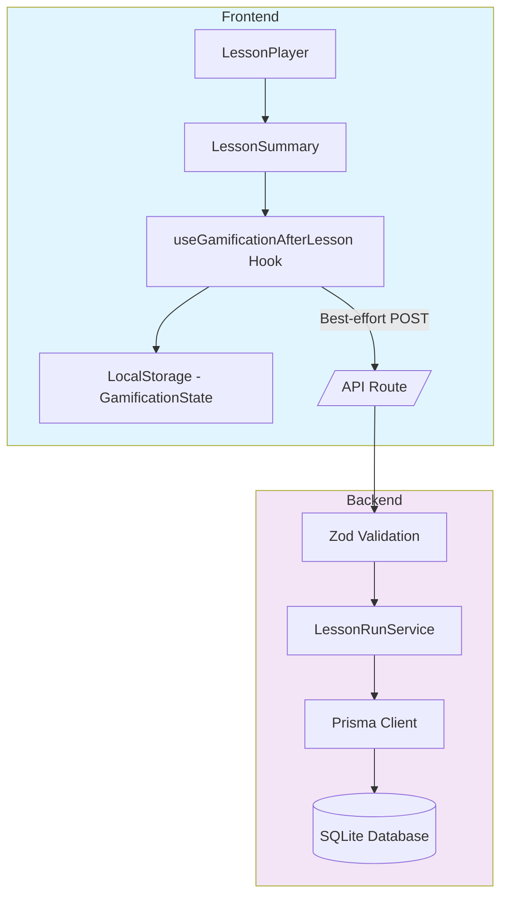

# LA3-P0-04: Lesson Runs Backend Analytics Implementation

## Overview

This plan implements the first backend analytics path for LessonArcade, recording lesson completion data in the database while maintaining the existing front-end gamification behavior.

## Context

### Existing Gamification System (Front-End Only)

The gamification system is currently a pure front-end layer:

- **Types**: [`LessonRunInput`](../lib/lessonarcade/gamification.ts:14-21), [`LessonRunSummary`](../lib/lessonarcade/gamification.ts:23-29), [`GamificationState`](../lib/lessonarcade/gamification.ts:31-39)
- **Hook**: [`useGamificationAfterLesson`](../hooks/use-gamification-after-lesson.ts:40) detects lesson completion and updates local state
- **Storage**: LocalStorage via [`gamification-storage.ts`](../lib/lessonarcade/gamification-storage.ts)
- **UI**: [`BadgesStrip`](../components/lesson/BadgesStrip.tsx) and [`LessonLeaderboard`](../components/lesson/LessonLeaderboard.tsx)

### Database Schema (Prisma)

The [`LessonRun`](../prisma/schema.prisma:163-191) model already exists:

```prisma
model LessonRun {
  id                 String        @id @default(uuid())
  lessonId           String
  workspaceId        String        // Denormalized for efficient analytics queries
  learnerId          String?       // Optional: authenticated user
  anonymousSessionId String?       // Optional: anonymous learner session
  lessonVersionId    String
  score              Int
  maxScore           Int
  correctCount       Int
  mode               LessonRunMode // focus | arcade
  startedAt          DateTime      @default(now())
  completedAt        DateTime?
  metadata           String?       // Additional data

  // Relationships
  lesson        Lesson        @relation(...)
  workspace     Workspace     @relation(...)
  learner       User?         @relation(...)
  lessonVersion LessonVersion @relation(...)
}
```

### Demo Environment

- **Workspace slug**: `"demo"`
- **Lessons**: `effective-meetings`, `react-hooks-intro`
- **Seeding script**: [`seed-demo-lessons.ts`](../scripts/db/seed-demo-lessons.ts)

## Architecture



## Implementation Plan

### 1. Zod Schema for Request Validation

**File**: `lib/lessonarcade/lesson-run-schema.ts`

Create a Zod schema that validates the API request payload:

```typescript
import { z } from 'zod'

// Request schema for creating a lesson run
export const CreateLessonRunSchema = z.object({
  workspaceSlug: z.string().min(1),
  lessonSlug: z.string().min(1),
  mode: z.enum(['focus', 'arcade']),
  score: z.number().int().min(0),
  maxScore: z.number().int().min(0),
  completedAt: z.string().datetime(),
  // Optional fields
  durationMs: z.number().int().min(0).optional(),
  anonymousSessionId: z.string().uuid().optional(),
})

export type CreateLessonRunInput = z.infer<typeof CreateLessonRunSchema>
```

### 2. Service Layer

**File**: `lib/lessonarcade/lesson-run-service.ts`

Extract business logic from the API handler:

```typescript
import { PrismaClient, LessonRunMode } from '@prisma/client'
import type { CreateLessonRunInput } from './lesson-run-schema'

export type CreateLessonRunResult =
  | { ok: true; lessonRunId: string }
  | { ok: false; kind: 'workspace-not-found' | 'lesson-not-found' | 'db-error'; error?: Error }

export async function createLessonRun(
  prisma: PrismaClient,
  input: CreateLessonRunInput
): Promise<CreateLessonRunResult> {
  // 1. Resolve workspace by slug
  const workspace = await prisma.workspace.findUnique({
    where: { slug: input.workspaceSlug },
  })
  if (!workspace) {
    return { ok: false, kind: 'workspace-not-found' }
  }

  // 2. Resolve lesson by workspaceId and slug
  const lesson = await prisma.lesson.findFirst({
    where: {
      workspaceId: workspace.id,
      slug: input.lessonSlug,
    },
    include: {
      versions: {
        where: { isPublished: true },
        orderBy: { versionNumber: 'desc' },
        take: 1,
      },
    },
  })
  if (!lesson || lesson.versions.length === 0) {
    return { ok: false, kind: 'lesson-not-found' }
  }

  // 3. Create LessonRun record
  const lessonRun = await prisma.lessonRun.create({
    data: {
      lessonId: lesson.id,
      workspaceId: workspace.id,
      lessonVersionId: lesson.versions[0].id,
      anonymousSessionId: input.anonymousSessionId,
      score: input.score,
      maxScore: input.maxScore,
      correctCount: 0, // Will be computed from lesson data
      mode: input.mode as LessonRunMode,
      completedAt: new Date(input.completedAt),
    },
  })

  return { ok: true, lessonRunId: lessonRun.id }
}
```

### 3. API Route

**File**: `app/api/lesson-runs/route.ts`

Create a POST endpoint that handles lesson run creation:

```typescript
import { NextRequest, NextResponse } from 'next/server'
import { prisma } from '@/lib/db/prisma'
import { CreateLessonRunSchema } from '@/lib/lessonarcade/lesson-run-schema'
import { createLessonRun } from '@/lib/lessonarcade/lesson-run-service'

export async function POST(request: NextRequest) {
  try {
    // Parse request body
    const body = await request.json()

    // Validate payload
    const validationResult = CreateLessonRunSchema.safeParse(body)
    if (!validationResult.success) {
      return NextResponse.json(
        { error: 'Invalid request', issues: validationResult.error.issues },
        { status: 400 }
      )
    }

    // Call service
    const result = await createLessonRun(prisma, validationResult.data)

    // Map result to HTTP response
    if (result.ok) {
      return NextResponse.json({ ok: true, lessonRunId: result.lessonRunId }, { status: 201 })
    } else {
      switch (result.kind) {
        case 'workspace-not-found':
          return NextResponse.json({ error: 'Workspace not found' }, { status: 404 })
        case 'lesson-not-found':
          return NextResponse.json({ error: 'Lesson not found' }, { status: 404 })
        case 'db-error':
          console.error('Database error creating lesson run:', result.error)
          return NextResponse.json({ error: 'Internal server error' }, { status: 503 })
      }
    }
  } catch (error) {
    console.error('Unexpected error in lesson-runs API:', error)
    return NextResponse.json({ error: 'Internal server error' }, { status: 500 })
  }
}
```

### 4. Frontend Integration

**File**: `hooks/use-gamification-after-lesson.ts`

Update the hook to:
1. Accept `lessonSlug` as a new prop
2. Trigger the backend API call after local gamification state is updated

```typescript
// Updated interface to include lessonSlug
export interface UseGamificationAfterLessonOptions {
  lessonId: string
  lessonSlug: string  // NEW: Lesson slug for backend routing
  isCompleted: boolean
  score: number
  maxScore: number
  correctCount: number
  mode: "focus" | "arcade"
}

export function useGamificationAfterLesson(
  options: UseGamificationAfterLessonOptions
): UseGamificationAfterLessonResult {
  const { lessonId, lessonSlug, isCompleted, score, maxScore, correctCount, mode } = options

  // ... existing state initialization ...

  useEffect(() => {
    if (!isCompleted || processedRef.current) {
      return
    }

    processedRef.current = true

    // Build LessonRunInput
    const runInput = {
      lessonId,
      score,
      maxScore,
      correctCount,
      completedAt: new Date(),
      mode,
    }

    // Apply lesson run locally
    setGamificationState((currentState) => {
      const { state: updatedState, newlyUnlockedBadges: newBadges } = applyLessonRun(
        currentState,
        runInput
      )

      // Save updated state
      saveGamificationStateSafe(updatedState)

      // Update newly unlocked badges
      setNewlyUnlockedBadges(newBadges)

      // NEW: Trigger backend API call (best-effort, non-blocking)
      void recordLessonRun({
        workspaceSlug: 'demo', // TODO: Derive from context in future
        lessonSlug: lessonSlug,  // Use the passed lesson slug
        mode,
        score,
        maxScore,
        completedAt: runInput.completedAt.toISOString(),
      })

      return updatedState
    })
  }, [isCompleted, lessonId, lessonSlug, score, maxScore, correctCount, mode])

  // ... existing return ...
}

// Helper function for backend API call
async function recordLessonRun(data: {
  workspaceSlug: string
  lessonSlug: string
  mode: 'focus' | 'arcade'
  score: number
  maxScore: number
  completedAt: string
}) {
  try {
    const response = await fetch('/api/lesson-runs', {
      method: 'POST',
      headers: { 'Content-Type': 'application/json' },
      body: JSON.stringify(data),
    })

    if (!response.ok) {
      console.warn('Failed to record lesson run:', response.status, await response.text())
    }
  } catch (error) {
    console.warn('Error recording lesson run:', error)
    // Silently fail - don't block the user experience
  }
}
```

**File**: `components/lesson/lesson-summary.tsx`

Update to pass `lessonSlug` to the hook:

```typescript
// In LessonSummary component:
const { gamificationState, newlyUnlockedBadges } = useGamificationAfterLesson({
  lessonId: lesson.id,
  lessonSlug: lesson.slug,  // NEW: Pass the lesson slug
  isCompleted,
  score: scoringState.totalScore,
  maxScore: metrics.totalPossiblePoints,
  correctCount: Object.values(scoringState.answeredItems).filter(
    (item) => item.isSubmitted && item.isCorrect
  ).length,
  mode: scoringState.mode,
})
```

### 5. Tests

#### Unit/Integration Tests

**File**: `test/db/lesson-run-service.test.ts`

```typescript
import { describe, it, expect, beforeAll, afterEach } from 'vitest'
import { seedDemoData } from '@/scripts/db/seed-demo-lessons'
import { prisma } from '@/lib/db/prisma'
import { createLessonRun } from '@/lib/lessonarcade/lesson-run-service'

describe('Lesson Run Service', () => {
  beforeAll(async () => {
    await seedDemoData(prisma)
  })

  afterEach(async () => {
    await prisma.$disconnect()
  })

  it('should create a lesson run for valid input', async () => {
    const result = await createLessonRun(prisma, {
      workspaceSlug: 'demo',
      lessonSlug: 'effective-meetings',
      mode: 'focus',
      score: 5,
      maxScore: 10,
      completedAt: new Date().toISOString(),
    })

    expect(result.ok).toBe(true)
    if (result.ok) {
      expect(result.lessonRunId).toBeDefined()
    }
  })

  it('should return workspace-not-found for unknown workspace', async () => {
    const result = await createLessonRun(prisma, {
      workspaceSlug: 'unknown-workspace',
      lessonSlug: 'effective-meetings',
      mode: 'focus',
      score: 5,
      maxScore: 10,
      completedAt: new Date().toISOString(),
    })

    expect(result.ok).toBe(false)
    if (!result.ok) {
      expect(result.kind).toBe('workspace-not-found')
    }
  })

  it('should return lesson-not-found for unknown lesson', async () => {
    const result = await createLessonRun(prisma, {
      workspaceSlug: 'demo',
      lessonSlug: 'unknown-lesson',
      mode: 'focus',
      score: 5,
      maxScore: 10,
      completedAt: new Date().toISOString(),
    })

    expect(result.ok).toBe(false)
    if (!result.ok) {
      expect(result.kind).toBe('lesson-not-found')
    }
  })
})
```

#### API Route Tests

**File**: `test/api/lesson-runs-route.test.ts`

```typescript
import { describe, it, expect, beforeAll, afterEach } from 'vitest'
import { POST } from '@/app/api/lesson-runs/route'
import { seedDemoData } from '@/scripts/db/seed-demo-lessons'
import { prisma } from '@/lib/db/prisma'

describe('Lesson Runs API Route', () => {
  beforeAll(async () => {
    await seedDemoData(prisma)
  })

  afterEach(async () => {
    await prisma.$disconnect()
  })

  it('should return 201 for valid payload', async () => {
    const request = new Request('http://localhost/api/lesson-runs', {
      method: 'POST',
      headers: { 'Content-Type': 'application/json' },
      body: JSON.stringify({
        workspaceSlug: 'demo',
        lessonSlug: 'effective-meetings',
        mode: 'focus',
        score: 5,
        maxScore: 10,
        completedAt: new Date().toISOString(),
      }),
    })

    const response = await POST(request)
    expect(response.status).toBe(201)

    const data = await response.json()
    expect(data.ok).toBe(true)
    expect(data.lessonRunId).toBeDefined()
  })

  it('should return 400 for invalid payload', async () => {
    const request = new Request('http://localhost/api/lesson-runs', {
      method: 'POST',
      headers: { 'Content-Type': 'application/json' },
      body: JSON.stringify({
        // Missing required fields
        workspaceSlug: 'demo',
      }),
    })

    const response = await POST(request)
    expect(response.status).toBe(400)
  })

  it('should return 404 for unknown workspace', async () => {
    const request = new Request('http://localhost/api/lesson-runs', {
      method: 'POST',
      headers: { 'Content-Type': 'application/json' },
      body: JSON.stringify({
        workspaceSlug: 'unknown',
        lessonSlug: 'effective-meetings',
        mode: 'focus',
        score: 5,
        maxScore: 10,
        completedAt: new Date().toISOString(),
      }),
    })

    const response = await POST(request)
    expect(response.status).toBe(404)
  })
})
```

#### E2E Tests

**File**: `e2e/lesson-runs.spec.ts`

```typescript
import { test, expect } from '@playwright/test'

test.describe('Lesson Runs E2E', () => {
  test('should record lesson run after completion', async ({ page }) => {
    // Navigate to lesson page
    await page.goto('/demo/lesson/effective-meetings')

    // Wait for lesson to load
    await expect(page.locator('[data-testid="la-lesson-page"]')).toBeVisible()

    // Complete all questions (simplified for demo)
    const answerButtons = page.locator('button[data-answer-option]')
    const count = await answerButtons.count()

    for (let i = 0; i < count; i++) {
      await answerButtons.nth(i).click()
      await page.waitForTimeout(500) // Brief pause
    }

    // Verify lesson completion UI appears
    await expect(page.locator('[data-testid="la-lesson-summary"]')).toBeVisible()

    // Check that the API was called (via network interception)
    // This is a lightweight check - we're not querying the DB directly
    const apiCalls = []
    page.on('request', request => {
      if (request.url().includes('/api/lesson-runs')) {
        apiCalls.push(request)
      }
    })

    // Wait a bit for the API call to complete
    await page.waitForTimeout(2000)

    // Verify at least one API call was made
    expect(apiCalls.length).toBeGreaterThanOrEqual(1)
  })
})
```

## Key Design Decisions

### 1. Best-Effort API Call

The backend write is non-blocking:
- Uses `void` to ignore the promise
- Errors are logged but not shown to users
- Local gamification state is always updated regardless of backend success

### 2. Workspace Slug Handling

For this phase, we hardcode `"demo"` as the workspace slug. This will be refactored in a future phase when workspace switching is implemented.

### 3. Lesson ID vs Slug

**Decision**: Add `lessonSlug` as a separate prop to the hook.

Rationale:
- `lessonId` and `lessonSlug` are different concepts. In Phase 3, `lessonId` will likely be a database primary key (e.g., UUID), while `lessonSlug` is the human-readable, URL-safe identifier used for routing and SEO.
- We should not assume they will always be the same, even for demo lessons. Using `lessonId` as the slug would make later schema changes much harder.
- Passing the full lesson object into the hook would couple the hook too tightly to the lesson shape, while the hook really only needs a few scalar fields.

The hook signature is extended to:
```typescript
useGamificationAfterLesson({ lessonId, lessonSlug, ... })
```

And `LessonSummary` passes both values in.

### 4. Anonymous Session ID

For now, we don't generate anonymous session IDs. This can be added later when we need to track anonymous users across sessions.

## Quality Gates

Before committing, run:

1. `pnpm lint` - Ensure no linting errors
2. `pnpm test` - Run all unit/integration tests
3. `pnpm test:e2e:ci` - Run E2E tests in CI mode
4. `pnpm test:smoke` - Run smoke tests

## Non-Goals

- Login or workspace switching UI
- Dashboard or reporting UI
- Billing or quotas
- Full multi-tenant UX
- Refactoring entire gamification system

## Files to Create/Modify

### New Files
- `lib/lessonarcade/lesson-run-schema.ts` - Zod validation schema
- `lib/lessonarcade/lesson-run-service.ts` - Service layer
- `app/api/lesson-runs/route.ts` - API route
- `test/db/lesson-run-service.test.ts` - Service tests
- `test/api/lesson-runs-route.test.ts` - API route tests
- `e2e/lesson-runs.spec.ts` - E2E tests

### Modified Files
- `hooks/use-gamification-after-lesson.ts` - Add `lessonSlug` prop and backend API call
- `components/lesson/lesson-summary.tsx` - Pass `lessonSlug` to the hook

## Commit Message

```
feat(la3-p0-04): record lesson runs in database

- Add Zod schema for lesson run API validation
- Create service layer for lesson run creation
- Add POST /api/lesson-runs endpoint
- Integrate backend write into useGamificationAfterLesson hook
- Add comprehensive tests (unit, integration, E2E)
- Backend write is best-effort, non-blocking
```
