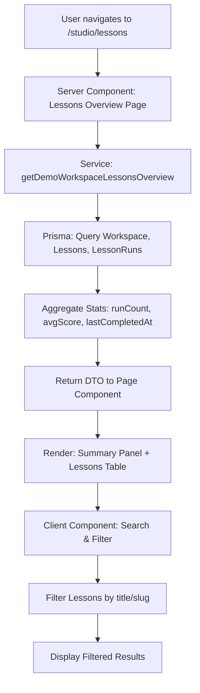
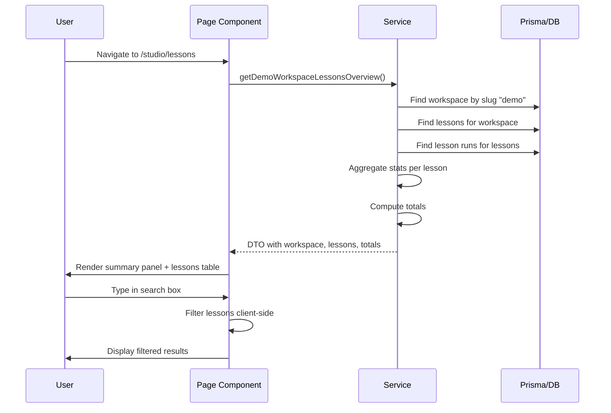

# LA3-P1-01: Demo Lessons Overview & Stats - Implementation Plan

## Overview

This plan implements a Demo Workspace lessons overview page that displays all lessons for the "demo" workspace with aggregated statistics from `LessonRun` records.

## Architecture Diagram



## Data Flow



## Implementation Tasks

### Task 1: Create Data Service for Lessons Overview

**File**: `lib/lessonarcade/lesson-dashboard-service.ts`

**Purpose**: Provide a clean data access layer for fetching workspace lessons with aggregated statistics.

**DTO Types**:

```typescript
interface LessonStats {
  id: string
  slug: string
  title: string
  status: LessonStatus
  runCount: number
  averageScorePercent: number | null
  lastCompletedAt: Date | null
}

interface WorkspaceSummary {
  id: string
  slug: string
  name: string
}

interface DashboardTotals {
  totalLessons: number
  totalRuns: number
  averageScorePercent: number | null
}

interface LessonsOverviewDTO {
  workspace: WorkspaceSummary
  lessons: LessonStats[]
  totals: DashboardTotals
}
```

**Implementation Details**:

1. Define `DEMO_WORKSPACE_SLUG = 'demo'` constant
2. Query workspace by slug
3. Query all lessons for workspace
4. Query all `LessonRun` records for those lessons
5. Aggregate stats per lesson:
   - `runCount`: Count of runs for the lesson
   - `averageScorePercent`: Average of (score / maxScore * 100), rounded to 1 decimal
   - `lastCompletedAt`: Max of `completedAt` dates (only completed runs)
6. Compute totals across all lessons
7. Return typed DTO

**Query Strategy**:
- Use Prisma `findMany` with `include` for related data
- Compute aggregates in TypeScript (simpler for demo scale)
- Handle edge cases: no runs, no completed runs, zero maxScore

### Task 2: Create Server-Side Page Component

**File**: `app/studio/lessons/page.tsx`

**Purpose**: Server component that fetches data and renders the lessons overview page.

**Layout**:
- Header with workspace name and description
- Summary panel with cards showing totals
- Search input (client component)
- Lessons table with columns:
  - Title
  - Slug
  - Status (badge)
  - Runs count
  - Average score
  - Last completed

**Design Tokens**:
- Use `bg-la-bg` for page background
- Use `bg-la-surface` for cards/panels
- Use `text-la-surface` for headings
- Use `text-la-muted` for secondary text
- Use `border-la-border` for borders

**Empty State**:
- If no lessons: Show friendly message "No lessons found in this workspace"
- If lessons but no runs: Show lessons with zero stats

### Task 3: Add Client-Side Search and Filtering

**File**: `app/studio/lessons/lessons-table-client.tsx` (new client component)

**Purpose**: Client component that handles search input and filters the lessons list.

**Features**:
- Search input filters by:
  - Lesson title (case-insensitive)
  - Lesson slug (case-insensitive)
- Default sorting by `lastCompletedAt` descending
- Lessons with no runs appear after those with runs

**Implementation**:
- Accept `lessons` prop from server component
- Use `useState` for search query
- Filter lessons based on search query
- Sort filtered lessons
- Pass filtered lessons to table component

### Task 4: Update Navigation

**File**: `components/layout/navigation.tsx`

**Change**: Add new navigation link for lessons overview.

**Placement**: After "Voice Conversation" link, before "Try LessonArcade" button.

**Styling**: Use same `Button asChild variant="ghost"` pattern as other links.

**A11y**: Ensure focus-visible styles match existing links.

### Task 5: Add Unit/Integration Tests

**File**: `test/db/lesson-dashboard-service.test.ts`

**Test Cases**:
1. Should return workspace info for demo workspace
2. Should return all lessons for demo workspace
3. Should compute correct runCount per lesson
4. Should compute correct averageScorePercent per lesson
5. Should compute correct lastCompletedAt per lesson
6. Should compute correct totals (totalLessons, totalRuns, averageScorePercent)
7. Should handle lessons with no runs gracefully
8. Should handle workspace with no lessons gracefully

**Setup**:
- Use `beforeAll` to seed demo data
- Create sample `LessonRun` records for testing
- Use `afterEach` to disconnect Prisma

### Task 6: Add E2E Tests

**File**: `e2e/studio-lessons-overview.spec.ts`

**Test Cases**:
1. Should render lessons overview page at /studio/lessons
2. Should display workspace name in header
3. Should display summary panel with totals
4. Should render lessons table with seeded lessons
5. Should filter lessons when typing in search box

**Assertions**:
- Check for page heading containing "Lessons" or "Workspace"
- Check for presence of seeded lesson titles/slugs
- Avoid exact numeric assertions to prevent flakiness

### Task 7: Run Quality Gates

**Commands**:
1. `pnpm lint` - Check for linting errors
2. `pnpm test` - Run all unit tests
3. `pnpm test:e2e:ci` - Run E2E tests (chromium only)
4. `pnpm test:smoke` - Run smoke tests

**Expected Outcomes**:
- All new tests pass
- Pre-existing E2E failures remain unchanged:
  - accessibility-and-layout mobile viewport test
  - branding-related tests
- No new E2E failures introduced

### Task 8: Commit Changes

**Commit Message**: `feat(la3-p1-01): add demo workspace lessons overview`

## File Structure

```
lib/lessonarcade/
  lesson-dashboard-service.ts  (new)

app/studio/lessons/
  page.tsx                      (new)
  lessons-table-client.tsx      (new)

components/layout/
  navigation.tsx                 (modified)

test/db/
  lesson-dashboard-service.test.ts  (new)

e2e/
  studio-lessons-overview.spec.ts   (new)
```

## Design Considerations

### Time Zone Handling
- Use ISO strings for `completedAt` in DTO
- Display dates using `toLocaleString()` or similar
- Avoid locale-dependent parsing

### Empty States
- No lessons: "No lessons found in this workspace"
- Lessons but no runs: Display lessons with "—" for stats
- No search results: "No lessons match your search"

### Sorting Logic
1. Lessons with runs (sorted by `lastCompletedAt` descending)
2. Lessons without runs (sorted by title ascending)

### Badge Colors for Status
- DRAFT: `variant="secondary"` (gray)
- ACTIVE: `variant="default"` (primary)
- ARCHIVED: `variant="outline"` (outline)

## Non-Goals (Out of Scope)

- Authentication/login flow
- Multi-workspace switching UI
- Complex filtering (tags, advanced queries)
- Modifying existing lesson player/Voice/Studio behavior
- Fixing pre-existing E2E failures

## Success Criteria

1. Service returns correct aggregated data from database
2. Page renders with workspace info, summary panel, and lessons table
3. Search filters lessons by title and slug
4. Default sorting places most active lessons first
5. Navigation link accessible with proper a11y styles
6. Unit tests pass for service logic
7. E2E tests pass for page rendering
8. No new E2E failures introduced
9. All quality gates pass (lint, test, test:e2e:ci, test:smoke)
