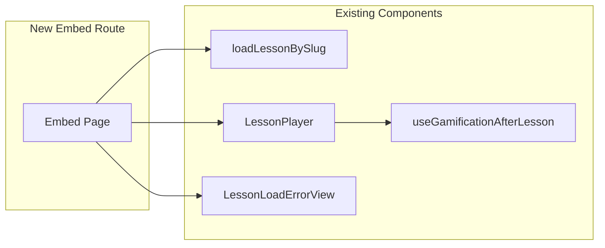

# LA3-P1-03: Embeddable LessonArcade Player Implementation Plan

## Overview

This plan outlines the implementation of an embeddable LessonArcade player that allows customers to embed demo lessons into their own websites or Learning Management Systems (LMS) using a simple iframe snippet.

## Architecture

### Embed Route Structure

```mermaid
graph TB
    A[External Site/LMS] -->|iframe src| B[/embed/demo/lesson/effective-meetings/]
    B --> C[app/embed/layout.tsx]
    C --> D[app/embed/[workspaceSlug]/lesson/[lessonSlug]/page.tsx]
    D --> E{Validate workspaceSlug}
    E -->|demo| F[loadLessonBySlug]
    E -->|other| G[Show embed-friendly error]
    F --> H[LessonPlayer Component]
    H --> I[useGamificationAfterLesson Hook]
    I --> J[/api/lesson-runs POST]
    J --> K[Prisma Database - LessonRun]
```

### Component Reuse



## Implementation Details

### 1. Embed Route Structure

#### 1.1 Create `app/embed/layout.tsx`

A minimal layout that:
- Wraps children in `BrandThemeProvider` to support brand theming
- Does NOT include site navigation, hero, or footer
- Uses existing design tokens from globals.css

```tsx
// app/embed/layout.tsx
import { BrandThemeProvider } from "@/components/layout/BrandThemeProvider"
import { getBrandPreset } from "@/lib/branding/brandPresets"

const brandId = process.env.NEXT_PUBLIC_BRAND_ID || "lessonarcade-default"
const brandPreset = getBrandPreset(brandId)

export default function EmbedLayout({
  children,
}: {
  children: React.ReactNode
}) {
  return (
    <BrandThemeProvider brandId={brandPreset.id}>
      {children}
    </BrandThemeProvider>
  )
}
```

#### 1.2 Create `app/embed/[workspaceSlug]/lesson/[lessonSlug]/page.tsx`

Main embed page that:
- Validates `workspaceSlug` (only "demo" supported in Phase 3)
- Loads lesson using `loadLessonBySlug`
- Renders `LessonPlayer` for valid lessons
- Shows embed-friendly error for invalid workspace or unknown lesson
- Sets `data-testid="la-embed-lesson-page"` on main container

Key features:
- Reuses existing `LessonPlayer` component (no duplication)
- Reuses `LessonLoadErrorView` for error handling
- Handles invalid `workspaceSlug` gracefully with small error message
- Handles unknown `lessonSlug` gracefully with small error message

### 2. Embed-Specific Styling

The embed page must be iframe-friendly:

- **No large outer margins** - content should expand to fill iframe viewport
- **Existing design tokens** - use `bg-la-bg`, `text-la-surface`, etc.
- **Scrollbar styling** - ensure scrollbars look good in constrained iframe
- **Focus outlines** - respect existing a11y work for keyboard navigation
- **Brand system support** - `NEXT_PUBLIC_BRAND_ID` and `brand` query param work

CSS considerations:
- Use `h-full` or `min-h-screen` to fill iframe
- Ensure `overflow-auto` for proper scrolling
- Keep focus states visible (`focus-visible:ring-2`, etc.)

### 3. Documentation

#### 3.1 Create `docs/embed-player.md`

Content:
1. **What is the Embeddable Player?** (2-3 paragraphs)
   - Explain that customers can embed LessonArcade lessons into their sites
   - Describe the iframe-based approach
   - Mention that Phase 3 supports demo workspace only

2. **How to Use** (iframe snippet)
   ```html
   <iframe
     src="https://YOUR-DEPLOYED-URL/embed/demo/lesson/effective-meetings"
     width="100%"
     height="640"
     frameborder="0"
     allowfullscreen
   ></iframe>
   ```

3. **URL Structure**
   - `/embed/[workspaceSlug]/lesson/[lessonSlug]`
   - Phase 3: only "demo" workspace supported
   - Lesson slugs match existing demo lessons

4. **Analytics**
   - Lesson runs and analytics are captured by backend
   - Same player components = same gamification behavior

#### 3.2 Update `README.md`

Add new subsection after "Voice Demo" section:

```markdown
## Embeddable Player

LessonArcade lessons can be embedded directly into any website or Learning Management System (LMS) using a simple iframe. The embeddable player delivers the same interactive experience as the main demo, including gamification, completion tracking, and analytics. For Phase 3, only the "demo" workspace is supported, with public demo lessons available for embedding.

For complete documentation and examples, see [docs/embed-player.md](docs/embed-player.md).

### Example

```html
<iframe
  src="https://YOUR-DEPLOYED-URL/embed/demo/lesson/effective-meetings"
  width="100%"
  height="640"
  frameborder="0"
  allowfullscreen
></iframe>
```
```

### 4. Tests

#### 4.1 Unit/Integration Test

Add a test for the embed route or loader logic:
- Test that `loadLessonBySlug` works with demo lesson slugs
- Test that invalid workspaceSlug is rejected
- Test that unknown lessonSlug returns appropriate error

#### 4.2 E2E Test: `e2e/embed-lesson.spec.ts`

```typescript
import { test, expect } from '@playwright/test';

test('embed lesson page loads correctly', async ({ page }) => {
  // Navigate to embed route
  await page.goto('/embed/demo/lesson/effective-meetings');

  // Wait for embed page to be visible
  await expect(page.locator('[data-testid="la-embed-lesson-page"]')).toBeVisible();

  // Verify lesson content is present (title or heading)
  const lessonTitle = page.locator('h1, h2').first();
  await expect(lessonTitle).toBeVisible();

  // Note: Do NOT assert on numeric stats (scores, counts)
  // as these may change from other tests
});
```

Key considerations:
- Demo seeding is handled by global setup
- Avoid asserting on exact numeric stats
- Use `data-testid="la-embed-lesson-page"` for reliable selection

### 5. Quality Gates

Run the following commands after implementation:

1. `pnpm lint` - verify no new lint errors
2. `pnpm test` - verify all unit/integration tests pass
3. `pnpm test:e2e:ci` - verify new embed spec passes
4. `pnpm test:smoke` - verify smoke tests pass

**Pre-existing E2E failures** (do NOT fix):
- `e2e/branding.spec.ts`
- `e2e/accessibility-and-layout.spec.ts`

These failures are outside the scope of this task.

### 6. Commit

After all quality gates pass:
- Commit directly to `main` with message:
  ```
  feat(la3-p1-03): add embeddable lesson player route
  ```

## Non-Goals (Out of Scope)

- Full embed configuration UI in Studio
- JavaScript snippet-based embed loader (iframe is enough for now)
- Multi-workspace access control or auth gating
- Fixing or refactoring unrelated parts of the app
- Changing existing `/demo` or `/studio` routes beyond navigation/docs

## File Structure

```
app/
├── embed/
│   ├── layout.tsx                    [NEW]
│   └── [workspaceSlug]/
│       └── lesson/
│           └── [lessonSlug]/
│               └── page.tsx          [NEW]
docs/
└── embed-player.md                   [NEW]
e2e/
└── embed-lesson.spec.ts              [NEW]
README.md                             [MODIFIED - add Embeddable Player section]
```

## Success Criteria

1. ✅ Embed route at `/embed/[workspaceSlug]/lesson/[lessonSlug]` works
2. ✅ Only "demo" workspace is supported (Phase 3)
3. ✅ Invalid workspaceSlug shows embed-friendly error
4. ✅ Unknown lessonSlug shows embed-friendly error
5. ✅ LessonPlayer components are reused (no duplication)
6. ✅ Lesson runs are recorded to backend (same as demo)
7. ✅ Documentation created (`docs/embed-player.md`)
8. ✅ README updated with embed player section
9. ✅ E2E test for embed route passes
10. ✅ All quality gates pass (lint, test, test:e2e:ci, test:smoke)
11. ✅ No new unrelated test failures introduced
