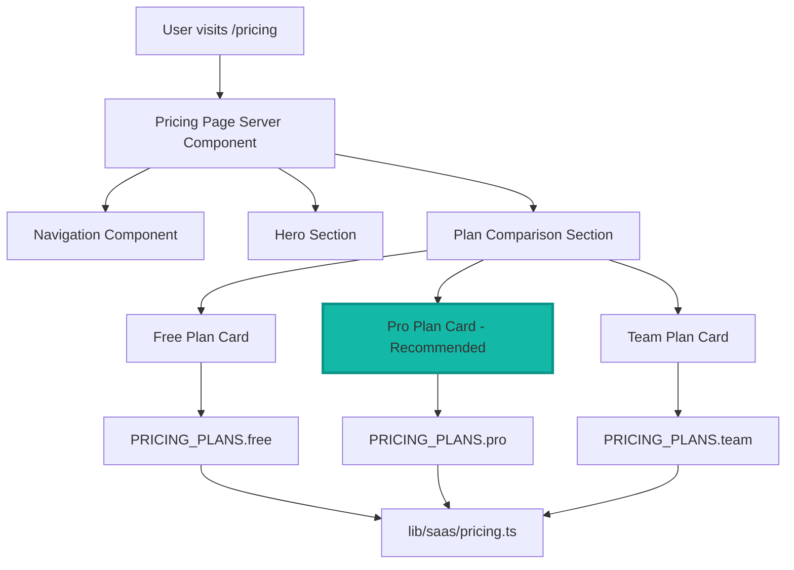

# LA3-P1-04: Pricing Page & Plan Comparison - Implementation Plan

## Overview

This plan documents the implementation of a public pricing page (`/pricing`) that displays the plans defined in `lib/saas/pricing.ts`, integrated with navigation and tested with E2E tests.

## Architecture Diagram



## Implementation Details

### 1. Pricing Page Route (`app/pricing/page.tsx`)

**Component Structure:**
- Server component (no "use client" directive)
- Imports `PRICING_PLANS` from `lib/saas/pricing.ts`
- Includes Navigation component
- Hero section explaining SaaS model
- Plan comparison section with 3 cards

**Hero Section:**
- 2-3 sentence explanation of LessonArcade's SaaS model
- Consistent with existing HeroSection styling
- Uses design tokens (`text-la-surface`, `text-la-muted`, etc.)

**Plan Comparison Section:**
- Responsive grid: `grid-cols-1 md:grid-cols-3`
- Each card shows:
  - Plan name (`text-2xl font-semibold`)
  - Description (`text-sm text-la-muted`)
  - Target audience (`text-sm`)
  - Quotas (workspaces, editor seats, lessons, lesson runs)
  - Features list with checkmarks
  - Price hint (`text-xl font-bold`)
  - "Recommended" badge for Pro plan

**Visual Highlight for Recommended Plan (Pro):**
- Badge component: `<Badge variant="default">Recommended</Badge>`
- Subtle border highlight: `border-la-accent` or `ring-2 ring-la-accent`
- Background tint: `bg-la-accent/5` (very subtle)
- `data-testid="la-pricing-recommended"` attribute

**Data Test IDs:**
- Main container: `data-testid="la-pricing-page"`
- Pro plan card: `data-testid="la-pricing-recommended"`

**Design Consistency:**
- Uses existing Card components (`Card`, `CardHeader`, `CardContent`, `CardFooter`)
- Uses Badge component for recommended tag
- Uses Button component for CTAs (if added)
- Uses FadeInSection for animations (optional)
- Follows existing typography scale

### 2. Navigation Update (`components/layout/navigation.tsx`)

**Placement:**
- Add Pricing link between "Lessons Overview" and "Try LessonArcade" buttons
- Uses same `Button asChild variant="ghost"` pattern as existing links
- Maintains accessibility styles (focus-visible, ring-offset)

**Code Pattern:**
```tsx
<Button asChild variant="ghost" className="...">
  <Link href="/pricing">
    Pricing
  </Link>
</Button>
```

### 3. E2E Test (`e2e/pricing-page.spec.ts`)

**Test Cases:**
1. Navigate to `/pricing` and verify page loads (200 status)
2. Verify `data-testid="la-pricing-page"` is visible
3. Verify all three plan names (Free, Pro, Team) appear on page
4. Verify recommended plan is visually distinguished (has `data-testid="la-pricing-recommended"`)

**Test Pattern:**
```typescript
test('pricing page loads and displays all plans', async ({ page }) => {
  await page.goto('/pricing');
  await expect(page.locator('[data-testid="la-pricing-page"]')).toBeVisible();
  await expect(page.getByText('Free')).toBeVisible();
  await expect(page.getByText('Pro')).toBeVisible();
  await expect(page.getByText('Team')).toBeVisible();
  await expect(page.locator('[data-testid="la-pricing-recommended"]')).toBeVisible();
});
```

### 4. Feature Display Mapping

| Field | Display Format |
|-------|----------------|
| `includedWorkspaces` | "1 workspace" or "Unlimited" (if null) |
| `includedEditorSeats` | "1 seat" or "25 seats" |
| `includedLessons` | "3 lessons" or "Unlimited" (if null) |
| `includedLessonRunsPerMonth` | "100 runs/month" or "10,000 runs/month" |
| `features` | Bullet list with checkmark icons |
| `priceHint` | Display as-is (e.g., "US$29–49 / workspace / month (TBD)") |
| `targetAudience` | Small text below description |

### 5. Responsive Design

**Mobile (< 768px):**
- Cards stacked vertically (`grid-cols-1`)
- Full width cards
- Padding adjusted for smaller screens

**Desktop (>= 768px):**
- 3-column grid (`grid-cols-3`)
- Cards with consistent height
- Hover effects on cards

## Quality Gates

After implementation, run:
1. `pnpm lint` - No new lint errors
2. `pnpm test` - All unit tests pass
3. `pnpm test:e2e:ci` - E2E tests pass (except known pre-existing failures)
4. `pnpm test:smoke` - Smoke tests pass

**Known Pre-existing E2E Failures (ignore):**
- `e2e/branding.spec.ts`
- `e2e/accessibility-and-layout.spec.ts`

## Non-Goals

- No checkout/payment integration
- No account creation/plan upgrade flows
- No runtime feature gating logic
- No Prisma schema or migration changes
- No modifications to existing E2E specs (branding, accessibility)

## Cross-Reference with README

The README section "Pricing & Plans (Concept)" states:
> "LessonArcade is moving toward a multi-workspace SaaS with plans based on workspaces, editor seats, and lesson-run usage. The pricing structure includes three tiers: **Free** (for individuals experimenting with the platform), **Pro** (for small teams with voice and embed support), and **Team** (for larger organizations with multiple workspaces and advanced analytics)."

The pricing page will display these exact three tiers with the described characteristics, ensuring consistency with the README.

## Files to Create/Modify

### Create:
1. `app/pricing/page.tsx` - New pricing page route
2. `e2e/pricing-page.spec.ts` - New E2E test spec

### Modify:
1. `components/layout/navigation.tsx` - Add Pricing link

### No Changes Needed:
- `lib/saas/pricing.ts` - Already complete
- `test/saas/pricing.test.ts` - Already comprehensive
- `README.md` - Already mentions pricing concept
