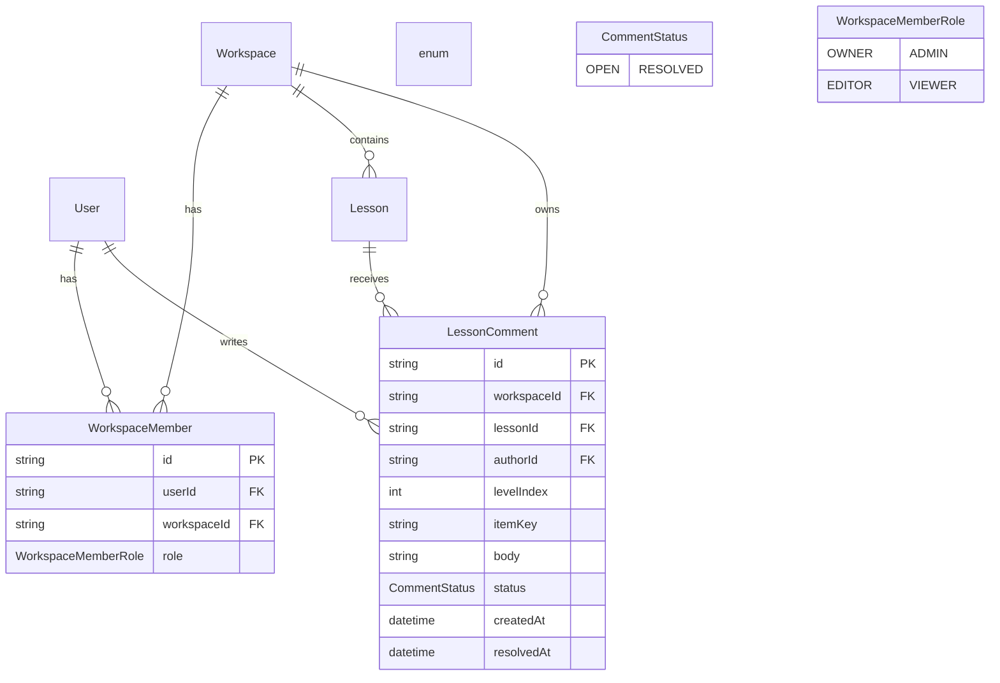
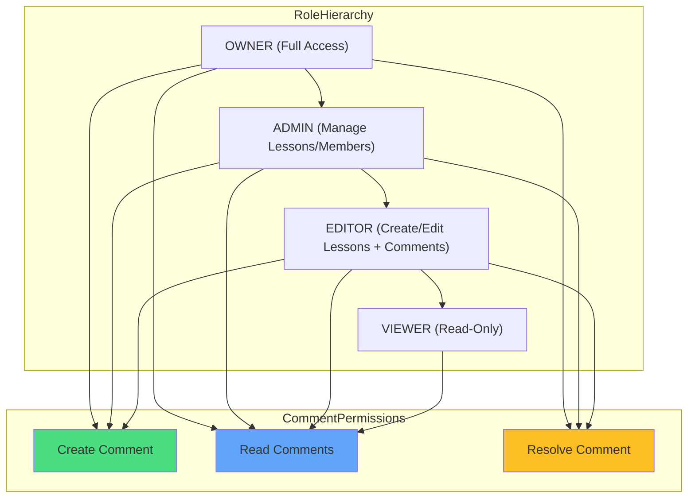
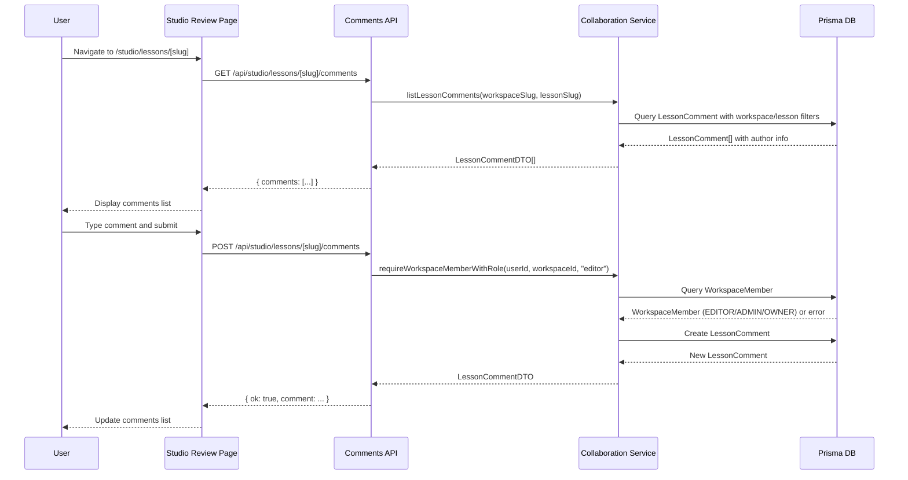

# LA3-P2-01: Lesson Comments and Collaboration Roles

## Overview

This plan implements a minimal but realistic collaboration feature for LessonArcade, allowing multiple users in a workspace to leave comments on lessons with simple role-based permissions. This is marked as demo-grade, not production-ready.

## Architecture Diagram



## Permission Model



## Component Flow



## Implementation Tasks

### Task 1: Prisma Model for Lesson Comments

**File:** `prisma/schema.prisma`

Add the following to the schema:

```prisma
// ============================================================================
// COLLABORATION
// ============================================================================

// CommentStatus defines the state of a lesson comment
enum CommentStatus {
  OPEN      // Comment is active and visible
  RESOLVED  // Comment has been resolved and archived
}

// LessonComment represents a comment on a lesson for collaboration
// POC/Demo-grade: Not production-ready for large-scale use
model LessonComment {
  id            String        @id @default(uuid())
  workspace     Workspace     @relation(fields: [workspaceId], references: [id], onDelete: Cascade)
  workspaceId   String
  lesson        Lesson        @relation(fields: [lessonId], references: [id], onDelete: Cascade)
  lessonId      String
  author        User          @relation(fields: [authorId], references: [id], onDelete: Cascade)
  authorId      String
  // Optional: allow comments to be tied to a specific level or item
  levelIndex    Int?          // e.g. 0-based level index
  itemKey       String?       // e.g. question id inside the lesson JSON
  body          String
  status        CommentStatus @default(OPEN)
  createdAt     DateTime      @default(now())
  resolvedAt    DateTime?

  @@index([workspaceId])
  @@index([lessonId])
  @@index([authorId])
  @@index([status])
  @@map("lesson_comments")
}
```

Add relations to existing models:

```prisma
model User {
  // ... existing fields
  lessonRuns      LessonRun[]
  lessonComments  LessonComment[]  // NEW
}

model Workspace {
  // ... existing fields
  lessons          Lesson[]
  lessonRuns       LessonRun[]
  lessonComments   LessonComment[]  // NEW
}

model Lesson {
  // ... existing fields
  versions         LessonVersion[]
  runs             LessonRun[]
  comments         LessonComment[]  // NEW
}
```

**Sync database:** Run `pnpm db:push:dev`

---

### Task 2: Collaboration Domain & Permission Helpers

**File:** `lib/lessonarcade/collaboration-service.ts`

```typescript
import { PrismaClient, WorkspaceMemberRole, CommentStatus } from '@prisma/client'
import { z } from 'zod'

// ============================================================================
// TYPES
// ============================================================================

export type MinimumRole = 'viewer' | 'editor'

export interface LessonCommentDTO {
  id: string
  authorName: string
  authorEmail: string
  createdAt: Date
  body: string
  status: CommentStatus
  levelIndex: number | null
  itemKey: string | null
}

// ============================================================================
// VALIDATION
// ============================================================================

export const CreateCommentSchema = z.object({
  body: z.string().min(1).max(2000),
  levelIndex: z.number().int().min(0).optional(),
  itemKey: z.string().optional(),
})

export type CreateCommentInput = z.infer<typeof CreateCommentSchema>

// ============================================================================
// PERMISSION HELPERS
// ============================================================================

/**
 * Role hierarchy mapping for minimum role requirements
 */
const ROLE_HIERARCHY: Record<MinimumRole, WorkspaceMemberRole[]> = {
  viewer: ['VIEWER', 'EDITOR', 'ADMIN', 'OWNER'],
  editor: ['EDITOR', 'ADMIN', 'OWNER'],
}

/**
 * Require workspace member with minimum role
 *
 * @param prisma - Prisma client
 * @param userId - User ID
 * @param workspaceId - Workspace ID
 * @param minimum - Minimum required role
 * @returns WorkspaceMember if user has sufficient role
 * @throws Error if not a member or insufficient role
 */
export async function requireWorkspaceMemberWithRole(
  prisma: PrismaClient,
  userId: string,
  workspaceId: string,
  minimum: MinimumRole
) {
  const member = await prisma.workspaceMember.findUnique({
    where: {
      userId_workspaceId: {
        userId,
        workspaceId,
      },
    },
  })

  if (!member) {
    throw new Error('User is not a member of this workspace')
  }

  const allowedRoles = ROLE_HIERARCHY[minimum]
  if (!allowedRoles.includes(member.role)) {
    throw new Error(`User role ${member.role} does not meet minimum requirement ${minimum}`)
  }

  return member
}

// ============================================================================
// COMMENT CRUD FUNCTIONS
// ============================================================================

/**
 * List comments for a lesson in a workspace
 *
 * @param prisma - Prisma client
 * @param workspaceSlug - Workspace slug
 * @param lessonSlug - Lesson slug
 * @returns Array of comment DTOs
 */
export async function listLessonComments(
  prisma: PrismaClient,
  workspaceSlug: string,
  lessonSlug: string
): Promise<LessonCommentDTO[]> {
  // Resolve workspace by slug
  const workspace = await prisma.workspace.findUnique({
    where: { slug: workspaceSlug },
  })

  if (!workspace) {
    throw new Error(`Workspace with slug "${workspaceSlug}" not found`)
  }

  // Resolve lesson by workspace and slug
  const lesson = await prisma.lesson.findUnique({
    where: {
      workspaceId_slug: {
        workspaceId: workspace.id,
        slug: lessonSlug,
      },
    },
  })

  if (!lesson) {
    throw new Error(`Lesson with slug "${lessonSlug}" not found in workspace`)
  }

  // Fetch comments with author info
  const comments = await prisma.lessonComment.findMany({
    where: {
      workspaceId: workspace.id,
      lessonId: lesson.id,
    },
    include: {
      author: true,
    },
    orderBy: {
      createdAt: 'desc',
    },
  })

  // Map to DTOs
  return comments.map((comment) => ({
    id: comment.id,
    authorName: comment.author.name,
    authorEmail: comment.author.email,
    createdAt: comment.createdAt,
    body: comment.body,
    status: comment.status,
    levelIndex: comment.levelIndex,
    itemKey: comment.itemKey,
  }))
}

/**
 * Create a new comment on a lesson
 *
 * @param prisma - Prisma client
 * @param workspaceSlug - Workspace slug
 * @param lessonSlug - Lesson slug
 * @param authorUserId - Author user ID
 * @param input - Comment input data
 * @returns Created comment DTO
 */
export async function createLessonComment(
  prisma: PrismaClient,
  workspaceSlug: string,
  lessonSlug: string,
  authorUserId: string,
  input: CreateCommentInput
): Promise<LessonCommentDTO> {
  // Validate input
  const validated = CreateCommentSchema.parse(input)

  // Resolve workspace by slug
  const workspace = await prisma.workspace.findUnique({
    where: { slug: workspaceSlug },
  })

  if (!workspace) {
    throw new Error(`Workspace with slug "${workspaceSlug}" not found`)
  }

  // Resolve lesson by workspace and slug
  const lesson = await prisma.lesson.findUnique({
    where: {
      workspaceId_slug: {
        workspaceId: workspace.id,
        slug: lessonSlug,
      },
    },
  })

  if (!lesson) {
    throw new Error(`Lesson with slug "${lessonSlug}" not found in workspace`)
  }

  // Create comment
  const comment = await prisma.lessonComment.create({
    data: {
      workspaceId: workspace.id,
      lessonId: lesson.id,
      authorId: authorUserId,
      body: validated.body,
      levelIndex: validated.levelIndex,
      itemKey: validated.itemKey,
      status: 'OPEN',
    },
    include: {
      author: true,
    },
  })

  return {
    id: comment.id,
    authorName: comment.author.name,
    authorEmail: comment.author.email,
    createdAt: comment.createdAt,
    body: comment.body,
    status: comment.status,
    levelIndex: comment.levelIndex,
    itemKey: comment.itemKey,
  }
}

/**
 * Resolve a comment (POC only - not production-ready)
 *
 * @param prisma - Prisma client
 * @param commentId - Comment ID
 * @param userId - User ID performing the action
 * @returns Updated comment DTO
 */
export async function resolveLessonComment(
  prisma: PrismaClient,
  commentId: string,
  userId: string
): Promise<LessonCommentDTO> {
  // POC: Basic implementation without full permission checks
  const comment = await prisma.lessonComment.update({
    where: { id: commentId },
    data: {
      status: 'RESOLVED',
      resolvedAt: new Date(),
    },
    include: {
      author: true,
    },
  })

  return {
    id: comment.id,
    authorName: comment.author.name,
    authorEmail: comment.author.email,
    createdAt: comment.createdAt,
    body: comment.body,
    status: comment.status,
    levelIndex: comment.levelIndex,
    itemKey: comment.itemKey,
  }
}
```

---

### Task 3: API Route Handlers

**File:** `app/api/studio/lessons/[lessonSlug]/comments/route.ts`

```typescript
import { NextRequest, NextResponse } from 'next/server'
import { prisma } from '@/lib/db/prisma'
import { requireAuth } from '@/lib/saas/session'
import {
  listLessonComments,
  createLessonComment,
  requireWorkspaceMemberWithRole,
  CreateCommentSchema,
} from '@/lib/lessonarcade/collaboration-service'

/**
 * GET /api/studio/lessons/[lessonSlug]/comments
 *
 * List comments for a lesson in the active workspace
 */
export async function GET(
  request: NextRequest,
  { params }: { params: { lessonSlug: string } }
) {
  try {
    // Require authentication
    const session = await requireAuth()

    // Get active workspace
    const workspace = await prisma.workspace.findUnique({
      where: { id: session.activeWorkspaceId },
    })

    if (!workspace) {
      return NextResponse.json(
        { error: 'Active workspace not found' },
        { status: 404 }
      )
    }

    // Check user is a member (viewer minimum)
    await requireWorkspaceMemberWithRole(prisma, session.userId, workspace.id, 'viewer')

    // List comments
    const comments = await listLessonComments(prisma, workspace.slug, params.lessonSlug)

    return NextResponse.json({ comments })
  } catch (error) {
    if (error instanceof Error) {
      if (error.message.includes('not a member')) {
        return NextResponse.json({ error: error.message }, { status: 403 })
      }
      if (error.message.includes('not found')) {
        return NextResponse.json({ error: error.message }, { status: 404 })
      }
    }
    return NextResponse.json({ error: 'Internal server error' }, { status: 500 })
  }
}

/**
 * POST /api/studio/lessons/[lessonSlug]/comments
 *
 * Create a new comment on a lesson
 */
export async function POST(
  request: NextRequest,
  { params }: { params: { lessonSlug: string } }
) {
  try {
    // Require authentication
    const session = await requireAuth()

    // Get active workspace
    const workspace = await prisma.workspace.findUnique({
      where: { id: session.activeWorkspaceId },
    })

    if (!workspace) {
      return NextResponse.json(
        { error: 'Active workspace not found' },
        { status: 404 }
      )
    }

    // Check user has editor role or higher
    await requireWorkspaceMemberWithRole(prisma, session.userId, workspace.id, 'editor')

    // Parse and validate request body
    const body = await request.json()
    const input = CreateCommentSchema.parse(body)

    // Create comment
    const comment = await createLessonComment(
      prisma,
      workspace.slug,
      params.lessonSlug,
      session.userId,
      input
    )

    return NextResponse.json({ ok: true, comment }, { status: 201 })
  } catch (error) {
    if (error instanceof Error) {
      if (error.message.includes('not a member') || error.message.includes('does not meet')) {
        return NextResponse.json({ error: error.message }, { status: 403 })
      }
      if (error.message.includes('not found')) {
        return NextResponse.json({ error: error.message }, { status: 404 })
      }
    }
    return NextResponse.json({ error: 'Internal server error' }, { status: 500 })
  }
}
```

---

### Task 4: Studio UI - Lesson Review Page

**File:** `app/studio/lessons/[lessonSlug]/page.tsx`

```typescript
import { Metadata } from 'next'
import { prisma } from '@/lib/db/prisma'
import { requireAuth } from '@/lib/saas/session'
import { StudioHeader } from '@/components/studio/studio-header'
import { LessonCommentsPanel } from './lesson-comments-panel'

export const metadata: Metadata = {
  title: 'Lesson Review | LessonArcade Studio',
  description: 'Review lesson and collaborate with comments',
}

export default async function LessonReviewPage({
  params,
}: {
  params: { lessonSlug: string }
}) {
  const session = await requireAuth()

  // Fetch workspace and lesson
  const workspace = await prisma.workspace.findUnique({
    where: { id: session.activeWorkspaceId },
  })

  if (!workspace) {
    throw new Error('Active workspace not found')
  }

  const lesson = await prisma.lesson.findUnique({
    where: {
      workspaceId_slug: {
        workspaceId: workspace.id,
        slug: params.lessonSlug,
      },
    },
  })

  if (!lesson) {
    throw new Error('Lesson not found')
  }

  // Fetch user's role in workspace
  const member = await prisma.workspaceMember.findUnique({
    where: {
      userId_workspaceId: {
        userId: session.userId,
        workspaceId: workspace.id,
      },
    },
  })

  // Fetch user's workspaces for header
  const user = await prisma.user.findUnique({
    where: { id: session.userId },
    include: {
      workspaceMembers: {
        include: {
          workspace: true,
        },
      },
    },
  })

  const workspaces = user?.workspaceMembers.map((m) => m.workspace) ?? []

  const canEdit = member && ['EDITOR', 'ADMIN', 'OWNER'].includes(member.role)

  return (
    <div data-testid="la-studio-lesson-review-page" className="min-h-screen bg-la-bg">
      <StudioHeader
        currentWorkspaceId={session.activeWorkspaceId}
        workspaces={workspaces}
        redirectTo={`/studio/lessons/${params.lessonSlug}`}
      />

      <main className="container mx-auto px-4 py-8">
        <div className="max-w-6xl mx-auto space-y-8">
          {/* Lesson Header */}
          <div>
            <p className="text-sm text-la-muted mb-2">{workspace.name}</p>
            <h1 className="text-4xl font-bold text-la-surface mb-2">{lesson.title}</h1>
            <p className="text-la-muted">/{lesson.slug}</p>
          </div>

          {/* Comments Panel */}
          <LessonCommentsPanel
            workspaceSlug={workspace.slug}
            lessonSlug={params.lessonSlug}
            canEdit={canEdit}
          />
        </div>
      </main>
    </div>
  )
}
```

**File:** `app/studio/lessons/[lessonSlug]/lesson-comments-panel.tsx`

```typescript
'use client'

import { useState, useEffect } from 'react'
import { Button } from '@/components/ui/button'
import { Textarea } from '@/components/ui/textarea'
import { Card, CardContent, CardHeader, CardTitle } from '@/components/ui/card'
import { Badge } from '@/components/ui/badge'
import type { LessonCommentDTO } from '@/lib/lessonarcade/collaboration-service'

interface LessonCommentsPanelProps {
  workspaceSlug: string
  lessonSlug: string
  canEdit: boolean
}

export function LessonCommentsPanel({
  workspaceSlug,
  lessonSlug,
  canEdit,
}: LessonCommentsPanelProps) {
  const [comments, setComments] = useState<LessonCommentDTO[]>([])
  const [isLoading, setIsLoading] = useState(true)
  const [isSubmitting, setIsSubmitting] = useState(false)
  const [newComment, setNewComment] = useState('')

  // Fetch comments
  useEffect(() => {
    async function fetchComments() {
      try {
        const response = await fetch(
          `/api/studio/lessons/${lessonSlug}/comments`
        )
        if (response.ok) {
          const data = await response.json()
          setComments(data.comments)
        }
      } catch (error) {
        console.error('Failed to fetch comments:', error)
      } finally {
        setIsLoading(false)
      }
    }

    fetchComments()
  }, [lessonSlug])

  // Submit new comment
  async function handleSubmit(e: React.FormEvent) {
    e.preventDefault()
    if (!newComment.trim()) return

    setIsSubmitting(true)
    try {
      const response = await fetch(
        `/api/studio/lessons/${lessonSlug}/comments`,
        {
          method: 'POST',
          headers: { 'Content-Type': 'application/json' },
          body: JSON.stringify({ body: newComment }),
        }
      )

      if (response.ok) {
        const data = await response.json()
        setComments([data.comment, ...comments])
        setNewComment('')
      }
    } catch (error) {
      console.error('Failed to submit comment:', error)
    } finally {
      setIsSubmitting(false)
    }
  }

  function formatDate(date: Date | string): string {
    return new Date(date).toLocaleString('en-US', {
      month: 'short',
      day: 'numeric',
      year: 'numeric',
      hour: '2-digit',
      minute: '2-digit',
    })
  }

  return (
    <Card>
      <CardHeader>
        <CardTitle>Comments</CardTitle>
      </CardHeader>
      <CardContent>
        {isLoading ? (
          <p className="text-la-muted">Loading comments...</p>
        ) : (
          <div className="space-y-6">
            {/* Comment Input (only for editors and above) */}
            {canEdit ? (
              <form onSubmit={handleSubmit} className="space-y-3">
                <Textarea
                  data-testid="la-lesson-comment-input"
                  placeholder="Add a comment..."
                  value={newComment}
                  onChange={(e) => setNewComment(e.target.value)}
                  rows={3}
                />
                <Button type="submit" disabled={isSubmitting || !newComment.trim()}>
                  {isSubmitting ? 'Adding...' : 'Add Comment'}
                </Button>
              </form>
            ) : (
              <p className="text-sm text-la-muted p-3 bg-muted rounded-md">
                View-only role; comments are read-only for this user.
              </p>
            )}

            {/* Comments List */}
            <div
              data-testid="la-lesson-comments-list"
              className="space-y-4"
            >
              {comments.length === 0 ? (
                <p className="text-la-muted">No comments yet.</p>
              ) : (
                comments.map((comment) => (
                  <div
                    key={comment.id}
                    className="border-b border-la-border pb-4 last:border-0 last:pb-0"
                  >
                    <div className="flex items-start justify-between gap-4">
                      <div className="flex-1">
                        <div className="flex items-center gap-2 mb-1">
                          <span className="font-medium text-la-surface">
                            {comment.authorName}
                          </span>
                          <span className="text-sm text-la-muted">
                            {comment.authorEmail}
                          </span>
                          <Badge
                            variant={
                              comment.status === 'OPEN' ? 'default' : 'secondary'
                            }
                          >
                            {comment.status}
                          </Badge>
                        </div>
                        <p className="text-sm text-la-muted mb-2">
                          {formatDate(comment.createdAt)}
                        </p>
                        <p className="text-la-surface whitespace-pre-wrap">
                          {comment.body}
                        </p>
                      </div>
                    </div>
                  </div>
                ))
              )}
            </div>
          </div>
        )}
      </CardContent>
    </Card>
  )
}
```

**Update:** `app/studio/lessons/lessons-table-client.tsx`

Add a "Review" button to each lesson row:

```typescript
// Add to TableCell section
<TableCell>
  <Button
    variant="outline"
    size="sm"
    asChild
  >
    <Link href={`/studio/lessons/${lesson.slug}`}>
      Review
    </Link>
  </Button>
</TableCell>
```

Add import for Link:
```typescript
import Link from 'next/link'
```

---

### Task 5: Demo Users and Roles

**Update:** `lib/test/demo-seed.ts`

Add demo user constants:
```typescript
export const DEMO_EDITOR = {
  email: 'demo-editor@example.com',
  name: 'Demo Editor',
}

export const DEMO_VIEWER = {
  email: 'demo-viewer@example.com',
  name: 'Demo Viewer',
}
```

Update `seedDemoWorkspaceAndLessons()` to create additional users:
```typescript
// After creating demo owner, create editor and viewer
const editor = await prisma.user.upsert({
  where: { email: DEMO_EDITOR.email },
  update: {},
  create: DEMO_EDITOR,
})
log(`User: ${editor.name} (${editor.email})`)

const viewer = await prisma.user.upsert({
  where: { email: DEMO_VIEWER.email },
  update: {},
  create: DEMO_VIEWER,
})
log(`User: ${viewer.name} (${viewer.email})`)

// Add editor and viewer as workspace members
await prisma.workspaceMember.upsert({
  where: {
    userId_workspaceId: {
      userId: editor.id,
      workspaceId: workspace.id,
    },
  },
  update: {},
  create: {
    userId: editor.id,
    workspaceId: workspace.id,
    role: 'EDITOR',
  },
})
log(`WorkspaceMember: EDITOR`)

await prisma.workspaceMember.upsert({
  where: {
    userId_workspaceId: {
      userId: viewer.id,
      workspaceId: workspace.id,
    },
  },
  update: {},
  create: {
    userId: viewer.id,
    workspaceId: workspace.id,
    role: 'VIEWER',
  },
})
log(`WorkspaceMember: VIEWER`)
```

**Update:** `app/auth/signin/action.ts`

Add sign-in actions for demo editor and viewer:
```typescript
export async function signInAsDemoEditorAction() {
  const user = await prisma.user.findUnique({
    where: { email: 'demo-editor@example.com' },
    include: {
      workspaceMembers: {
        include: {
          workspace: true,
        },
      },
    },
  })

  if (!user) {
    redirect('/auth/demo-signin?error=demo-editor-not-found')
  }

  const demoWorkspace = user.workspaceMembers.find(
    (m) => m.workspace.slug === 'demo'
  )?.workspace

  if (!demoWorkspace) {
    redirect('/auth/demo-signin?error=demo-workspace-not-found')
  }

  await setSession(user.id, demoWorkspace.id)
  redirect('/studio')
}

export async function signInAsDemoViewerAction() {
  const user = await prisma.user.findUnique({
    where: { email: 'demo-viewer@example.com' },
    include: {
      workspaceMembers: {
        include: {
          workspace: true,
        },
      },
    },
  })

  if (!user) {
    redirect('/auth/demo-signin?error=demo-viewer-not-found')
  }

  const demoWorkspace = user.workspaceMembers.find(
    (m) => m.workspace.slug === 'demo'
  )?.workspace

  if (!demoWorkspace) {
    redirect('/auth/demo-signin?error=demo-workspace-not-found')
  }

  await setSession(user.id, demoWorkspace.id)
  redirect('/studio')
}
```

**Update:** `app/auth/demo-signin/sign-in-form.tsx`

```typescript
import { signInAction, signInAsDemoOwnerAction, signInAsDemoEditorAction, signInAsDemoViewerAction, SignInState } from '../signin/action'

// Add after existing buttons:
<div className="grid grid-cols-3 gap-2">
  <form action={signInAsDemoOwnerAction}>
    <Button
      type="submit"
      variant="outline"
      className="w-full text-xs"
    >
      Owner
    </Button>
  </form>
  <form action={signInAsDemoEditorAction}>
    <Button
      type="submit"
      variant="outline"
      className="w-full text-xs"
    >
      Editor
    </Button>
  </form>
  <form action={signInAsDemoViewerAction}>
    <Button
      type="submit"
      variant="outline"
      className="w-full text-xs"
    >
      Viewer
    </Button>
  </form>
</div>
```

**Update:** `app/auth/demo-signin/page.tsx`

```typescript
{/* Demo Credentials Hint */}
<div className="mt-6 p-4 bg-blue-50 dark:bg-blue-900/20 border border-blue-200 dark:border-blue-800 rounded-md">
  <p className="text-sm text-blue-800 dark:text-blue-200">
    <strong>Demo Identities:</strong>
    <br />
    • Demo Owner – Full access
    <br />
    • Demo Editor – Can add comments
    <br />
    • Demo Viewer – Read-only, cannot post comments
  </p>
</div>
```

**Update:** `README.md`

Add section under Authentication:
```markdown
### Demo Identities

The demo sign-in page provides three pre-configured identities for testing:

| Identity | Email | Role | Permissions |
|----------|-------|------|-------------|
| Demo Owner | demo-owner@example.com | OWNER | Full access to workspace |
| Demo Editor | demo-editor@example.com | EDITOR | Can create and edit lessons, add comments |
| Demo Viewer | demo-viewer@example.com | VIEWER | Read-only access to lessons and comments |
```

---

### Task 6: Tests

**File:** `test/lessonarcade/collaboration-service.test.ts`

```typescript
import { describe, it, expect, beforeAll, afterEach } from 'vitest'
import { seedDemoWorkspaceAndLessons } from '@/lib/test/demo-seed'
import { prisma } from '@/lib/db/prisma'
import {
  createLessonComment,
  listLessonComments,
  requireWorkspaceMemberWithRole,
} from '@/lib/lessonarcade/collaboration-service'

describe('Collaboration Service', () => {
  beforeAll(async () => {
    await seedDemoWorkspaceAndLessons(prisma)
  })

  afterEach(async () => {
    await prisma.$disconnect()
  })

  it('should allow EDITOR to create a comment', async () => {
    // Get demo editor user
    const editor = await prisma.user.findUnique({
      where: { email: 'demo-editor@example.com' },
    })
    expect(editor).toBeDefined()

    // Get demo workspace
    const workspace = await prisma.workspace.findUnique({
      where: { slug: 'demo' },
    })
    expect(workspace).toBeDefined()

    // Get a lesson
    const lesson = await prisma.lesson.findFirst({
      where: { workspaceId: workspace!.id },
    })
    expect(lesson).toBeDefined()

    // Create comment
    const comment = await createLessonComment(
      prisma,
      workspace!.slug,
      lesson!.slug,
      editor!.id,
      { body: 'Test comment from editor' }
    )

    expect(comment).toBeDefined()
    expect(comment.body).toBe('Test comment from editor')
    expect(comment.authorEmail).toBe('demo-editor@example.com')
  })

  it('should block VIEWER from creating comments via permission check', async () => {
    // Get demo viewer user
    const viewer = await prisma.user.findUnique({
      where: { email: 'demo-viewer@example.com' },
    })
    expect(viewer).toBeDefined()

    // Get demo workspace
    const workspace = await prisma.workspace.findUnique({
      where: { slug: 'demo' },
    })
    expect(workspace).toBeDefined()

    // Expect error when requiring editor role
    await expect(
      requireWorkspaceMemberWithRole(prisma, viewer!.id, workspace!.id, 'editor')
    ).rejects.toThrow('does not meet minimum requirement editor')
  })

  it('should list comments scoped to workspace and lesson', async () => {
    // Get demo workspace and lesson
    const workspace = await prisma.workspace.findUnique({
      where: { slug: 'demo' },
    })
    expect(workspace).toBeDefined()

    const lesson = await prisma.lesson.findFirst({
      where: { workspaceId: workspace!.id },
    })
    expect(lesson).toBeDefined()

    // Get sample team workspace
    const sampleTeam = await prisma.workspace.findUnique({
      where: { slug: 'sample-team' },
    })
    expect(sampleTeam).toBeDefined()

    // Create a comment in demo workspace
    const editor = await prisma.user.findUnique({
      where: { email: 'demo-editor@example.com' },
    })

    await createLessonComment(
      prisma,
      workspace!.slug,
      lesson!.slug,
      editor!.id,
      { body: 'Demo workspace comment' }
    )

    // Create a comment in sample team workspace
    const sampleLesson = await prisma.lesson.findFirst({
      where: { workspaceId: sampleTeam!.id },
    })

    if (sampleLesson) {
      await createLessonComment(
        prisma,
        sampleTeam!.slug,
        sampleLesson.slug,
        editor!.id,
        { body: 'Sample team comment' }
      )
    }

    // List comments for demo workspace lesson
    const demoComments = await listLessonComments(
      prisma,
      workspace!.slug,
      lesson!.slug
    )

    // Should only contain demo workspace comment
    expect(demoComments.some((c) => c.body === 'Demo workspace comment')).toBe(true)
    expect(demoComments.some((c) => c.body === 'Sample team comment')).toBe(false)
  })
})
```

**File:** `e2e/collaboration-comments.spec.ts`

```typescript
import { test, expect } from '@playwright/test'

const AUTH_HEADER = 'Basic ' + Buffer.from('e2e:e2e').toString('base64')

test.describe('Collaboration Comments', () => {
  test('Editor can add and see comments', async ({ page }) => {
    await page.setExtraHTTPHeaders({ Authorization: AUTH_HEADER })

    // Sign in as demo editor
    await page.goto('/auth/demo-signin')
    await page.getByRole('button', { name: 'Editor' }).click()
    await expect(page).toHaveURL(/\/studio/)

    // Navigate to lessons overview
    await page.goto('/studio/lessons')

    // Click Review button on first lesson
    await page.getByRole('button', { name: 'Review' }).first().click()
    await expect(page).toHaveURL(/\/studio\/lessons\/.+/)

    // Verify comments panel is visible
    await expect(
      page.locator('[data-testid="la-studio-lesson-review-page"]')
    ).toBeVisible()
    await expect(
      page.locator('[data-testid="la-lesson-comments-list"]')
    ).toBeVisible()

    // Verify comment input is available (editor role)
    await expect(
      page.locator('[data-testid="la-lesson-comment-input"]')
    ).toBeVisible()

    // Add a comment
    const testComment = 'E2E test comment from editor'
    await page
      .locator('[data-testid="la-lesson-comment-input"]')
      .fill(testComment)
    await page.getByRole('button', { name: 'Add Comment' }).click()

    // Verify comment appears in list
    await expect(page.getByText(testComment)).toBeVisible()
  })

  test('Viewer sees comments in read-only mode', async ({ page }) => {
    await page.setExtraHTTPHeaders({ Authorization: AUTH_HEADER })

    // First, sign in as editor to create a comment
    await page.goto('/auth/demo-signin')
    await page.getByRole('button', { name: 'Editor' }).click()
    await expect(page).toHaveURL(/\/studio/)

    await page.goto('/studio/lessons')
    await page.getByRole('button', { name: 'Review' }).first().click()

    const testComment = 'E2E test comment for viewer'
    await page
      .locator('[data-testid="la-lesson-comment-input"]')
      .fill(testComment)
    await page.getByRole('button', { name: 'Add Comment' }).click()
    await expect(page.getByText(testComment)).toBeVisible()

    // Sign out
    await page.goto('/auth/demo-signin')

    // Sign in as viewer
    await page.getByRole('button', { name: 'Viewer' }).click()
    await expect(page).toHaveURL(/\/studio/)

    // Navigate to same lesson
    await page.goto('/studio/lessons')
    await page.getByRole('button', { name: 'Review' }).first().click()

    // Verify comment is visible
    await expect(page.getByText(testComment)).toBeVisible()

    // Verify comment input is NOT available (viewer role)
    await expect(
      page.locator('[data-testid="la-lesson-comment-input"]')
    ).not.toBeVisible()

    // Verify read-only message is shown
    await expect(
      page.getByText('View-only role; comments are read-only for this user')
    ).toBeVisible()
  })

  test('Comments are scoped per workspace', async ({ page }) => {
    await page.setExtraHTTPHeaders({ Authorization: AUTH_HEADER })

    // Sign in as editor
    await page.goto('/auth/demo-signin')
    await page.getByRole('button', { name: 'Editor' }).click()
    await expect(page).toHaveURL(/\/studio/)

    // Add comment in demo workspace
    await page.goto('/studio/lessons')
    await page.getByRole('button', { name: 'Review' }).first().click()

    const demoComment = 'Demo workspace specific comment'
    await page
      .locator('[data-testid="la-lesson-comment-input"]')
      .fill(demoComment)
    await page.getByRole('button', { name: 'Add Comment' }).click()
    await expect(page.getByText(demoComment)).toBeVisible()

    // Switch to sample team workspace
    await page.goto('/studio')
    await page.getByRole('button', { name: 'Switch Workspace' }).click()
    await page.getByRole('menuitem', { name: 'Sample Team' }).click()

    // Navigate to lessons in sample team
    await page.goto('/studio/lessons')
    await page.getByRole('button', { name: 'Review' }).first().click()

    // Verify demo workspace comment is NOT visible
    await expect(page.getByText(demoComment)).not.toBeVisible()
  })
})
```

---

## Quality Gates

Before committing, run:

```bash
# Sync database (if schema changed)
pnpm db:push:dev

# Lint
pnpm lint

# Unit/integration tests
pnpm test

# E2E tests
pnpm test:e2e:ci

# Smoke tests
pnpm test:smoke
```

All new tests must pass. Existing failing tests (branding, accessibility) may remain failing.

## Git Commit

```bash
git add .
git commit -m "feat(la3-p2-01): add lesson comments and collaboration roles"
```

## Summary

This implementation adds:

1. **Prisma Model**: `LessonComment` with workspace, lesson, and author relations
2. **Collaboration Service**: Permission helpers and CRUD functions for comments
3. **API Routes**: GET and POST handlers for lesson comments
4. **Studio UI**: Lesson review page with comments panel, role-based editing
5. **Demo Users**: Owner, Editor, and Viewer identities for testing
6. **Tests**: Unit tests for service functions, E2E tests for UI flows

The feature is demo-grade and clearly marked as not production-ready.
