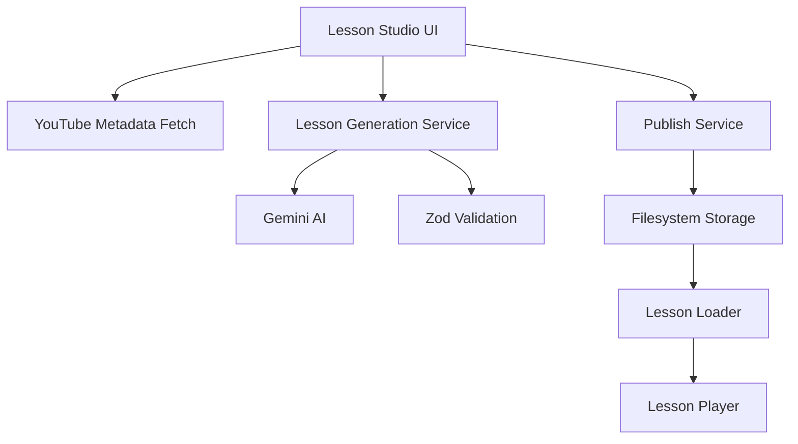

# Lesson Studio Implementation Plan

## Overview
Implement a dual-mode "Lesson Studio" for generating lessons from YouTube videos with two modes:
- Quick mode: YouTube URL only
- Accurate mode: YouTube URL + transcript

## Architecture Overview

## Step 1: Add Gemini SDK and Environment Configuration

### Tasks:
1. Install @google/genai package
2. Create .env.example with GEMINI_API_KEY placeholder
3. Implement lib/ai/gemini.ts with server-only client initialization

### Implementation Details:
- Add @google/genai to package.json dependencies
- Create .env.example with `GEMINI_API_KEY=`
- Implement server-side Gemini client with proper error handling
- Ensure client is never imported from client components (use "use server" directive)

### Files to Create/Modify:
- package.json (add dependency)
- .env.example (new file)
- lib/ai/gemini.ts (new file)

## Step 2: Implement YouTube Metadata Fetch

### Tasks:
1. Create lib/youtube/oembed.ts with fetchYouTubeOEmbed function
2. Implement YouTube URL validation
3. Handle oEmbed API responses

### Implementation Details:
- Support both youtube.com/watch and youtu.be URL formats
- Validate URL structure before making API call
- Extract title and author_name from oEmbed response
- Handle API errors gracefully
- No OAuth required (public endpoint)

### Files to Create:
- lib/youtube/oembed.ts (new file)

## Step 3: Dual-Mode Lesson Generation

### Tasks:
1. Create lib/lessonarcade/generate.ts with generateLessonDualMode function
2. Implement structured output with JSON Schema
3. Add Zod validation with retry mechanism
4. Handle both Quick and Accurate modes

### Implementation Details:
- Quick mode: Generate from video metadata only (title, channel)
- Accurate mode: Generate from transcript with time alignment
- Use Gemini structured output with JSON Schema
- Validate with existing lessonArcadeLessonSchema
- Implement retry loop (max 2 retries) with repair prompts
- Default to 3 levels, 4 items per level (customizable)
- Maintain existing item types: multiple_choice, open_ended, checkpoint

### Files to Create:
- lib/lessonarcade/generate.ts (new file)

## Step 4: Build Lesson Studio UI

### Tasks:
1. Create app/studio/page.tsx (server component)
2. Create components/studio/lesson-studio-form.tsx (client component)
3. Implement form with YouTube URL, mode selection, and transcript input
4. Add preview functionality with LessonPlayer
5. Style with existing Tailwind v4 tokens

### Implementation Details:
- Server component page with initial data loading
- Client component form with controlled inputs
- Segmented control for Quick/Accurate mode selection
- Conditional transcript textarea (required for Accurate mode)
- Server Actions for form submission
- Preview generated lesson using existing LessonPlayer
- Use la-bg, la-surface, la-border, la-primary, la-accent, la-muted tokens

### Files to Create:
- app/studio/page.tsx (new file)
- components/studio/lesson-studio-form.tsx (new file)

## Step 5: Implement Publish Persistence

### Tasks:
1. Create lib/lessonarcade/storage.ts with save/load functions
2. Implement slug sanitization and path traversal protection
3. Add server-side validation before writing
4. Create data/user-lessons directory structure

### Implementation Details:
- saveUserLesson(lesson): Write to data/user-lessons/{safeSlug}.json
- loadUserLessonBySlug(slug): Read and validate with schema
- Sanitize slugs to safe filenames (alphanumeric, hyphens only)
- Prevent path traversal attacks
- Re-validate lessons before persisting
- Use Node runtime for filesystem operations

### Files to Create:
- lib/lessonarcade/storage.ts (new file)
- data/user-lessons/.gitkeep (new directory with gitkeep)

## Step 6: Wire Published Lessons into Loader

### Tasks:
1. Update lib/lessonarcade/loaders.ts to check user lessons
2. Modify loadLessonBySlug to fallback to user lessons
3. Create app/demo/lesson/[slug]/page.tsx for dynamic loading
4. Add friendly not-found UI for unknown slugs
5. Keep app/demo/lesson/page.tsx as redirect

### Implementation Details:
- loadLessonBySlug: Check registry first, then user lessons
- Create dynamic route for [slug]
- Implement not-found UI with links back to /demo or /studio
- Preserve existing demo lesson links
- Handle loading and error states

### Files to Create/Modify:
- lib/lessonarcade/loaders.ts (modify)
- app/demo/lesson/[slug]/page.tsx (new file)
- app/demo/lesson/page.tsx (modify to redirect)

## Step 7: Quality Checks and Commit

### Tasks:
1. Run pnpm lint and fix issues
2. Run pnpm build and fix issues
3. Test both Quick and Accurate modes
4. Test publish and load functionality
5. Commit with conventional commit message

### Implementation Details:
- Ensure all linting passes
- Verify build completes successfully
- Test end-to-end flow: generate → preview → publish → load
- Test error handling for invalid URLs/transcripts
- Commit with "feat: add dual-mode lesson studio with generation and publishing"

## Technical Considerations

### Security:
- Server Actions for all form submissions (no client-side API keys)
- Path traversal protection in storage
- Input validation for YouTube URLs and transcripts

### Performance:
- Streaming responses for large transcripts
- Efficient validation with Zod
- Proper error boundaries in UI

### UX:
- Clear distinction between Quick and Accurate modes
- Progress indicators during generation
- Preview before publishing
- Friendly error messages

### Data Model:
- Reuse existing lessonArcadeLessonSchema
- Maintain compatibility with existing LessonPlayer
- Support customization of levelCount and itemsPerLevel
- Preserve existing item types (multiple_choice, open_ended, checkpoint)