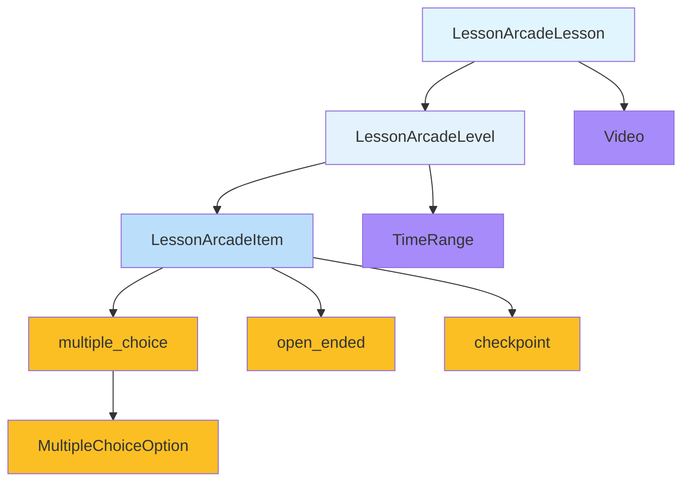

# LessonArcade Data Model Implementation Plan

## Overview
This document outlines the implementation plan for the LessonArcade data model and JSON validation layer, covering roadmap items LA1-P0-03 and LA1-P0-04.

## Data Model Design

### LessonArcadeLesson Structure
```typescript
{
  id: string                    // Unique identifier
  slug: string                  // URL-friendly identifier
  title: string                 // Display title
  shortDescription: string         // Brief description
  longDescription?: string        // Optional detailed description
  estimatedDurationMinutes?: number // Optional duration estimate
  tags: string[]               // Categorization tags
  language: string               // Language code (e.g., "en", "zh-Hant")
  video: {
    provider: string             // Video provider (e.g., "youtube")
    videoId: string             // Platform-specific video ID
    startAtSeconds?: number      // Optional start time
    endAtSeconds?: number        // Optional end time
  }
  levels: LessonArcadeLevel[]   // Array of levels
}
```

### LessonArcadeLevel Structure
```typescript
{
  id: string                    // Unique identifier
  index: number                 // Sequential order
  title: string                 // Display title
  summary: string               // Brief summary
  timeRange?: {                // Optional video time range
    startSeconds: number        // Start time in video
    endSeconds: number          // End time in video
  }
  keyPoints: string[]           // Key learning points
  items: LessonArcadeItem[]    // Array of items
}
```

### LessonArcadeItem Discriminated Union
```typescript
// Base fields for all items
{
  kind: "multiple_choice" | "open_ended" | "checkpoint"
  id: string
  prompt: string
}

// Multiple Choice Item (kind: "multiple_choice")
{
  kind: "multiple_choice",
  options: { id: string; text: string }[]
  correctOptionIds: string[]
  explanation?: string
  difficulty?: "easy" | "medium" | "hard"
  points?: number
}

// Open Ended Item (kind: "open_ended")
{
  kind: "open_ended",
  placeholder?: string
  guidance?: string
  maxCharacters?: number
}

// Checkpoint Item (kind: "checkpoint")
{
  kind: "checkpoint",
  message: string
  actionHint?: string
}
```

## Implementation Files

### 1. Zod Schema File
**Location**: `/lib/lessonarcade/schema.ts`

This file will contain:
- Zod schemas for all data types
- Discriminated union for item types
- Validation rules with helpful error messages
- Exported TypeScript types inferred from schemas

### 2. Example Lesson Data
**Location**: `/data/demo-lessons/react-hooks-intro.json`

Example lesson titled "Introduction to React Hooks" with:
- 2-3 levels
- Each level with 2-3 keyPoints
- Mix of item types (multiple_choice, open_ended, checkpoint)
- Realistic content that exercises the full schema

### 3. Type-Safe Loader
**Location**: `/lib/lessonarcade/loaders.ts`

This module will:
- Import JSON files statically
- Validate with Zod schemas
- Return typed objects or throw clear errors
- Include registry interface for multiple lessons

### 4. Debug Page
**Location**: `/app/demo/lesson/debug/page.tsx`

Server component that:
- Loads the demo lesson via the loader
- Renders a simple JSON summary
- Shows level titles and item counts
- Provides debugging information without full UI

## Key Implementation Details

### Zod Schema Features
- **Strict validation**: All required fields enforced
- **Type discrimination**: Proper union handling for item types
- **Custom error messages**: Developer-friendly validation errors
- **Optional fields**: Proper handling of non-required data

### Type Safety
- **Inferred types**: TypeScript types from Zod schemas
- **Discriminated unions**: Type-safe item handling
- **Export organization**: Clear separation of schemas and types

### Extensibility
- **Easy to extend**: New item types can be added to the discriminated union
- **Future-proof**: Optional fields for additional data
- **Versioning ready**: Structure supports future enhancements

## Quality Assurance

### Validation Testing
- Test valid lesson passes schema validation
- Test invalid lesson fails with clear error
- Test all item types individually

### Build Verification
- Ensure TypeScript compilation
- Verify no linting errors
- Confirm proper module resolution

## Next Steps

1. **Create Zod schema file** with all data types
2. **Generate TypeScript types** from schemas
3. **Create example lesson** with realistic content
4. **Implement loader** with validation
5. **Build debug page** to test integration
6. **Run quality checks** (lint, build)
7. **Commit and push** to main branch

## Mermaid Diagram



This implementation provides a solid foundation for the LessonArcade platform's data model with comprehensive validation and type safety.