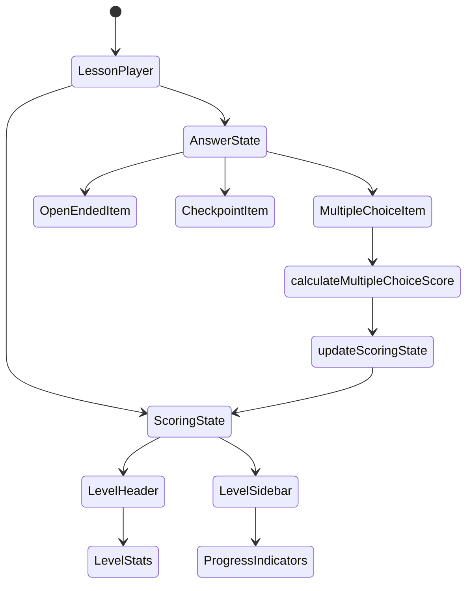
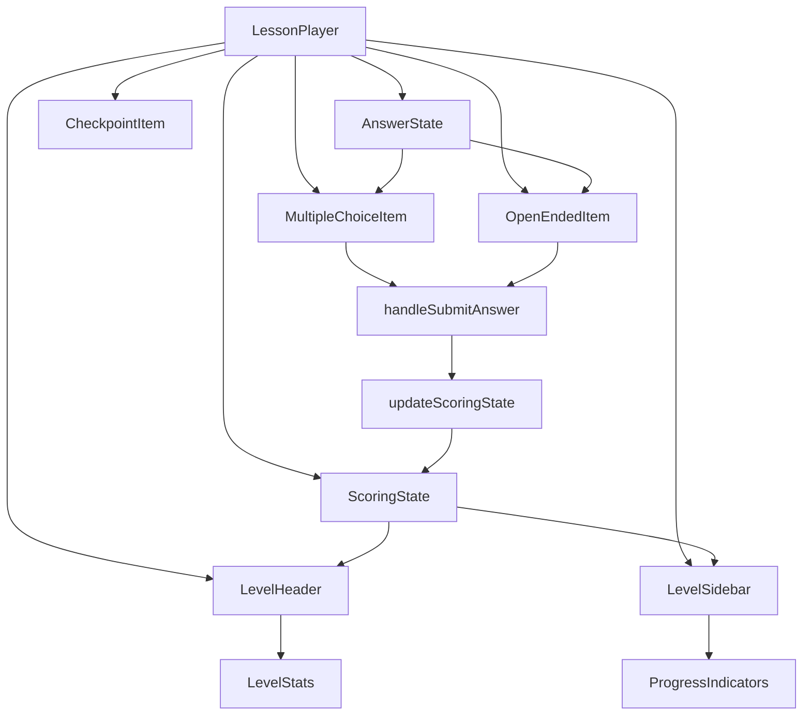
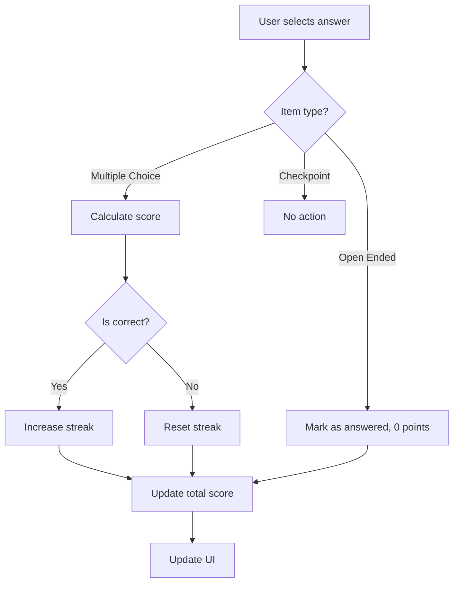

# Scoring System Architecture Diagram

## State Management Flow



## Component Data Flow



## Scoring Logic Flow



## State Structure

```mermaid
classDiagram
    class LessonPlayer {
        -currentLevelIndex: number
        -answeredItems: Record<string, AnswerState>
        -scoringState: ScoringState
        +handleAnswerSelect(itemId, optionIds)
        +handleSubmitAnswer(itemId, item)
        +updateScoringState(itemId, item, isCorrect, points)
    }
    
    class AnswerState {
        +selectedOptions: string[]
        +isSubmitted: boolean
        +isCorrect?: boolean
        +pointsEarned?: number
    }
    
    class ScoringState {
        +totalScore: number
        +levelScores: Record<string, number>
        +streak: number
        +answeredItems: Record<string, AnswerState>
    }
    
    LessonPlayer --> AnswerState
    LessonPlayer --> ScoringState