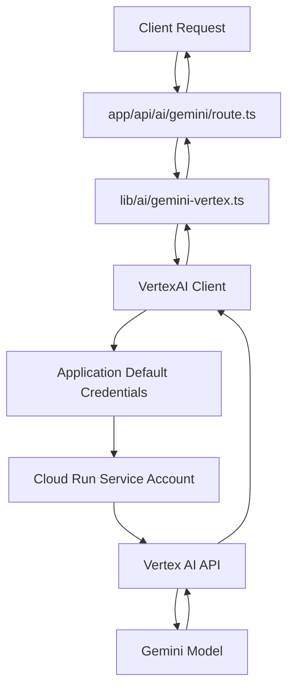

# Vertex AI Gemini Integration Implementation Plan

## Overview

This plan documents the implementation of a production-grade Vertex AI Gemini integration for LessonArcade, replacing the current developer API key approach with Google Cloud Vertex AI using Application Default Credentials (ADC) for Cloud Run deployment.

## Research Findings

### SDK Information
- **Package**: `@google-cloud/vertexai`
- **Latest Version**: 0.3.1+ (as of 2025)
- **Installation**: `pnpm add @google-cloud/vertexai`

### Authentication Pattern for Cloud Run
- **Recommended Method**: Application Default Credentials (ADC)
- **No API Key Required**: Cloud Run service accounts automatically authenticate via ADC
- **Service Account**: Cloud Run uses the default compute service account (`{PROJECT_NUMBER}-compute@developer.gserviceaccount.com`)
- **IAM Role Required**: `roles/aiplatform.user` for Vertex AI access

### Environment Variables Required
- `GCP_PROJECT_ID` - Google Cloud Project ID
- `GCP_REGION` - GCP region (e.g., `us-central1`)
- `GCP_VERTEX_MODEL` - Vertex AI model (e.g., `gemini-2.0-flash-exp` or `gemini-1.5-flash`)

## Implementation Steps

### Step 1: Install Dependencies
```bash
pnpm add @google-cloud/vertexai
```

### Step 2: Create Vertex AI Module (`lib/ai/gemini-vertex.ts`)

**Purpose**: Server-only module for Vertex AI Gemini calls

**Key Features**:
- Single exported function `generateGeminiText()`
- Parameters: `messages`, `systemPrompt`, `model`, `temperature`
- Environment validation at module initialization
- Server-only flag enforcement

**Function Signature**:
```typescript
export async function generateGeminiText({
  messages,
  systemPrompt,
  model,
  temperature
}: {
  messages: Array<{ role: 'system' | 'user' | 'assistant'; content: string }>
  systemPrompt?: string
  model?: string
  temperature?: number
}): Promise<{ text: string; usage?: { promptTokens: number; completionTokens: number; totalTokens: number } }>
```

### Step 3: Create API Route (`app/api/ai/gemini/route.ts`)

**Purpose**: App Router API endpoint for Vertex AI Gemini generation

**Request Body**:
```typescript
{
  messages: Array<{ role: 'system' | 'user' | 'assistant'; content: string }>,
  options?: {
    model?: string
    temperature?: number
    maxOutputTokens?: number
  }
}
```

**Response Body**:
```typescript
{
  text: string
  usage?: {
    promptTokens: number
    completionTokens: number
    totalTokens: number
  }
}
```

**Features**:
- Runtime: `nodejs` (explicitly declared)
- Input validation
- Error handling with proper HTTP status codes
- No browser-only globals

### Step 4: Environment Variable Validation

Add validation function in `lib/ai/gemini-vertex.ts`:
- Check for `GCP_PROJECT_ID`
- Check for `GCP_REGION`
- Check for `GCP_VERTEX_MODEL`
- Throw descriptive error if missing

### Step 5: Unit Tests (`test/ai/gemini-vertex.test.ts`)

**Test Coverage**:
- Mock Vertex AI client to avoid network calls
- Test successful generation
- Test error handling (missing env vars, API errors)
- Test message format conversion
- Test usage tracking

**Mock Strategy**:
```typescript
vi.mock('@google-cloud/vertexai', () => ({
  VertexAI: vi.fn().mockImplementation(() => ({
    getGenerativeModel: vi.fn().mockReturnValue({
      generateContent: vi.fn().mockResolvedValue({
        response: {
          text: vi.fn().mockReturnValue('Generated text'),
          usageMetadata: { promptTokenCount: 10, candidatesTokenCount: 20, totalTokenCount: 30 }
        }
      })
    })
  }))
}))
```

### Step 6: E2E Smoke Test (`e2e/vertex-ai-gemini.spec.ts`)

**Test Purpose**: Verify API route returns 200 with non-empty text

**Test Strategy**:
- Use mocked mode or test stub for CI determinism
- Test with environment variable set to enable Vertex AI mode
- Verify response structure

### Step 7: Documentation Updates

#### `.env.example` additions:
```bash
# Vertex AI Configuration (Production Mode)
# When set, uses Vertex AI instead of developer API key
GCP_PROJECT_ID=
GCP_REGION=
GCP_VERTEX_MODEL=gemini-2.0-flash-exp
```

#### `README.md` updates:
- Add Vertex AI configuration section
- Document environment variables
- Explain when to use Vertex AI vs developer API key

#### `docs/deploy-cloud-run.md` updates:
- Add Vertex AI setup instructions
- Document IAM role requirements
- Add service account permission commands

### Step 8: Verification Steps

Run all quality checks:
```bash
pnpm lint
pnpm typecheck
CI=1 pnpm test
pnpm test:e2e
```

### Step 9: Commit and Push

Direct commit to main (no PR required per task instructions):
```bash
git add .
git commit -m "feat: Add Vertex AI mode for production Gemini integration"
git push origin main
```

## Architecture Diagram



## Environment Variable Priority

1. **Vertex AI Mode** (Production): When `GCP_PROJECT_ID`, `GCP_REGION`, and `GCP_VERTEX_MODEL` are set
2. **Developer API Key Mode** (Development): When `GEMINI_API_KEY` is set
3. **No AI**: When neither is set, AI features are disabled

## Security Considerations

- No API keys in code or environment for Vertex AI mode
- Service account follows principle of least privilege
- Only `roles/aiplatform.user` role required
- Service account access scoped to specific project/region

## Cloud Run IAM Setup

```bash
# Get project number
PROJECT_NUMBER=$(gcloud projects describe $PROJECT_ID --format='value(projectNumber)')
SERVICE_ACCOUNT="${PROJECT_NUMBER}-compute@developer.gserviceaccount.com"

# Grant Vertex AI user role
gcloud projects add-iam-policy-binding $PROJECT_ID \
  --member="serviceAccount:$SERVICE_ACCOUNT" \
  --role="roles/aiplatform.user"
```

## Testing Strategy

### Unit Tests
- Mock all external dependencies
- Test all code paths
- Verify error handling

### E2E Tests
- Use test stub for determinism
- Test API contract
- Verify response structure

### CI Considerations
- Set `CI=1` for test runs
- Mock mode prevents network calls
- All tests must be deterministic

## Rollback Plan

If issues arise after deployment:
1. Revert commit: `git revert HEAD`
2. Redeploy previous version
3. Investigate logs: `gcloud logs tail`
