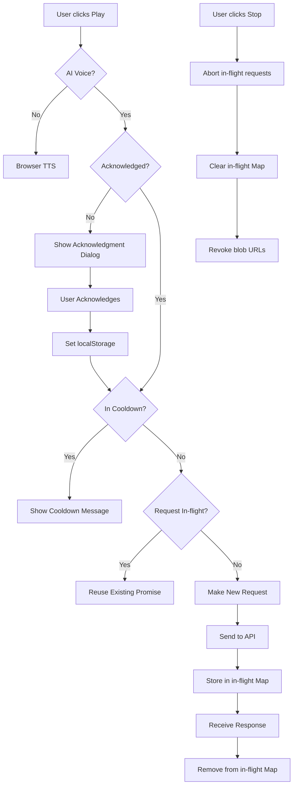
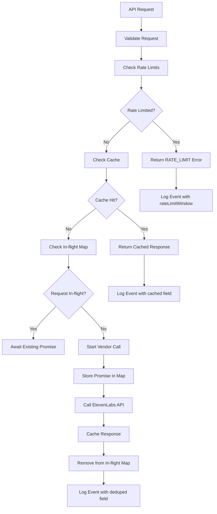

# TTS Cost Guardrails Architecture

## Overview

This document outlines the architecture for implementing TTS cost guardrails in LessonArcade to prevent excessive API usage and costs.

## Components

### Frontend Guardrails (voice-lesson-player.tsx)



### Backend Guardrails (app/api/voice/tts/route.ts)



## Key Features

### 1. No Autoplay + First-time Acknowledgment
- **localStorage key**: `la:aiVoiceAcknowledged`
- Shows dialog every time user switches to AI Voice until acknowledged
- Persists across browser sessions
- Disables AI Voice controls until acknowledged

### 2. Play Cooldown (Anti Double-click)
- **Cooldown period**: 2 seconds
- **itemKey format**: `slug + levelIndex + itemIndex + displayLanguage + presetKey + rate`
- Only applies to identical items with same parameters
- Shows user-friendly message when blocked

### 3. Client-side In-flight Dedupe
- **Key**: `cacheKey` (same as server: text+lang+voiceId+rate)
- Reuses Promise for identical requests
- Clears on Stop to prevent unexpected playback

### 4. Server-side In-flight Dedupe
- **Key**: `sha256(text+lang+voiceId+rate)`
- Module-level Map<string, Promise<Response>>
- Cleans up entries in finally blocks

### 5. Multi-tier Rate Limiting
- **Minute limits**: 5 req/min per IP, 10 req/min per fingerprint
- **Hour limits**: 10 req/hour per IP (existing)
- **Day limits**: 30 req/day per fingerprint (existing)
- All three tiers apply simultaneously

## Implementation Details

### Frontend State Management
```typescript
// New state variables
const [aiVoiceAcknowledged, setAiVoiceAcknowledged] = useState(false)
const [showAcknowledgmentDialog, setShowAcknowledgmentDialog] = useState(false)
const [lastPlayedItem, setLastPlayedItem] = useState<{itemKey: string, timestamp: number} | null>(null)
const [inFlightRequests, setInFlightRequests] = useState<Map<string, Promise<Blob>>>(new Map())
```

### Backend Rate Limiting
```typescript
// Updated rate limit configuration
const rateLimitResult = ttsRateLimiter.checkMultipleLimits(request, [
  { key: 'ip', maxRequests: 5, windowMs: 60 * 1000 },      // 5 requests per minute
  { key: 'ip', maxRequests: 10, windowMs: 60 * 60 * 1000 }, // 10 requests per hour
  { key: 'fingerprint', maxRequests: 10, windowMs: 60 * 1000 },      // 10 requests per minute
  { key: 'fingerprint', maxRequests: 30, windowMs: 24 * 60 * 60 * 1000 } // 30 requests per day
])
```

### Logging Enhancements
```typescript
// New log fields
{
  event: "voice_tts",
  ok: boolean,
  ipHash: string,
  textLength: number,
  textHash: string,
  voiceId: string,
  language: string,
  rate: number,
  elapsedMs: number,
  errorCode?: TTSErrorCode,
  cached?: boolean,
  deduped?: boolean,        // NEW: Server dedupe indicator
  rateLimitWindow?: string, // NEW: "minute" | "hour" | "day"
  voicePreset?: string
}
```

## Testing Strategy

### Unit Tests
1. **Rate Limiter Tests**
   - Minute window behavior
   - RetryAfterSeconds calculation
   - Multiple limit tiers interaction

2. **Dedupe Tests**
   - In-flight Map behavior
   - Cleanup in finally blocks
   - Cache key generation

3. **Component Tests**
   - Acknowledgment dialog behavior
   - Cooldown enforcement
   - In-flight request reuse

### Manual Testing Checklist
- [ ] AI Voice toggle shows acknowledgment dialog
- [ ] Repeated Play within 2s shows cooldown message
- [ ] Stop during queue clears all in-flight requests
- [ ] Rate limit message displays correctly
- [ ] Multiple identical requests reuse promises