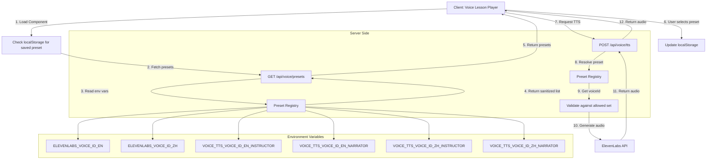
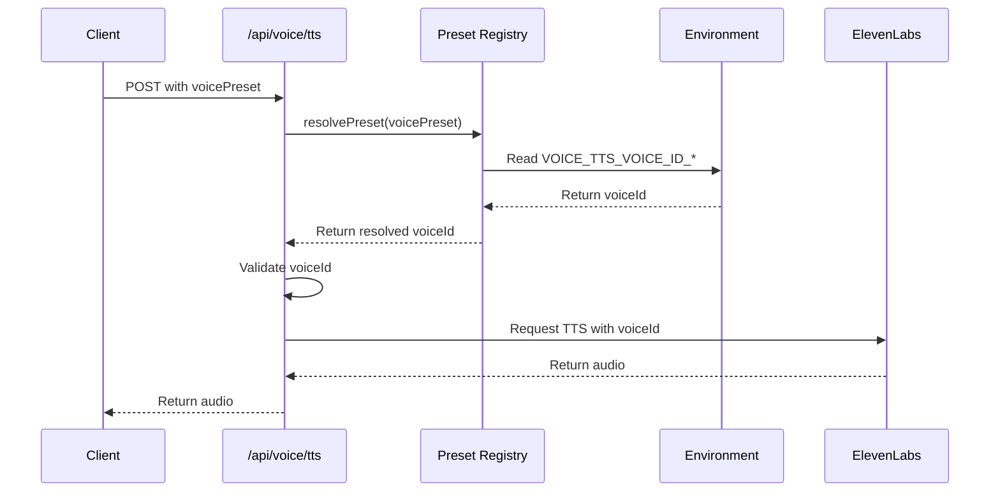
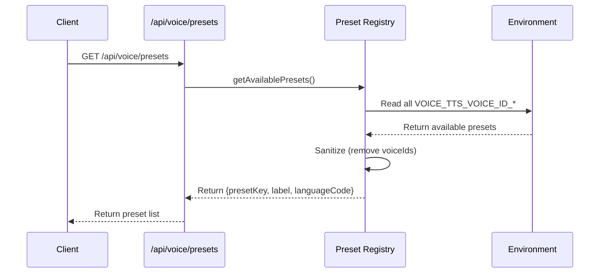
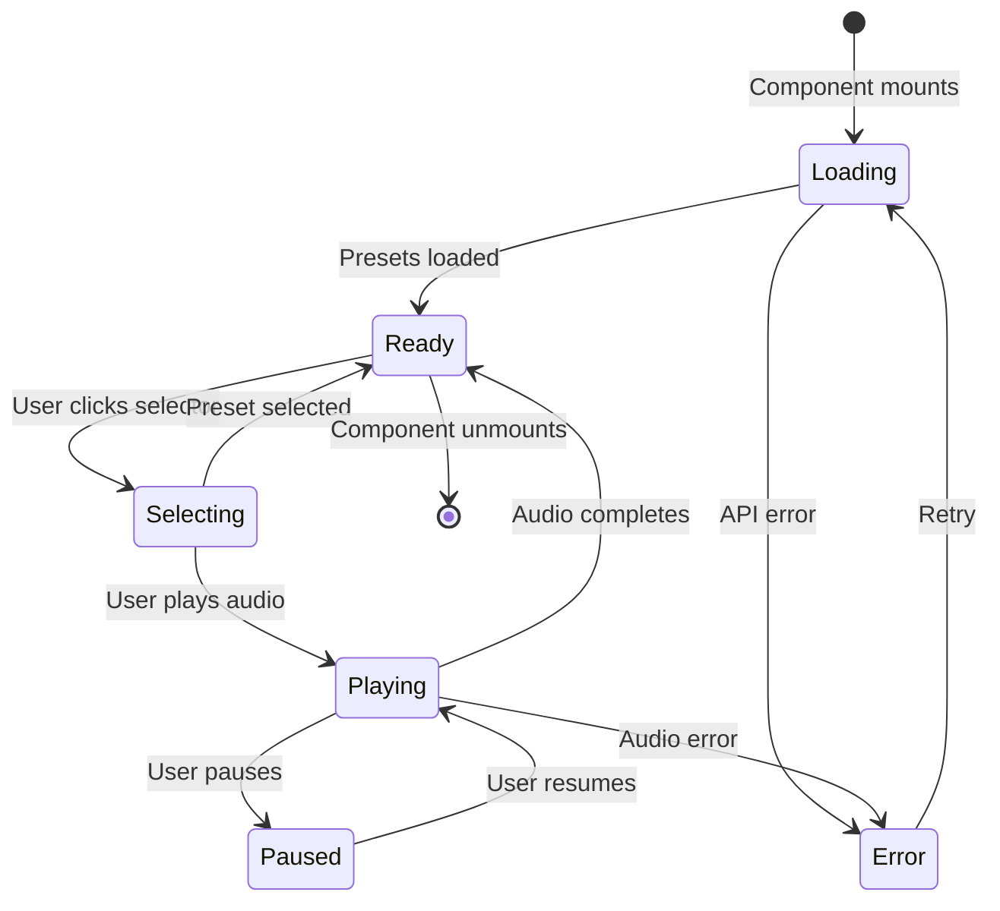

# Voice Presets Architecture Diagram

## System Flow



## Component Architecture

```mermaid
graph LR
    subgraph "Client Components"
        A[voice-lesson-player.tsx]
        B[Preset Selector UI]
        C[localStorage Manager]
    end

    subgraph "API Layer"
        D[/api/voice/presets]
        E[/api/voice/tts]
    end

    subgraph "Core Logic"
        F[preset-registry.ts]
        G[voice/constants.ts]
        H[voice/chunk-text.ts]
    end

    subgraph "External Services"
        I[ElevenLabs API]
    end

    A --> B
    A --> C
    B --> D
    A --> E
    D --> F
    E --> F
    F --> G
    E --> H
    E --> I
```

## Data Flow

### Preset Resolution Flow



### Preset List Flow



## State Management



## Environment Variable Mapping

```mermaid
graph TD
    A[Environment Variables] --> B[Preset Registry]
    
    subgraph "Default Voices (Backward Compatible)"
        C[ELEVENLABS_VOICE_ID_EN]
        D[ELEVENLABS_VOICE_ID_ZH]
    end
    
    subgraph "New Preset Voices"
        E[VOICE_TTS_VOICE_ID_EN_INSTRUCTOR]
        F[VOICE_TTS_VOICE_ID_EN_NARRATOR]
        G[VOICE_TTS_VOICE_ID_ZH_INSTRUCTOR]
        H[VOICE_TTS_VOICE_ID_ZH_NARRATOR]
    end
    
    C --> B
    D --> B
    E --> B
    F --> B
    G --> B
    H --> B
    
    B --> I[Available Presets]
    I --> J[en_instructor: English Instructor]
    I --> K[en_narrator: English Narrator]
    I --> L[zh_instructor: 中文讲师]
    I --> M[zh_narrator: 中文旁白]