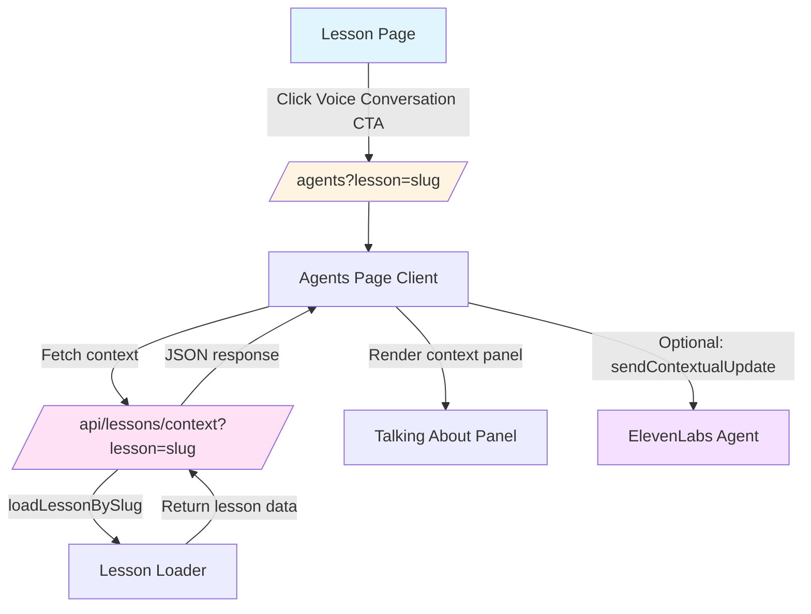

# Voice Session Lesson-Aware Implementation Plan (la3-p1-02)

## Overview
Make voice session lesson-aware by passing lesson context into the `/agents` page. This allows users to have voice conversations about specific lessons they're studying.

## Architecture Diagram



## STEP 1: Update Voice Conversation CTA in lesson-player.tsx

### File: `components/lesson/lesson-player.tsx`

**Location:** Lines 357-361

**Current Code:**
```tsx
<Button asChild variant="outline" size="sm">
  <Link href="/agents">
    Voice Conversation
  </Link>
</Button>
```

**Change To:**
```tsx
<Button asChild variant="outline" size="sm">
  <Link href={`/agents?lesson=${encodeURIComponent(lesson.slug)}`}>
    Voice Conversation
  </Link>
</Button>
```

**Notes:**
- Use `lesson.slug` as the lesson identifier (preferred over `lesson.id`)
- Use `encodeURIComponent()` to properly URL-encode the slug
- Other entry points (navigation, hero-section, demo page) keep linking to `/agents` without params

---

## STEP 2: Implement Lesson Context API Route

### File: `app/api/lessons/context/route.ts` (NEW)

**Create new API route with the following structure:**

```typescript
import { NextResponse } from "next/server"
import { loadLessonBySlug } from "@/lib/lessonarcade/loaders"
import { LessonLoadError } from "@/lib/lessonarcade/loaders"

export const runtime = "nodejs"

interface LessonContextResponse {
  ok: true
  lesson: {
    id: string
    title: string
    summary: string
    keyPoints: string[]
    suggestedQuestions: string[]
  }
}

interface ErrorResponse {
  ok: false
  error: {
    code: "NOT_FOUND" | "VALIDATION" | "INTERNAL_ERROR"
    message: string
  }
}

export async function GET(
  request: Request
): Promise<NextResponse<LessonContextResponse | ErrorResponse>> {
  const { searchParams } = new URL(request.url)
  const lessonSlug = searchParams.get("lesson")

  if (!lessonSlug) {
    return NextResponse.json(
      {
        ok: false,
        error: {
          code: "VALIDATION",
          message: "Missing 'lesson' query parameter",
        },
      },
      { status: 400 }
    )
  }

  try {
    const lesson = await loadLessonBySlug(lessonSlug)

    // Aggregate key points from all levels
    const keyPoints = lesson.levels.flatMap((level) => level.keyPoints)

    // Generate suggested questions from lesson content
    const suggestedQuestions = [
      `Can you explain the main concepts from ${lesson.title}?`,
      `What are the key takeaways from this lesson?`,
      `How can I apply what I learned in ${lesson.title} to real situations?`,
      `What should I focus on when studying ${lesson.title}?`,
    ]

    return NextResponse.json({
      ok: true,
      lesson: {
        id: lesson.id,
        title: lesson.title,
        summary: lesson.longDescription || lesson.shortDescription,
        keyPoints,
        suggestedQuestions,
      },
    })
  } catch (error) {
    if (error instanceof LessonLoadError) {
      if (error.code === "NOT_FOUND") {
        return NextResponse.json(
          {
            ok: false,
            error: {
              code: "NOT_FOUND",
              message: "Lesson not found",
            },
          },
          { status: 404 }
        )
      }
    }

    return NextResponse.json(
      {
        ok: false,
        error: {
          code: "INTERNAL_ERROR",
          message: "Failed to load lesson context",
        },
      },
      { status: 500 }
    )
  }
}
```

**Key Points:**
- Reuses existing `loadLessonBySlug` function from `lib/lessonarcade/loaders`
- Returns English-only JSON response (no i18n text)
- Aggregates `keyPoints` from all lesson levels
- Generates 4 suggested questions dynamically
- Returns 404 for NOT_FOUND errors
- Returns 400 for missing query parameter
- Returns 500 for other errors

---

## STEP 2: Update /agents Page

### File: `app/agents/page.tsx`

**Change from server component to client component to handle query params and state:**

```tsx
"use client"

import { ElevenLabsConversation } from "@/components/agents/elevenlabs-conversation"
import { useSearchParams } from "next/navigation"
import { useEffect, useState } from "react"
import { Button } from "@/components/ui/button"

interface LessonContext {
  id: string
  title: string
  summary: string
  keyPoints: string[]
  suggestedQuestions: string[]
}

interface LessonContextResponse {
  ok: true
  lesson: LessonContext
}

interface ErrorResponse {
  ok: false
  error: {
    code: string
    message: string
  }
}

export default function AgentsPage() {
  const searchParams = useSearchParams()
  const lessonSlug = searchParams.get("lesson")

  const [lessonContext, setLessonContext] = useState<LessonContext | null>(null)
  const [isLoading, setIsLoading] = useState(false)
  const [error, setError] = useState<string | null>(null)

  useEffect(() => {
    if (!lessonSlug) {
      setLessonContext(null)
      setError(null)
      return
    }

    const fetchLessonContext = async () => {
      setIsLoading(true)
      setError(null)

      try {
        const response = await fetch(`/api/lessons/context?lesson=${encodeURIComponent(lessonSlug)}`)
        const data = (await response.json()) as LessonContextResponse | ErrorResponse

        if (data.ok) {
          setLessonContext(data.lesson)
        } else {
          setError(data.error.message)
        }
      } catch (err) {
        setError("Failed to load lesson context")
      } finally {
        setIsLoading(false)
      }
    }

    fetchLessonContext()
  }, [lessonSlug])

  const handleRetry = () => {
    if (lessonSlug) {
      // Trigger refetch by re-running the effect
      window.location.reload()
    }
  }

  return (
    <div className="min-h-screen bg-la-bg" data-testid="la-agents-page">
      <div className="max-w-4xl mx-auto py-12 px-4 sm:px-6">
        {/* Page Header */}
        <div className="mb-8">
          <h1 className="text-3xl font-bold text-la-surface mb-2">
            Voice Conversation with AI Agent
          </h1>
          <p className="text-gray-600 max-w-2xl">
            Have a natural voice conversation with an AI agent. Click the button below to start.
            Please note that microphone permission is required for this feature to work.
          </p>
        </div>

        {/* Lesson Context Panel */}
        {lessonContext && (
          <div className="mb-6 bg-blue-50 border border-blue-200 rounded-lg p-6" data-testid="la-lesson-context-panel">
            <h2 className="text-xl font-semibold text-blue-900 mb-2">
              Talking about: {lessonContext.title}
            </h2>
            <p className="text-blue-800 mb-4">{lessonContext.summary}</p>
            
            <div className="mb-4">
              <h3 className="font-medium text-blue-900 mb-2">Key Points:</h3>
              <ul className="list-disc list-inside space-y-1 text-blue-800">
                {lessonContext.keyPoints.slice(0, 5).map((point, index) => (
                  <li key={index}>{point}</li>
                ))}
              </ul>
            </div>

            <div>
              <h3 className="font-medium text-blue-900 mb-2">Suggested Questions:</h3>
              <ul className="list-disc list-inside space-y-1 text-blue-800">
                {lessonContext.suggestedQuestions.slice(0, 5).map((question, index) => (
                  <li key={index}>{question}</li>
                ))}
              </ul>
            </div>
          </div>
        )}

        {/* Loading State */}
        {isLoading && lessonSlug && (
          <div className="mb-6 bg-gray-50 border border-gray-200 rounded-lg p-6" data-testid="la-lesson-context-loading">
            <p className="text-gray-600">Loading lesson context...</p>
          </div>
        )}

        {/* Error State */}
        {error && (
          <div className="mb-6 bg-red-50 border border-red-200 rounded-lg p-6" data-testid="la-lesson-context-error">
            <p className="text-red-800 mb-4">{error}</p>
            <Button onClick={handleRetry} variant="outline" size="sm">
              Retry
            </Button>
          </div>
        )}

        {/* Conversation Component */}
        <div className="bg-white rounded-lg shadow-md p-8">
          <ElevenLabsConversation lessonContext={lessonContext} />
        </div>

        {/* Additional Info */}
        <div className="mt-6 text-sm text-gray-500">
          <p>
            <strong>How it works:</strong>
          </p>
          <ul className="list-disc list-inside space-y-2 ml-4">
            <li>Click "Start Conversation" to begin</li>
            <li>Grant microphone permission when prompted</li>
            <li>Speak naturally with AI agent</li>
            <li>Click "Stop Conversation" to end</li>
          </ul>
        </div>
      </div>
    </div>
  )
}
```

**Key Points:**
- Changed from server component to client component with `"use client"`
- Uses `useSearchParams` to detect `lesson` query param
- Fetches lesson context from API route
- Renders "Talking about:" panel with lesson summary and key points
- Shows 3-5 suggested questions
- Handles loading state (no infinite loading - always shows something)
- Shows error state with Retry button
- Passes `lessonContext` prop to `ElevenLabsConversation`

---

## STEP 2 (Optional): Update elevenlabs-conversation.tsx

### File: `components/agents/elevenlabs-conversation.tsx`

**Add optional lesson context prop and send contextual update after connection:**

```typescript
"use client"

import { useConversation } from "@elevenlabs/react"
import { Button } from "@/components/ui/button"
import { useState, useEffect } from "react"

interface LessonContext {
  id: string
  title: string
  summary: string
  keyPoints: string[]
  suggestedQuestions: string[]
}

interface ElevenLabsConversationProps {
  lessonContext?: LessonContext | null
}

export function ElevenLabsConversation({ lessonContext }: ElevenLabsConversationProps) {
  const conversation = useConversation()
  const [error, setError] = useState<string | null>(null)
  const [isLoading, setIsLoading] = useState(false)
  const [hasSentContext, setHasSentContext] = useState(false)

  // Send lesson context after connection
  useEffect(() => {
    if (
      conversation.status === "connected" &&
      lessonContext &&
      !hasSentContext
    ) {
      const contextMessage = `The user is studying the lesson "${lessonContext.title}". 
        Summary: ${lessonContext.summary}. 
        Key points: ${lessonContext.keyPoints.join(", ")}.`
      
      conversation.sendContextualUpdate(contextMessage)
      setHasSentContext(true)
    }
  }, [conversation.status, lessonContext, hasSentContext, conversation])

  const handleStart = async () => {
    setError(null)
    setIsLoading(true)

    try {
      await navigator.mediaDevices.getUserMedia({ audio: true })

      const response = await fetch("/api/get-signed-url")
      if (!response.ok) {
        const errorData = await response.json()
        throw new Error(errorData.error?.message || "Failed to get signed URL")
      }

      const { signedUrl } = await response.json()
      
      // eslint-disable-next-line @typescript-eslint/no-explicit-any
      await conversation.startSession(signedUrl as any)
    } catch (err) {
      const errorMessage = err instanceof Error ? err.message : "Failed to start conversation"
      setError(errorMessage)
      console.error("Failed to start conversation:", err)
    } finally {
      setIsLoading(false)
    }
  }

  const handleStop = async () => {
    setError(null)
    setIsLoading(true)

    try {
      await conversation.endSession()
      setHasSentContext(false) // Reset for next session
    } catch (err) {
      const errorMessage = err instanceof Error ? err.message : "Failed to stop conversation"
      setError(errorMessage)
      console.error("Failed to stop conversation:", err)
    } finally {
      setIsLoading(false)
    }
  }

  const isConnected = conversation.status === "connected"

  return (
    <div className="flex flex-col items-center gap-6">
      {/* Status Display */}
      <div className="flex items-center gap-6 text-sm">
        <div className="flex items-center gap-2">
          <span className="text-gray-600">Connection:</span>
          <span
            className={`font-medium ${
              isConnected ? "text-green-600" : "text-gray-500"
            }`}
          >
            {isConnected ? "Connected" : "Disconnected"}
          </span>
        </div>
        <div className="flex items-center gap-2">
          <span className="text-gray-600">Speaking:</span>
          <span
            className={`font-medium ${
              conversation.isSpeaking ? "text-la-accent" : "text-gray-500"
            }`}
          >
            {conversation.isSpeaking ? "Yes" : "No"}
          </span>
        </div>
      </div>

      {/* Control Buttons */}
      {!isConnected ? (
        <Button
          onClick={handleStart}
          disabled={isLoading}
          className="min-w-[180px]"
        >
          {isLoading ? "Starting..." : "Start Conversation"}
        </Button>
      ) : (
        <Button
          onClick={handleStop}
          disabled={isLoading}
          variant="destructive"
          className="min-w-[180px]"
        >
          {isLoading ? "Stopping..." : "Stop Conversation"}
        </Button>
      )}

      {/* Error Display */}
      {error && (
        <div className="flex items-center gap-2 text-red-500 text-sm bg-red-50 px-4 py-2 rounded-md">
          <svg
            className="w-4 h-4 flex-shrink-0"
            fill="none"
            stroke="currentColor"
            viewBox="0 0 24 24"
          >
            <path
              strokeLinecap="round"
              strokeLinejoin="round"
              strokeWidth={2}
              d="M12 8v4m0 4h.01M21 12a9 9 0 11-18 0 9 9 0 0118 0z"
            />
          </svg>
          <span>{error}</span>
        </div>
      )}

      {/* Info Text */}
      {!isConnected && !error && (
        <p className="text-xs text-gray-500 text-center max-w-md">
          Click "Start Conversation" to begin. Your browser will request microphone
          permission.
        </p>
      )}
    </div>
  )
}
```

**Key Points:**
- Adds optional `lessonContext` prop
- Uses `sendContextualUpdate` to send lesson brief after connection
- Uses `sendContextualUpdate` instead of `sendUserMessage` because it doesn't trigger a response
- Tracks whether context has been sent with `hasSentContext` state
- Resets context flag on session stop

---

## STEP 3: Add Unit Tests

### File: `test/api/lessons-context.test.ts` (NEW)

```typescript
// @vitest-environment node
import { describe, it, expect, beforeEach, vi } from 'vitest'

// Mock server-only module
vi.mock('server-only', () => ({}))

import { GET } from '@/app/api/lessons/context/route'
import { loadLessonBySlug } from '@/lib/lessonarcade/loaders'

// Mock the lesson loader
vi.mock('@/lib/lessonarcade/loaders', () => ({
  loadLessonBySlug: vi.fn(),
}))

describe('/api/lessons/context', () => {
  beforeEach(() => {
    vi.clearAllMocks()
  })

  describe('Success Path', () => {
    it('should return lesson context for valid lesson slug', async () => {
      const mockLesson = {
        id: 'test-lesson-id',
        slug: 'test-lesson',
        title: 'Test Lesson',
        shortDescription: 'A test lesson',
        longDescription: 'A longer description of the test lesson',
        levels: [
          {
            id: 'level-1',
            index: 0,
            title: 'Level 1',
            summary: 'First level',
            timeRange: { startSeconds: 0, endAtSeconds: 60 },
            keyPoints: ['Key point 1', 'Key point 2'],
            items: [],
          },
        ],
        tags: ['test'],
        language: 'en',
        video: { provider: 'youtube', videoId: 'test' },
      }

      vi.mocked(loadLessonBySlug).mockResolvedValue(mockLesson as any)

      const request = new Request('http://localhost/api/lessons/context?lesson=test-lesson')
      const response = await GET(request)
      const data = await response.json()

      expect(response.status).toBe(200)
      expect(data.ok).toBe(true)
      expect(data.lesson.id).toBe('test-lesson-id')
      expect(data.lesson.title).toBe('Test Lesson')
      expect(data.lesson.summary).toBe('A longer description of the test lesson')
      expect(data.lesson.keyPoints).toEqual(['Key point 1', 'Key point 2'])
      expect(data.lesson.suggestedQuestions).toHaveLength(4)
      expect(data.lesson.suggestedQuestions[0]).toContain('Test Lesson')
    })
  })

  describe('Error Handling', () => {
    it('should return 400 when lesson query param is missing', async () => {
      const request = new Request('http://localhost/api/lessons/context')
      const response = await GET(request)
      const data = await response.json()

      expect(response.status).toBe(400)
      expect(data.ok).toBe(false)
      expect(data.error.code).toBe('VALIDATION')
      expect(data.error.message).toContain('Missing')
    })

    it('should return 404 when lesson is not found', async () => {
      const error = new Error('Lesson not found') as any
      error.code = 'NOT_FOUND'
      vi.mocked(loadLessonBySlug).mockRejectedValue(error)

      const request = new Request('http://localhost/api/lessons/context?lesson=non-existent')
      const response = await GET(request)
      const data = await response.json()

      expect(response.status).toBe(404)
      expect(data.ok).toBe(false)
      expect(data.error.code).toBe('NOT_FOUND')
      expect(data.error.message).toBe('Lesson not found')
    })

    it('should return 500 for internal errors', async () => {
      vi.mocked(loadLessonBySlug).mockRejectedValue(new Error('Internal error'))

      const request = new Request('http://localhost/api/lessons/context?lesson=test-lesson')
      const response = await GET(request)
      const data = await response.json()

      expect(response.status).toBe(500)
      expect(data.ok).toBe(false)
      expect(data.error.code).toBe('INTERNAL_ERROR')
    })
  })
})
```

---

## STEP 3: Add E2E Test

### File: `e2e/lesson-aware-voice.spec.ts` (NEW)

```typescript
import { test, expect } from '@playwright/test'

test('lesson page Voice Conversation CTA navigates with lesson parameter', async ({ page }) => {
  await page.goto('/demo/lesson/design-feedback-basics')

  // Verify lesson page is visible
  await expect(page.locator('[data-testid="la-lesson-page"]')).toBeVisible()

  // Verify Voice Conversation button is visible
  const voiceConversationButton = page.getByRole('link', { name: 'Voice Conversation' })
  await expect(voiceConversationButton).toBeVisible()

  // Click button and verify navigation to /agents with lesson parameter
  await voiceConversationButton.click()
  await expect(page).toHaveURL(/\/agents\?lesson=design-feedback-basics/)
  await expect(page.locator('[data-testid="la-agents-page"]')).toBeVisible()
})

test('agents page shows lesson context when lesson parameter is provided', async ({ page }) => {
  await page.goto('/agents?lesson=design-feedback-basics')

  // Verify agents page is visible
  await expect(page.locator('[data-testid="la-agents-page"]')).toBeVisible()

  // Verify lesson context panel is visible
  await expect(page.locator('[data-testid="la-lesson-context-panel"]')).toBeVisible()

  // Verify "Talking about:" text is present
  await expect(page.getByText(/Talking about:/)).toBeVisible()

  // Verify lesson title is in the context
  await expect(page.getByText(/Design Feedback Basics/i)).toBeVisible()

  // Verify key points are shown
  await expect(page.getByText(/Key Points:/i)).toBeVisible()

  // Verify suggested questions are shown
  await expect(page.getByText(/Suggested Questions:/i)).toBeVisible()
})

test('agents page shows error when lesson parameter is invalid', async ({ page }) => {
  await page.goto('/agents?lesson=non-existent-lesson')

  // Verify agents page is visible
  await expect(page.locator('[data-testid="la-agents-page"]')).toBeVisible()

  // Verify error state is shown (not loading forever)
  await expect(page.locator('[data-testid="la-lesson-context-error"]')).toBeVisible()

  // Verify Retry button is present
  await expect(page.getByRole('button', { name: 'Retry' })).toBeVisible()
})

test('agents page works normally without lesson parameter', async ({ page }) => {
  await page.goto('/agents')

  // Verify agents page is visible
  await expect(page.locator('[data-testid="la-agents-page"]')).toBeVisible()

  // Verify lesson context panel is NOT shown
  await expect(page.locator('[data-testid="la-lesson-context-panel"]')).not.toBeVisible()

  // Verify start button is still visible
  await expect(page.getByRole('button', { name: 'Start Conversation' })).toBeVisible()
})
```

**Key Points:**
- Tests navigation from lesson page to agents with lesson parameter
- Tests that lesson context panel is shown with lesson title
- Tests error handling for invalid lesson slug
- Tests that agents page works normally without lesson parameter
- Does NOT start microphone in CI (uses mock mode)

---

## STEP 3: Update Progress Tracker

### File: `artifacts/progress.html`

**Add new work item to Phase 3 section:**

```html
<div class="work-item" data-id="la3-p1-02" data-status="completed">
  <div class="work-item-id">LA3-P1-02</div>
  <div class="work-item-title">Make voice session lesson-aware</div>
  <div class="work-item-desc">Pass lesson context into /agents page via query parameter and API route</div>
  <span class="status-badge status-completed">Completed</span>
</div>
```

**Update stats:**
- Total items: 12 (was 11)
- Completed items: 7 (was 6)
- Pending items: 5 (was 5)

**Update localStorage key version:**
```javascript
const PROGRESS_STORAGE_KEY = 'lessonarcade_progress_v22';
```

---

## CI Commands to Run

```bash
# Lint
pnpm lint

# Type check
pnpm typecheck

# English audit
pnpm audit:english

# Unit tests (CI mode)
CI=1 pnpm test

# E2E tests
pnpm test:e2e
```

---

## Git Commit and Push

```bash
# Stage all changes
git add .

# Commit
git commit -m "feat: make voice session lesson-aware (la3-p1-02)

- Add lesson parameter to Voice Conversation CTA in lesson-player
- Create /api/lessons/context API route for lesson context
- Update /agents page to fetch and render lesson context
- Add optional sendContextualUpdate to elevenlabs-conversation
- Add unit tests for lesson-context API
- Add E2E tests for lesson-aware flow
- Update progress tracker with la3-p1-02 marked as Done"

# Push directly to main (no PR/MR)
git push origin main
```

---

## Summary of Files to Modify/Create

### Modified Files:
1. `components/lesson/lesson-player.tsx` - Update Voice Conversation CTA
2. `app/agents/page.tsx` - Add lesson context fetching and rendering
3. `components/agents/elevenlabs-conversation.tsx` - Add lesson context prop and sendContextualUpdate
4. `artifacts/progress.html` - Add la3-p1-02 work item

### New Files:
1. `app/api/lessons/context/route.ts` - Lesson context API route
2. `test/api/lessons-context.test.ts` - Unit tests for lesson context API
3. `e2e/lesson-aware-voice.spec.ts` - E2E tests for lesson-aware flow

### Files NOT Modified (keep existing links to `/agents`):
- `components/layout/navigation.tsx` - Keep `/agents` without params
- `components/layout/hero-section.tsx` - Keep `/agents` without params
- `app/demo/page.tsx` - Keep `/agents` without params
