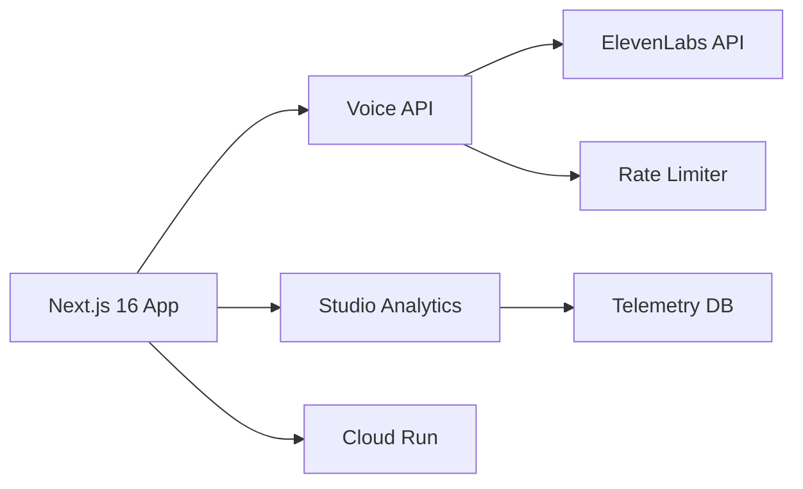
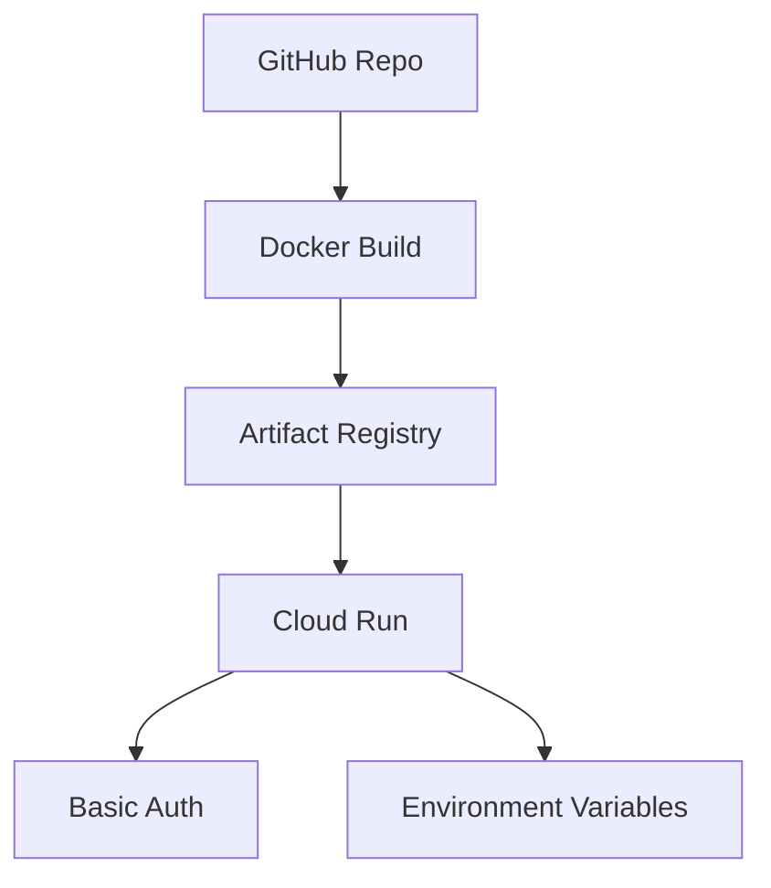

# LessonArcade Pitch Deck

## Slide 1: Title

# LessonArcade
## AI-Powered Voice Lessons for Modern Education

Transforming traditional lessons into interactive, voice-enabled learning experiences

---

## Slide 2: The Problem

# Traditional E-Learning Challenges

- **Static Content**: Text-heavy lessons lack engagement
- **Language Barriers**: Limited multilingual support
- **No Analytics**: Limited insights into learner engagement
- **Complex Infrastructure**: Difficult to deploy and scale

---

## Slide 3: Our Solution

# LessonArcade: Voice-First Learning

- **AI Voice Integration**: Natural-sounding narration in multiple languages
- **Interactive Controls**: Pause, resume, and stop functionality
- **Advanced Analytics**: Comprehensive voice usage telemetry
- **Cloud-Native**: Scalable deployment with minimal overhead

---

## Slide 4: Key Features

# What Makes LessonArcade Unique

### Voice System
- ElevenLabs-powered AI voices
- Customizable presets for different content types
- Intelligent chunking for optimal performance

### Guardrails & Safety
- Acknowledgment system for consent
- Cooldown periods to prevent abuse
- Multi-tier rate limiting (minute/hour/day)

### Analytics
- Real-time voice usage tracking
- Completion and replay rate metrics
- Privacy-first data collection

---

## Slide 5: Architecture Overview

# Modern Technical Stack

- **Frontend**: Next.js 16 with App Router
- **Backend**: Serverless API routes
- **Voice**: ElevenLabs integration
- **Deployment**: Google Cloud Run

---

## Slide 6: Voice System Flow

# Intelligent Voice Processing

1. **Script Building**: Dynamic content generation
2. **Chunking Queue**: Optimized text processing
3. **TTS API**: ElevenLabs integration
4. **Caching Layer**: Performance optimization
5. **Telemetry**: Usage tracking

*Supports both English and Chinese with automatic language detection*

---

## Slide 7: Analytics Dashboard

# Data-Driven Insights

### Voice Analytics at `/studio/voice-analytics`
- **Completion Rates**: Track lesson completion
- **Replay Patterns**: Identify popular content
- **Interruption Points**: Optimize content length
- **Language Preferences**: Understand user behavior

### Privacy-First Approach
- Hashed IP addresses
- No personal data collection
- Aggregated metrics only

---

## Slide 8: Deployment Architecture

# Scalable Cloud Infrastructure

### Benefits
- **Auto-scaling**: Handle traffic spikes automatically
- **Cost-effective**: Pay only for what you use
- **Global CDN**: Fast content delivery
- **Secure**: Basic Auth for admin routes

---

## Slide 9: Demo Experience

# See It In Action

### Live Demo Features
- **Lesson Selection**: Browse available content
- **Voice Playback**: Natural AI narration
- **Interactive Controls**: User-friendly interface
- **Real-time Analytics**: Monitor usage patterns

### Try It Yourself
1. Visit the demo page
2. Select a voice-enabled lesson
3. Experience AI narration
4. Check analytics dashboard

---

## Slide 10: Use Cases

# Perfect For

### Educational Institutions
- **Language Learning**: Pronunciation practice
- **Accessibility**: Support for diverse learners
- **Remote Learning**: Engaging online content

### Content Creators
- **Course Authors**: Add voice to lessons
- **Corporate Training**: Professional narration
- **E-learning Platforms**: White-label solution

---

## Slide 11: Future Roadmap

# What's Next

### Short Term
- [ ] More voice providers
- [ ] Advanced analytics features
- [ ] Mobile app optimization

### Long Term
- [ ] Custom voice cloning
- [ ] Real-time collaboration
- [ ] AI-powered content generation

---

## Slide 12: Get Started

# Join the Voice Revolution

### For Developers
- Open source on GitHub
- Easy deployment with Docker
- Comprehensive documentation

### For Organizations
- Cloud-hosted solutions
- Custom voice options
- Priority support

**Transform your lessons today with LessonArcade**

---

*Contact us for technical inquiries or partnership opportunities*